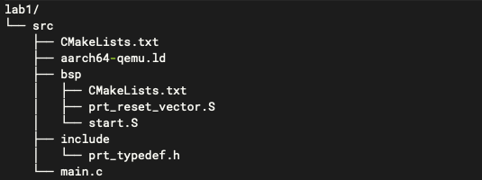
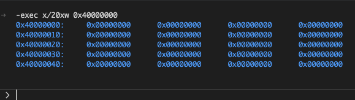
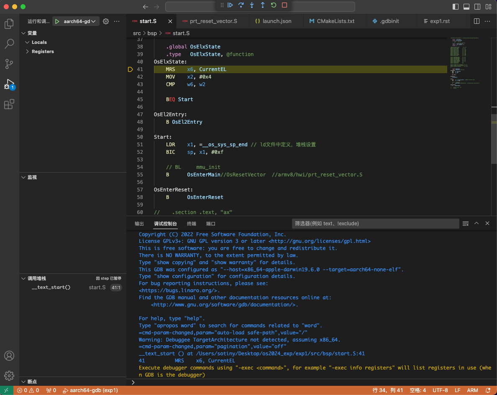
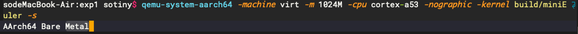

实验一 环境配置 
=====================

安装工具链
--------------------------

.. attention:: 

	Linux请使用ubuntu 18以上的版本开展本系列实验（本系列实验已在Ubuntu 18 （64位）版本, MacOS 12 （Intel Core i5）版本上验证）。

安装交叉编译工具链 (aarch64)
^^^^^^^^^^^^^^^^^^^^^^^^^^^^^^^^

交叉工具链可以从Arm官网的 `GNU Toolchain Downloads <https://developer.arm.com/downloads/-/arm-gnu-toolchain-downloads>`_ 页面下载。

Linux

.. code-block:: console

    # 下载工具链，以下载工具链版本为11.2，宿主机为x86 64位 Linux机器为例
    $ wget https://developer.arm.com/-/media/Files/downloads/gnu/11.2-2022.02/binrel/gcc-arm-11.2-2022.02-x86_64-aarch64-none-elf.tar.xz 
    # 解压工具链
    $ tar -xf gcc-arm-(按Tab键补全)
    # 重命名工具链目录
    $ mv gcc-arm-(按Tab键补全) aarch64-none-elf 

将目录 /path/to/your/aarch64-none-elf/bin （这里对应你自己实际的目录，用 pwd 命令查看）加入到环境变量 PATH 中。 

测试工具链是否安装成功

.. code-block:: console

    $ aarch64-none-elf-gcc --version

Mac

操作方法与Linux相同。但需下载工具链版本（Intel芯片）为： gcc-arm-11.2-2022.02-darwin-x86_64-aarch64-none-elf.tar.xz。

.. note::
    下载的交叉工具链版本需选择与你宿主机器和目标机器均对应的版本，本系列实验目标机器为： AArch64 bare-metal target (aarch64-none-elf)，再依据你的宿主机器选择相对应的版本。

    如果是M1或M2芯片版本的Mac，请使用更新版本的工具链。

.. note::
    交叉工具链可能会遇到缺少依赖库的问题，请自行检索解决。 Linux 下的 ldd 命令， Mac 下的 otool -L 命令可以查看动态链接库的依赖关系。

安装QEMU模拟器
^^^^^^^^^^^^^^^^^^^^^^^^^^^

Linux

.. code-block:: console

    $ sudo apt-get update
    $ sudo apt-get install qemu
    $ sudo apt-get install qemu-system

Mac

参考QEMU官网 https://wiki.qemu.org/Hosts/Mac 安装。

安装CMake
^^^^^^^^^^^^^^^^^^^^^^^^^^^

Linux

.. code-block:: console

    $ sudo apt-get install cmake

Mac 可通过 brew install cmake 或从官网的 `Get the Software <https://cmake.org/download/>`_ 页面下载安装。 

创建裸机(Bare Metal)程序
--------------------------

由于我们的目标是编写一个操作系统，所以我们需要创建一个独立于操作系统的可执行程序，又称 独立式可执行程序（freestanding executable） 或 裸机程序（bare-metal executable） 。这意味着所有依赖于操作系统的库我们都不能使用。比如 std 中的大部分内容（io, thread, file system, etc.）都需要操作系统的支持，所以这部分内容我们不能使用。

但是，不依赖与操作系统的语言特性还是可以继续使用的。

创建项目
^^^^^^^^^^^^^^^^^^^^^^^^^^

我们将参照UniProton设计项目的目录层次，但为了理解方便，将会进行相应简化。其初始目录结构如下图所示。

可以看到：在实验一 lab1 目录下有一个 src 目录，所有源代码均放在此处。其下包括 bsp 目录和 include 目录。其中 bsp 目录存放与硬件紧密相关的代码，include 目录中存放项目的大部分头文件。

.. note::
    src 下目前仅 main.c 文件

    include 目录下有 prt_typedef.h 头文件，它是 UniProton 所使用的基本数据类型和结构的定义，如 U8、U16、U32、U64等。

    bsp 目录下目前包括 CMakeLists.txt 和两个汇编文件 start.S 和 prt_reset_vector.S。

在src/下创建main.c

main.c源码

.. code-block:: c
    :linenos:

    #include "prt_typedef.h"

    #define UART_REG_WRITE(value, addr)  (*(volatile U32 *)((uintptr_t)addr) = (U32)value)
    char out_str[] = "AArch64 Bare Metal";
    
    S32 main(void)
    {
        int length = sizeof(out_str) / sizeof(out_str[0]);

        // 逐个输出字符
        for (int i = 0; i < length - 1; i++) {
            UART_REG_WRITE(out_str[i], 0x9000000);
        }
    }

.. note::
	S32 是在 prt_typedef.h 中定义的基本类型，这是为了屏蔽各硬件系统的区别，方便操作系统移植到多种不同规格的硬件上。

	main 函数的主要功能（L12-L13）是把 out_str 中的字符通过宏 UART_REG_WRITE 逐个写入地址为 0x9000000 的地方。其作用将在 :doc:`../lab2/index` 部分详细解释。

在src/include/下创建prt_typedef.h。 `此处 <../\_static/prt_typedef.h>`_ 下载 prt_typedef.h

在src/bsp/下创建 start.S 和 prt_reset_vector.S 两个文件

start.S 源码

.. code-block:: asm
    :linenos:

        .global   OsEnterMain
        .extern __os_sys_sp_end 

        .type     start, function
        .section  .text.bspinit, "ax"
        .balign   4

        .global OsElxState
        .type   OsElxState, @function
    OsElxState:
        MRS    x6, CurrentEL // 把系统寄存器 CurrentEL 的值读入到通用寄存器 x6 中
        MOV    x2, #0x4 // CurrentEL EL1： bits [3:2] = 0b01 
        CMP    w6, w2
        
        BEQ Start // 若 CurrentEl 为 EL1 级别，跳转到 Start 处执行，否则死循环。
        
    OsEl2Entry:
        B OsEl2Entry
        
    Start:
        LDR    x1, =__os_sys_sp_end // 符号在ld文件中定义
        BIC    sp, x1, #0xf // 设置栈指针, BIC: bit clear

        B      OsEnterMain

    OsEnterReset:
        B      OsEnterReset
        

.. note::
    L1，L2两行声明 OsEnterMain 和 __os_sys_sp_end 是外部定义的符号，其中 OsEnterMain 在 prt_reset_vector.S 中定义， __os_sys_sp_end 在链接脚本 aarch64-qemu.ld 定义。

    L5 声明这部分代码段(section)的名字是 .text.bspinit

    L10 为系统入口，即系统一启动就会执行从L10开始的代码，其原因在随后的链接脚本中说明。

    L11-L15 检测当前CPU的 Exception Level 是否为 EL1 （将在 :doc:`../lab4/index` 部分详细解释），如果是 EL1 则通过 L15 的 BEQ Start 跳转到标号Start(L20)处开始执行，否则执行 L17 开始的指令，它和 L18 一起构成死循环。

    L11 中的 CurrentEL 是 AArch64 架构的系统寄存器。这些寄存器不能直接操作，需要通过 MRS 指令（把系统寄存器的值读入到通用寄存器）或 MSR 指令（把通用寄存器的值写入到系统寄存器）借助通用寄存器来访问。

    L21-L22 用链接文件定义的地址初始化栈指针 sp，然后 L24 跳转到 prt_reset_vector.S 的 L7 行 OsEnterMain 处开始执行。

.. tip:: mrs类指令阅读技巧： MRS（Move to Register from System register）

.. tip:: 完整的寄存器列表及相关描述可访问 `AArch64 System Registers <https://developer.arm.com/documentation/ddi0601/latest/?lang=en>`_ 查看，指令集在 `A64 Instruction Set Architecture <https://developer.arm.com/documentation/ddi0602/latest/?lang=en>`_ 查看。

prt_reset_vector.S 源码

.. code-block:: asm
    :linenos:

    DAIF_MASK = 0x1C0       // disable SError Abort, IRQ, FIQ

        .global  OsVectorTable
        .global  OsEnterMain

        .section .text.startup, "ax"    
    OsEnterMain:
        BL      main

        MOV     x2, DAIF_MASK // bits [9:6] disable SError Abort, IRQ, FIQ 
        MSR     DAIF, x2 // 把通用寄存器 x2 的值写入系统寄存器 DAIF 中

    EXITLOOP:
        B EXITLOOP 

.. note::
    目前，完全可以把 start.S 和 prt_reset_vector.S 合成一个文件，但为了将来扩展且与 UniProton 保持一致选择保留2个文件。

    L8 行跳转到通过 BL main 跳转到main.c中的main函数执行，main函数执行完后会回到 L10继续执行。

    L10-L11 禁用了Debug、SError、IRQ和FIQ，因为中断处理尚未设置，详细参见 :doc:`../lab4/index`

    L10 中的 DAIF 是 AArch64 架构的系统寄存器，完整的寄存器列表可参考 Arm 官网的 `AArch64 System Registers <https://developer.arm.com/documentation/ddi0601/latest/?lang=en>`_ 页面。

    L13-L14 进入死循环。

    在上面两个汇编文件中出现了两种不同的跳转指令 B 和 BL，其中 B 跳转后不返回调用位置， BL 跳转后执行完函数后会回到调用位置继续执行。

在src/下创建链接文件 aarch64-qemu.ld

aarch64-qemu.ld 脚本。 该脚本较长，下面展示的仅是目前需了解的部分。完整版可从 `这里 <../\_static/aarch64-qemu.ld>`_ 下载。

.. code-block:: ld
    :linenos:

    ENTRY(__text_start)

    _stack_size = 0x10000;
    _heap_size = 0x10000;

    MEMORY
    {
        IMU_SRAM (rwx) : ORIGIN = 0x40000000, LENGTH = 0x800000 /* 内存区域 */
        MMU_MEM (rwx) : ORIGIN = 0x40800000, LENGTH = 0x800000 /* 内存区域 */
    }

    SECTIONS
    {
        text_start = .;
        .start_bspinit :
        {
            __text_start = .; /* __text_start 指向当前位置， "." 表示当前位置 */
            KEEP(*(.text.bspinit))
        } > IMU_SRAM
        
        ... ... ...
        
        .heap (NOLOAD) :
        {
            . = ALIGN(8);
            PROVIDE (__HEAP_INIT = .);
            . = . + _heap_size; /* 堆空间 */
            . = ALIGN(8);
            PROVIDE (__HEAP_END = .);
        } > IMU_SRAM
        
        .stack (NOLOAD) :
        {
            . = ALIGN(8);
            PROVIDE (__os_sys_sp_start = .);
            . = . + _stack_size; /* 栈空间 */
            . = ALIGN(8);
            PROVIDE (__os_sys_sp_end = .);
        } > IMU_SRAM
        end = .;
        
        ... ... ...
    }

.. Sphinx uses Pygments for highlighting. On a machine that has Pygments installed the command pygmentize -L will list all available lexers.

.. note::
    L1 的 ENTRY(__text_start)中指明系统入口为 __text_start 。 L17-L18 表明 __text_start 为 .text.bspinit 段的起始位置。而在 start.S 中 L5 处定义了 .text.bspinit 段，其入口为 L10 处的 OsElxState 标号。因此系统的入口实际上就是 start.S 中的 L10 处的 OsElxState 标号处。
    
    链接脚本中通过 PROVIDE 定义的符号 __os_sys_sp_end 是全局符号，可以在程序中使用（如 start.s 中），其定义的是栈底的位置。
    
    L26-L29，L35-L38 处分别定义了堆空间和栈空间。

.. note::
	链接脚本中除了组织各个段之外，还可以定义符号，链接脚本中定义的符号被添加到全局符号中

	symbol = expression ; symbol += expression ;第一个表达式表示定义一个符号，第二个表达式对符号值进行操作，中间的空格是必须的

	当程序和链接脚本中同时定义了变量符号时，链接脚本中的符号会覆盖掉程序中定义的符号

	定义内存区域后，一个段没有显示地指定将要添加到哪个区域,将会对段的属性和区域的属性进行匹配

	详情可参考 `The GNU linker <https://ftp.gnu.org/old-gnu/Manuals/ld-2.9.1/html_mono/ld.html>`_。此外，这里还有一个简单的 `链接脚本基本介绍 <https://zhuanlan.zhihu.com/p/363308789>`_ 可参考。

.. important::
	链接脚本对理解操作系统的实现非常重要，所以应及早熟悉。

工程构建
--------------------------

操作系统是一个复杂的工程。如当前版本的 UniProton 包含了近 500 个文件，超过 10 万行的代码及说明，而 Linux 内核则包含有 6 万多个文件，超过 2700 万行的代码 (2020)。如果纯手工构建这样的系统是不可想象的，所以我们需要构建系统的帮助。

.. 统计方法 代码行数： find . -type f -print | xargs wc -l 文件个数： ls -lR | grep "^d" | wc -l

CMake 是一个跨平台的开源构建系统。CMake 通过简单的、与平台和编译器无关的配置文件来控制软件编译过程。

CMakeLists.txt
^^^^^^^^^^^^^^^^^^^^^^^^

src/下的CMakeLists.txt 

.. code-block:: cmake
    :linenos:

    cmake_minimum_required(VERSION 3.12)

    set(CMAKE_SYSTEM_NAME "Generic") # 目标系统(baremental)：  cmake/tool_chain/uniproton_tool_chain_gcc_arm64.cmake 写的是Linux
    set(CMAKE_SYSTEM_PROCESSOR "aarch64") # 目标系统CPU

    set(TOOLCHAIN_PATH "/usr/local/aarch64-none-elf") # 修改为交叉工具链实际所在目录 build.py config.xml中定义
    set(CMAKE_C_COMPILER ${TOOLCHAIN_PATH}/bin/aarch64-none-elf-gcc)
    set(CMAKE_CXX_COMPILER ${TOOLCHAIN_PATH}/bin/aarch64-none-elf-g++)
    set(CMAKE_ASM_COMPILER ${TOOLCHAIN_PATH}/bin/aarch64-none-elf-gcc)
    set(CMAKE_LINKER ${TOOLCHAIN_PATH}/bin/aarch64-none-elf-ld)

    # 定义编译和链接等选项
    set(CC_OPTION "-Os   -Wformat-signedness    -Wl,--build-id=none   -fno-PIE -fno-PIE --specs=nosys.specs -fno-builtin -fno-dwarf2-cfi-asm -fomit-frame-pointer -fzero-initialized-in-bss -fdollars-in-identifiers -ffunction-sections -fdata-sections -fno-aggressive-loop-optimizations -fno-optimize-strlen -fno-schedule-insns -fno-inline-small-functions -fno-inline-functions-called-once -fno-strict-aliasing -finline-limit=20  -mlittle-endian -nostartfiles -funwind-tables")
    set(AS_OPTION "-Os   -Wformat-signedness    -Wl,--build-id=none   -fno-PIE -fno-PIE --specs=nosys.specs -fno-builtin -fno-dwarf2-cfi-asm -fomit-frame-pointer -fzero-initialized-in-bss -fdollars-in-identifiers -ffunction-sections -fdata-sections -fno-aggressive-loop-optimizations -fno-optimize-strlen -fno-schedule-insns -fno-inline-small-functions -fno-inline-functions-called-once -fno-strict-aliasing -finline-limit=20  -mlittle-endian -nostartfiles -funwind-tables")
    set(LD_OPTION " ")
    set(CMAKE_C_FLAGS "${CC_OPTION} ")
    set(CMAKE_ASM_FLAGS "${AS_OPTION} ")
    set(CMAKE_LINK_FLAGS "${LD_OPTION} -T ${CMAKE_CURRENT_SOURCE_DIR}/aarch64-qemu.ld") # 指定链接脚本
    set(CMAKE_EXE_LINKER_FLAGS "${LD_OPTION} -T ${CMAKE_CURRENT_SOURCE_DIR}/aarch64-qemu.ld") # 指定链接脚本
    set (CMAKE_C_LINK_FLAGS " ") 
    set (CMAKE_CXX_LINK_FLAGS " ")

    set(HOME_PATH ${CMAKE_CURRENT_SOURCE_DIR})

    set(APP "miniEuler") # APP变量，后面会用到 ${APP}
    project(${APP} LANGUAGES C ASM) # 工程名及所用语言
    set(CMAKE_BUILD_TYPE Debug) # 生成 Debug 版本

    include_directories( # include 目录
        ${CMAKE_CURRENT_SOURCE_DIR}/include
        ${CMAKE_CURRENT_SOURCE_DIR}/bsp
    )

    add_subdirectory(bsp) # 包含子文件夹的内容

    list(APPEND OBJS $<TARGET_OBJECTS:bsp>)
    add_executable(${APP} main.c ${OBJS}) # 可执行文件

.. hint:: 注意修改 set(TOOLCHAIN_PATH "/usr/local/aarch64-none-elf") 中的目录

src/bsp/下的CMakeLists.txt

.. code-block:: cmake
    :linenos:

    set(SRCS start.S prt_reset_vector.S )
    add_library(bsp OBJECT ${SRCS})  # OBJECT类型只编译生成.o目标文件，但不实际链接成库

.. note::
    L36-L37 中指明需链接的目标对象 ${OBJS} 包括 $<TARGET_OBJECTS:bsp>，而 $<TARGET_OBJECTS:bsp> 在src/bsp/下的 CMakeLists.txt 中定义。这样 main.c、prt_reset_vector.S、start.S 都将被包含在可执行文件中。

    CMake 的命令和参数等可参考 `官网文档 <https://cmake.org/cmake/help/latest/index.html>`_。此外，这里还有一个很好的入门 `博客文章 <https://zhuanlan.zhihu.com/p/500002865>`_。

可以看到，src/下的 CMakeLists.txt 设置了交叉工具路径、编译和链接选项、项目名称和语言等全局环境，然后设置了需包含头文件的位置和源文件及其子目录。

编译运行
^^^^^^^^^^^^^^^^^^^^^^^^

- 编译

首先在项目目录 lab1 下创建 build 目录用于编译生成，然后进入 build 目录执行

.. code-block:: console

    $ cmake ../src
    $ cmake --build .

- 运行

在项目目录 lab1 下执行

.. code-block:: console

	$ qemu-system-aarch64 -machine virt -m 1024M -cpu cortex-a53 -nographic -kernel build/miniEuler  -s

.. hint:: ctrl-a x 退出 Qemu

调试支持
--------------------------

GDB简单调试方法
^^^^^^^^^^^^^^^^^^^^^^^^^^

编译成功后就可以运行，这需要使用前面安装的QEMU模拟器。此外，为了查找并修正bug，我们需要使用调试工具。

通过QEMU运行程序并启动调试服务器，默认端口1234

.. code-block:: console

	$ qemu-system-aarch64 -machine virt,gic-version=2 -m 1024M -cpu cortex-a53 -nographic -kernel build/miniEuler  -s -S

.. note::
	qemu的参数说明：

	-s shorthand for -gdb tcp::1234

	-S freeze CPU at startup (use 'c' to start execution)

	查看相关参数的作用可在命令行执行： ``qemu-system-aarch64 --help``， 

.. hint::
    与上面运行程序的差别在于命令中加入了 -S 参数。

启动调试客户端

.. code-block:: console

	$ aarch64-none-elf-gdb build/miniEuler

设置调试参数，开始调试

.. code-block::

	(gdb) target remote localhost:1234 
	(gdb) disassemble 
	(gdb) n

.. hint:: 可以安装使用 `GDB dashboard <https://github.com/cyrus-and/gdb-dashboard>`_ 进入可视化调试界面

将调试集成到vscode
^^^^^^^^^^^^^^^^^^^^^^^^^^^^
如上通过QEMU运行程序并启动调试服务器

打开 main.c 文件，点击 vscode左侧的运行和调试按钮，弹出对话框选择创建 launch.json文件，增加如下配置：

.. code-block:: json

    {
        "version": "0.2.0",
        "configurations": [
            {
                "name": "aarch64-gdb",
                "type": "cppdbg",
                "request": "launch",
                "program": "${workspaceFolder}/build/miniEuler",
                "stopAtEntry": true,
                "cwd": "${fileDirname}",
                "environment": [],
                "externalConsole": false,
                "launchCompleteCommand": "exec-run",
                "MIMode": "gdb",
                "miDebuggerPath": "/usr/local/aarch64-none-elf/bin/aarch64-none-elf-gdb", // 修改成交叉调试器gdb对应位置
                "miDebuggerServerAddress": "localhost:1234",
                "setupCommands": [
                    {
                        "description": "Enable pretty-printing for gdb",
                        "text": "-enable-pretty-printing",
                        "ignoreFailures": true
                    }
                ]
            }
        ],
        
    }

在左边面板顶部选择刚添加的 aarch64-gdb 选项，点击旁边的绿色 开始调试（F5） 按钮开始调试。

在调试时，可以在调试控制台执行gdb命令，如：

- 查看指定地址的内存内容。在调试控制台执行 -exec x/20xw 0x40000000 即可，其中 x表示查看命令，20表示查看数量，x表示格式，可选格式包括 Format letters are o(octal), x(hex), d(decimal), u(unsigned decimal),t(binary), f(float), a(address), i(instruction), c(char) and s(string).Size letters are b(byte), h(halfword), w(word), g(giant, 8 bytes).，最后的 w表示字宽，b表示单字节，h表示双字节，w表示四字节，g表示八字节。还可以是指令：-exec x/20i 0x40000000; 字符串：-exec x/20s 0x40000000
- 显示所有寄存器。-exec info all-registers
- 查看寄存器内容。-exec p/x $pc
- 修改寄存器内容。-exec set $x24 = 0x5
- 修改指定内存位置的内容。-exec set {int}0x4000000 = 0x1 或者 -exec set *((int *) 0x4000000) = 0x1 
- 修改指定MMIO 寄存器的内容。 -exec set *((volatile int *) 0x08010004) = 0x1
- 退出调试 -exec q

总之，可以通过 -exec这种方式可以执行所有的 gdb 调试指令。

.. hint::
	集成到vscode的调试方法默认不支持 start.s 等汇编代码断点调试，如需调试 .s 文件，需在 vscode 中打开允许在任何文件中设置断点选项。

..        .. image:: exp1_debug_on_dots.png

QEMU执行结果

自动化脚本
--------------------------

每次构建和运行系统都需要键入长短不一的命令。方便起见，我们可以使用 shell 脚本来简化这项工作。在项目目录 lab1 下新建 makeMiniEuler.sh 脚本来编译项目，新建 runMiniEuler.sh 脚本来运行项目。你也可以自行创建符合自己需求的脚本。

makeMiniEuler.sh

.. code-block:: console
    :linenos:

    # sh makeMiniEuler.sh 不打印编译命令
    # sh makeMiniEuler.sh -v 打印编译命令等详细信息
    rm -rf build/*
    mkdir build
    cd build 
    cmake ../src
    cmake --build . $1

runMiniEuler.sh

.. code-block:: console
    :linenos:

    # sh runMiniEuler.sh 直接运行
    # sh runMiniEuler.sh -S 启动后在入口处暂停等待调试

    echo qemu-system-aarch64 -machine virt,gic-version=2 -m 1024M -cpu cortex-a53 -nographic -kernel build/miniEuler  -s $1

    qemu-system-aarch64 -machine virt,gic-version=2 -m 1024M -cpu cortex-a53 -nographic -kernel build/miniEuler  -s $1

之后编译及运行程序只需要执行：

.. code-block:: console

    $ sh makeMiniEuler.sh
    $ sh runMiniEuler.sh 

.. note::
    运行 sh makeMiniEuler.sh -v 将会显示实际执行的编译指令，方便了解编译的过程并查找编译错误原因。

    运行 sh runMiniEuler.sh -S 将在程序启动后在入口处暂停等待调试，此时可通过 aarch64-none-elf-gdb 或 vscode 连入调试服务器。

lab1 作业
--------------------------

完成下列实验，并撰写实验报告。

作业1
^^^^^^^^^^^^^^^^^^^^^^^^^^
请通过 NZCV 寄存器获取 start.S 中执行 `CMP w6, w2` 前后 NZCV 寄存器的变化。

作业2
^^^^^^^^^^^^^^^^^^^^^^^^^^

商业操作系统都有复杂的构建系统，试简要分析 UniProton 的构建系统。

.. hint::
    UniProton 通过在根目录下执行 python build.py m4 （m4是指目标平台，还有如hi3093等）进行构建，所以构建系统的分析可从 build.py 入手进行。

作业3
^^^^^^^^^^^^^^^^^^^^^^^^^^

学习如何调试项目。

