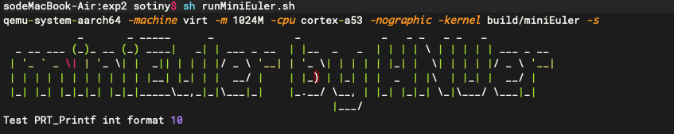

实验二 Hello, miniEuler
=========================

print函数是学习几乎任何一种软件开发语言时最先学习使用的函数，同时该函数也是最基本和原始的程序调试手段，但该函数的实现却并不简单。本实验的目的在于理解操作系统与硬件的接口方法，并实现一个可打印字符的函数（非系统调用），用于后续的调试和开发。

了解virt机器
--------------------------

操作系统介于硬件和应用程序之间，向下管理硬件资源，向上提供应用编程接口。设计并实现操作系统需要熟悉底层硬件的组成及其操作方法。

本系列实验都会在QEMU模拟器上完成，首先来了解一下模拟的机器信息。可以通过下列两种方法：

1. 查看QEMU关于 `virt的描述 <https://www.qemu.org/docs/master/system/arm/virt.html>`_ ， 或者查看QEMU的源码，如github上的 `virt.h <https://github.com/qemu/qemu/blob/master/include/hw/arm/virt.h>`_ 和 `virt.c <https://github.com/qemu/qemu/blob/master/hw/arm/virt.c>`_。virt.c中可见如下有关内存映射的内容。
   
.. code-block:: c

  static const MemMapEntry base_memmap[] = {
      /* Space up to 0x8000000 is reserved for a boot ROM */
      [VIRT_FLASH] =              {          0, 0x08000000 },
      [VIRT_CPUPERIPHS] =         { 0x08000000, 0x00020000 },
      /* GIC distributor and CPU interfaces sit inside the CPU peripheral space */
      [VIRT_GIC_DIST] =           { 0x08000000, 0x00010000 },
      [VIRT_GIC_CPU] =            { 0x08010000, 0x00010000 },
      [VIRT_GIC_V2M] =            { 0x08020000, 0x00001000 },
      [VIRT_GIC_HYP] =            { 0x08030000, 0x00010000 },
      [VIRT_GIC_VCPU] =           { 0x08040000, 0x00010000 },
      /* The space in between here is reserved for GICv3 CPU/vCPU/HYP */
      [VIRT_GIC_ITS] =            { 0x08080000, 0x00020000 },
      /* This redistributor space allows up to 2*64kB*123 CPUs */
      [VIRT_GIC_REDIST] =         { 0x080A0000, 0x00F60000 },
      [VIRT_UART] =               { 0x09000000, 0x00001000 },
      [VIRT_RTC] =                { 0x09010000, 0x00001000 },
      [VIRT_FW_CFG] =             { 0x09020000, 0x00000018 },
      [VIRT_GPIO] =               { 0x09030000, 0x00001000 },
      [VIRT_SECURE_UART] =        { 0x09040000, 0x00001000 },
      [VIRT_SMMU] =               { 0x09050000, 0x00020000 },
      [VIRT_PCDIMM_ACPI] =        { 0x09070000, MEMORY_HOTPLUG_IO_LEN },
      [VIRT_ACPI_GED] =           { 0x09080000, ACPI_GED_EVT_SEL_LEN },
      [VIRT_NVDIMM_ACPI] =        { 0x09090000, NVDIMM_ACPI_IO_LEN},
      [VIRT_PVTIME] =             { 0x090a0000, 0x00010000 },
      [VIRT_SECURE_GPIO] =        { 0x090b0000, 0x00001000 },
      [VIRT_MMIO] =               { 0x0a000000, 0x00000200 },
      /* ...repeating for a total of NUM_VIRTIO_TRANSPORTS, each of that size */
      [VIRT_PLATFORM_BUS] =       { 0x0c000000, 0x02000000 },
      [VIRT_SECURE_MEM] =         { 0x0e000000, 0x01000000 },
      [VIRT_PCIE_MMIO] =          { 0x10000000, 0x2eff0000 },
      [VIRT_PCIE_PIO] =           { 0x3eff0000, 0x00010000 },
      [VIRT_PCIE_ECAM] =          { 0x3f000000, 0x01000000 },
      /* Actual RAM size depends on initial RAM and device memory settings */
      [VIRT_MEM] =                { GiB, LEGACY_RAMLIMIT_BYTES },
  };

2. 通过QEMU导出设备树 

  1. 安装设备树格式转换工具

  Mac下安装

  .. code-block:: console
    
    
    $  brew install dtc

  Linux下安装

  .. code-block:: console

    $ apt-get install device-tree-compiler

  2. 通过QEMU导出设备树并转成可读格式

  .. code-block:: console

    $ qemu-system-aarch64 -machine virt,dumpdtb=virt.dtb -cpu cortex-a53 -nographic 
    $ dtc -I dtb -O dts -o virt.dts virt.dtb

  .. note::
    -machine virt 指明机器类型为virt，这是QEMU仿真的虚拟机器。

  virt.dtb转换后生成的virt.dts中可找到如下内容

  .. code-block::

    pl011@9000000 {
        clock-names = "uartclk\0apb_pclk";
        clocks = <0x8000 0x8000>;
        interrupts = <0x00 0x01 0x04>;
        reg = <0x00 0x9000000 0x00 0x1000>;
        compatible = "arm,pl011\0arm,primecell";
    };
        
    chosen {
        stdout-path = "/pl011@9000000";
        kaslr-seed = <0xcbd0568d 0xb463306c>;
    };

  由上可以看出，virt机器包含有pl011的设备，该设备的寄存器在0x9000000开始处。pl011实际上是一个UART设备，即串口。可以看到virt选择使用pl011作为标准输出，这是因为与PC不同，大部分嵌入式系统默认情况下并不包含VGA设备。

实现 PRT_Printf 函数
--------------------------

.. 我们参照 `Writing an OS in Rust <https://os.phil-opp.com/vga-text-mode/>`_ （ `中文版 <https://github.com/rustcc/writing-an-os-in-rust/blob/master/03-vga-text-mode.md>`_ ）来实现println!宏，但与之不同，我们使用串口来输出，而不是通过操作VGA的Frame Buffer。

本系列实验每个实验均依赖前序相关实验，因此可拷贝 lab1 目录并重命名为 lab2 ，在 lab2 目录中再操作（后续实验照此操作）。

新建 src/bsp/print.c 文件，完成如下部分。

宏定义
^^^^^^^^^^^^^^^^^^^^^

在 print.c 中包含所需头文件，并定义后续将会用到的宏

.. code-block:: c
    :linenos:

    #include <stdarg.h>
    #include "prt_typedef.h"

    #define UART_0_REG_BASE 0x09000000 // pl011 设备寄存器地址
    // 寄存器及其位定义参见：https://developer.arm.com/documentation/ddi0183/g/programmers-model/summary-of-registers
    #define DW_UART_THR 0x00 // UARTDR(Data Register) 寄存器
    #define DW_UART_FR 0x18  // UARTFR(Flag Register) 寄存器
    #define DW_UART_LCR_HR 0x2c  // UARTLCR_H(Line Control Register) 寄存器
    #define DW_XFIFO_NOT_FULL 0x020  // 发送缓冲区满置位
    #define DW_FIFO_ENABLE 0x10 // 启用发送和接收FIFO

    #define UART_BUSY_TIMEOUT   1000000
    #define OS_MAX_SHOW_LEN 0x200

    #define UART_REG_READ(addr)          (*(volatile U32 *)(((uintptr_t)addr)))  // 读设备寄存器
    #define UART_REG_WRITE(value, addr)  (*(volatile U32 *)((uintptr_t)addr) = (U32)value) // 写设备寄存器

串口的初始化
^^^^^^^^^^^^^^^^^^^^^

.. note::
  如何操作硬件通常需要阅读硬件制造商提供的技术手册。如pl011串口设备（PrimeCell UART）是arm设计的，其技术参考手册可以通过其 `官网 <https://developer.arm.com/documentation/ddi0183/latest/>`_ 查看。也可以通过顶部的下载链接下载pdf版本，如下图所示。

  .. image:: down-pl011-ref.png

  依据之前virt.dts中的描述，pl011的寄存器在virt机器中被映射到了0x9000000的内存位置。通过访问pl011的技术参考手册中的“Chapter 3. Programmers Model”中的”Summary of registers“一节可知，第0号寄存器是pl011串口的数据寄存器，用于数据的收发。其详细描述参见 `这里 <https://developer.arm.com/documentation/ddi0183/g/programmers-model/register-descriptions/data-register--uartdr?lang=en>`_。

  注意到我们只是向UART0写入，而没从UART0读出（如果读出会读出其他设备通过串口发送过来的数据，而不是刚才写入的数据，注意体会这与读写内存时是不一样的，详情参见pl011的技术手册），编译器在优化时可能对这部分代码进行错误的优化，如把这些操作都忽略掉。在 UART_REG_READ 宏和 UART_REG_WRITE 宏中使用 volatile 关键字的目的是告诉编译器，这些读取或写入有特定目的，不应将其优化（也就是告诉编译器不要瞎优化，这些写入和读出都有特定用途。如连续两次读，编译器可能认为第二次读就是前次的值，所以优化掉第二次读，但对外设寄存器的连续读可能返回不同的值。再比如写，编译器可能认为写后没有读所以写没有作用，或者连续的写会覆盖前面的写，但对外设而言对这些寄存器的写入都有特定作用）。

.. code-block:: c
    :linenos:

    U32 PRT_UartInit(void)
    {
        U32 result = 0;
        U32 reg_base = UART_0_REG_BASE;
        // LCR寄存器： https://developer.arm.com/documentation/ddi0183/g/programmers-model/register-descriptions/line-control-register--uartlcr-h?lang=en
        result = UART_REG_READ((unsigned long)(reg_base + DW_UART_LCR_HR));
        UART_REG_WRITE(result | DW_FIFO_ENABLE, (unsigned long)(reg_base + DW_UART_LCR_HR)); // 启用 FIFO

        return OS_OK;
    }

往串口发送字符
^^^^^^^^^^^^^^^^^^^^^

.. code-block:: C
    :linenos:

    // 读 reg_base + offset 寄存器的值。 uartno 参数未使用
    S32 uart_reg_read(S32 uartno, U32 offset, U32 *val)
    {
        S32 ret;
        U32 reg_base = UART_0_REG_BASE;

        *val = UART_REG_READ((unsigned long)(reg_base + offset));
        return OS_OK;
    }

    // 通过检查 FR 寄存器的标志位确定发送缓冲是否满，满时返回1.
    S32 uart_is_txfifo_full(S32 uartno)
    {
        S32 ret;
        U32 usr = 0;

        ret = uart_reg_read(uartno, DW_UART_FR, &usr);
        if (ret) {
            return OS_OK;
        }

        return (usr & DW_XFIFO_NOT_FULL);
    }

    // 往 reg_base + offset 寄存器中写入值 val。
    void uart_reg_write(S32 uartno, U32 offset, U32 val) 
    {
        S32 ret;
        U32 reg_base = UART_0_REG_BASE;

        UART_REG_WRITE(val, (unsigned long)(reg_base + offset));
        return;
    }

    // 通过轮询的方式发送字符到串口
    void uart_poll_send(unsigned char ch)
    {

        S32 timeout = 0;
        S32 max_timeout = UART_BUSY_TIMEOUT;

        // 轮询发送缓冲区是否满
        int result = uart_is_txfifo_full(0);
        while (result) {
            timeout++;
            if (timeout >= max_timeout) {
                return;
            }
            result = uart_is_txfifo_full(0);
        }

        // 如果缓冲区没满，通过往数据寄存器写入数据发送字符到串口
        uart_reg_write(0, DW_UART_THR, (U32)(U8)ch);
        return;
    }

    // 轮询的方式发送字符到串口，且转义换行符
    void TryPutc(unsigned char ch)
    {
        uart_poll_send(ch);
        if (ch == '\n') {
            uart_poll_send('\r');
        }
    }

上面的代码很简单，就是通过轮询的方式向 PL011 的数据寄存器 DR 写入数据即可实现往串口发送字符，实现字符输出。

支持格式化输出
^^^^^^^^^^^^^^^^^^^^^

.. code-block:: C
    :linenos:

    extern int  vsnprintf_s(char *buff, int buff_size, int count, char const *fmt, va_list arg);
    int TryPrintf(const char *format, va_list vaList)
    {
        int len;
        char buff[OS_MAX_SHOW_LEN] = {0};
        char *str = buff;
        
        len = vsnprintf_s(buff, OS_MAX_SHOW_LEN, OS_MAX_SHOW_LEN, format, vaList);
        if (len == -1) {
            return len;
        }
        
        while (*str != '\0') {
            TryPutc(*str);
            str++;
        }
        
        return OS_OK;
    }

    U32 PRT_Printf(const char *format, ...)
    {
        va_list vaList;
        S32 count;
        
        va_start(vaList, format);
        count = TryPrintf(format, vaList);
        va_end(vaList);
        
        return count;
    }

为了实现与 C 语言中 printf 函数类似的格式化功能，我们要用到可变参数列表 va_list 。而真正实现格式化控制转换的函数是 vsnprintf_s 函数。

实现 vsnprintf_s 函数  
^^^^^^^^^^^^^^^^^^^^^^^^^^^

新建 src/bsp/vsnprintf_s.c 实现 vsnprintf_s 函数

vsnprintf_s 函数的主要作用是依据格式控制符将可变参数列表转换成字符列表写入缓冲区。UniProton 提供了 libboundscheck 库，其中实现了 vsnprintf_s 函数，作为可选作业你可以试着使用 libboundscheck 库中的 vsnprintf_s 函数。简单起见，我们从另一个国产实时操作系统 RT-Thread 的 `kservice.c <https://github.com/RT-Thread/rt-thread/blob/master/src/kservice.c>`_ 中引入了一个实现并进行了简单修改。 可以在 `这里 <../\_static/vsnprintf_s.c>`_ 下载 vsnprintf_s.c。

.. hint::

    你可以读一读 vsnprintf_s 函数的实现代码，但由于与操作系统关键技术的相关性较弱，我们不过多说明。

    从这里你也可以看出计算机里没有魔法，魔法只是别人帮你做了而已。所以学习一定要去神秘化！

调用 PRT_Printf 函数
^^^^^^^^^^^^^^^^^^^^^^^^^^^

main.c 修改为调用 PRT_Printf 函数输出信息。 

.. code-block:: C
    :linenos:

    #include "prt_typedef.h"

    extern U32 PRT_Printf(const char *format, ...);
    extern void PRT_UartInit(void);

    S32 main(void)
    {
        PRT_UartInit();

        PRT_Printf("Test PRT_Printf int format %d \n\n", 10);
    }

将新增文件纳入构建系统
^^^^^^^^^^^^^^^^^^^^^^^^^^^

修改 src/bsp/CMakeLists.txt 文件加入新增文件 print.c 和 vsnprintf_s.c

    .. code-block:: cmake
        :linenos:

        set(SRCS start.S prt_reset_vector.S print.c vsnprintf_s.c)
        add_library(bsp OBJECT ${SRCS})  # OBJECT类型只编译生成.o目标文件，但不实际链接成库

启用 FPU
^^^^^^^^^^^^^^^^^^^^^^^^^^^

构建项目并执行发现程序没有任何输出。 需启用 FPU (src/bsp/start.S)。

.. code-block:: asm
    :linenos:

    Start:
        LDR    x1, =__os_sys_sp_end // ld文件中定义，堆栈设置
        BIC    sp, x1, #0xf

    //参考： https://developer.arm.com/documentation/den0024/a/Memory-Ordering/Barriers/ISB-in-more-detail
    Enable_FPU: 
        MRS X1, CPACR_EL1
        ORR X1, X1, #(0x3 << 20)
        MSR CPACR_EL1, X1
        ISB

        B      OsEnterMain 

Hello, miniEuler
^^^^^^^^^^^^^^^^^^^^^^^^^^^

再次构建项目并执行，发现已可正常输出。至此，我们获得了一个基本的输出和调试手段，如我们可以在系统崩溃时调用 PRT_Printf 函数进行输出。

我们可以利用 PRT_Printf 函数来打印一个文本 banner 让我们写的 OS 显得专业一点😁。 `manytools.org <https://manytools.org/hacker-tools/ascii-banner/>`_ 可以创建 ascii banner，选择你喜欢的样式和文字（下面选择的是 Standard 样式），然后在 main.c 的 main 函数中调用 PRT_Printf 输出。

.. code-block:: c
    :linenos:

    S32 main(void)
    {
        PRT_UartInit();

        PRT_Printf("            _       _ _____      _             _             _   _ _   _ _   _           \n");
        PRT_Printf("  _ __ ___ (_)_ __ (_) ____|   _| | ___ _ __  | |__  _   _  | | | | \\ | | | | | ___ _ __ \n");
        PRT_Printf(" | '_ ` _ \\| | '_ \\| |  _|| | | | |/ _ \\ '__| | '_ \\| | | | | |_| |  \\| | | | |/ _ \\ '__|\n");
        PRT_Printf(" | | | | | | | | | | | |__| |_| | |  __/ |    | |_) | |_| | |  _  | |\\  | |_| |  __/ |   \n");
        PRT_Printf(" |_| |_| |_|_|_| |_|_|_____\\__,_|_|\\___|_|    |_.__/ \\__, | |_| |_|_| \\_|\\___/ \\___|_|   \n");
        PRT_Printf("                                                     |___/                               \n");

        PRT_Printf("Test PRT_Printf int format %d \n\n", 10);
    }

构建项目并执行
^^^^^^^^^^^^^^^^^^^^^^^^^^^

lab2 作业
--------------------------

完成下列实验，并撰写实验报告。

作业1 
^^^^^^^^^^^^^^^^^^^^^^^^^^^

不启用 fifo，通过检测 UARTFR 寄存器的 TXFE 位来发送数据。

作业2（可选）
^^^^^^^^^^^^^^^^^^^^^^^^^^^
  
采用 UniProton 提供的 libboundscheck 库实现 vsnprintf_s 函数。