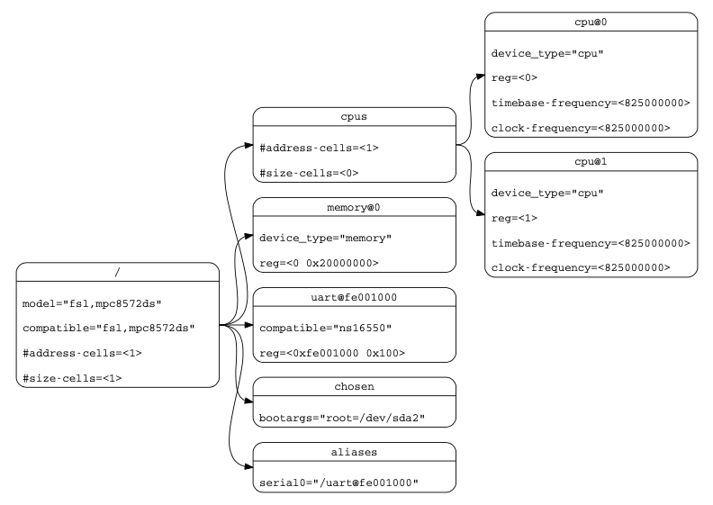

实验三 设备树（可选）
=====================

设备树是用于解决ARM等嵌入式系统由于设备种类纷繁复杂导致的与平台相关的大量内核代码被大量重复的问题。通过设备树来描述系统硬件及其属性，然后通过bootLoader将其传递给kernel，以便kernel可以有较大的灵活性。如下图所示设备树的例子。

https://www.devicetree.org/ 旨在促进devicetree标准的发展，其最新的版本为 `设备树规范 v0.4-rc1 <https://github.com/devicetree-org/devicetree-specification/releases/download/v0.4-rc1/devicetree-specification-v0.4-rc1.pdf>`_。 `kernel.org <https://www.kernel.org/doc/Documentation/devicetree/bindings/arm/>`_ 上有关于设备树的例子，如 `cpu <https://www.kernel.org/doc/Documentation/devicetree/bindings/arm/cpus.txt>`_ 的描述。

设备树是描述硬件的数据结构。 无需将设备的每个细节都硬编码到操作系统中，可以在引导时通过DTB这种形式的数据结构对硬件的各方面进行描述，然后传递给操作系统从而增强操作系统的灵活性。 设备树由 OpenFirmware、OpenPOWER 抽象层 (OPAL)、Power Architecture Platform Requirements (PAPR) 以独立的 Flattened Device Tree (FDT) 形式使用。

基本上，那些可以动态探测到的设备是不需要描述的，例如USB device。不过对于SOC上的usb host controller，它是无法动态识别的，需要在device tree中描述。同样的道理，在computer system中，PCI device可以被动态探测到，不需要在device tree中描述，但是PCI bridge如果不能被探测，那么就需要描述 [1]_。

很多系统工具是OS开发过程中自然产生的需求，如将.dtb文件进行解析并转换成可读的.dts格式。

.. hint:: 由于本系列实验暂时没有使用bootloader，而是通过QEMU将内核直接加载到内存，所以不会借由设备树往kernel传递参数。

.. [1] http://www.wowotech.net/device_model/dt_basic_concept.html

实验内容
-----------------------

依据 `设备树规范 <https://github.com/devicetree-org/devicetree-specification/releases/download/v0.4-rc1/devicetree-specification-v0.4-rc1.pdf>`_ 选择你熟悉的语言编写程序解析virt.dtb文件。

