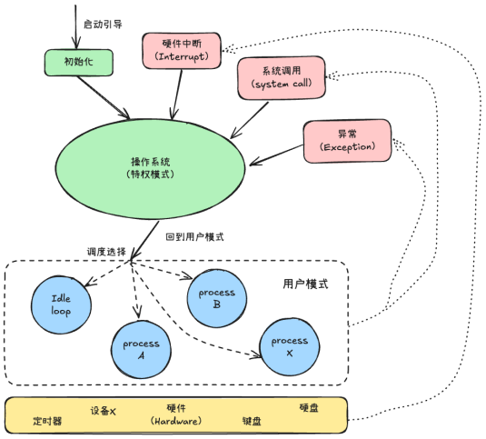
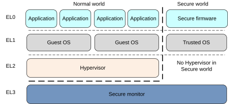

实验四 异常处理
=====================

中断、异常和陷阱指令是操作系统的基石，现代操作系统就是由中断驱动的。本实验学习ARMv8的中断与异常处理，并自己实现一条系统调用。

陷入操作系统
--------------------------

如下图所示，操作系统是一个多入口的程序，执行陷阱（Trap）指令，出现异常、发生中断时都会陷入到操作系统。

.. attention:: 在Arm中，理论课中所说的硬件中断、异常、陷阱指令统称为异常Exception。

ARMv8的中断与异常处理
------------------------------

.. attention:: 访问Arm官网下载并阅读 `ARM Cortex-A Series Programmer's Guide for ARMv8-A <https://www.arm.com/architecture/learn-the-architecture/a-profile>`_ 和 `AArch64 Exception and Interrupt Handling <https://developer.arm.com/documentation/102412/latest/>`_ 等技术参考手册。
            
ARMv8 架构定义了两种执行状态(Execution States)，AArch64 和 AArch32。分别对应使用64位宽通用寄存器或32位宽通用寄存器的执行。

上图所示为AArch64中的异常级别(Exception levels)的组织。可见AArch64中共有4个异常级别，分别为EL0，EL1，EL2和EL3。在AArch64中，Interrupt是Exception的子类型，称为异常。 AArch64 中有四种类型的异常（IRQ、FIQ、SError又属于Asynchronous exceptions  异步异常 ） [1]_ ：
- Sync（Synchronous exceptions，同步异常），在执行时触发的异常，例如在尝试访问不存在的内存地址时。
- IRQ （Interrupt requests，中断请求），由外部设备产生的中断
- FIQ （Fast Interrupt Requests，快速中断请求），类似于IRQ，但具有更高的优先级，因此 FIQ 中断服务程序不能被其他 IRQ 或 FIQ 中断。
- SError （System Error，系统错误），用于外部数据中止的异步中断。

当异常发生时，处理器将执行与该异常对应的异常处理代码。在ARM架构中，这些异常处理代码将会被保存在内存的异常向量表中。每一个异常级别（EL0，EL1，EL2和EL3）都有其对应的异常向量表。需要注意的是，与x86等架构不同，该表包含的是要执行的指令，而不是函数地址 [2]_ 

异常向量表的基地址由VBAR_ELn给出，然后每个表项都有一个从该基地址定义的偏移量。 每个表有16个表项，每个表项的大小为128（0x80）字节（32 条指令）。 该表实际上由4组，每组4个表项组成。 分别是：

- 发生于当前异常级别的异常且SPSel寄存器选择SP0 [3]_ ， Sync、IRQ、FIQ、SError对应的4个异常处理。
- 发生于当前异常级别的异常且SPSel寄存器选择SPx [3]_ ， Sync、IRQ、FIQ、SError对应的4个异常处理。
- 发生于较低异常级别的异常且执行状态为AArch64， Sync、IRQ、FIQ、SError对应的4个异常处理。
- 发生于较低异常级别的异常且执行状态为AArch32， Sync、IRQ、FIQ、SError对应的4个异常处理。

.. - 异常类型（SError、FIQ、IRQ 或 Sync）
.. - 如果是在当前异常级别发生异常，使用的堆栈指针（SP0 或 SPx）的情况。
.. - 如果是在较低的异常级别发生的异常，执行状态（AArch64 或 AArch32）的情况。

异常向量表
^^^^^^^^^^^^^^^^^^^^^^^^

新建 src/bsp/prt_vector.S 文件，参照这里 [2]_ 定义异常向量表如下：

.. code-block:: asm
    :linenos:

        .section .os.vector.text, "ax"

        .global  OsVectorTable
        .type  OsVectorTable,function

        .align 13

    OsVectorTable:
    .set    VBAR, OsVectorTable
    .org VBAR                                // Synchronous, Current EL with SP_EL0
        EXC_HANDLE  0 OsExcDispatch

    .org (VBAR + 0x80)                       // IRQ/vIRQ, Current EL with SP_EL0
        EXC_HANDLE  1 OsExcDispatch

    .org (VBAR + 0x100)                      // FIQ/vFIQ, Current EL with SP_EL0
        EXC_HANDLE  2 OsExcDispatch

    .org (VBAR + 0x180)                      // SERROR, Current EL with SP_EL0
        EXC_HANDLE  3 OsExcDispatch

    .org (VBAR + 0x200)                      // Synchronous, Current EL with SP_ELx
        EXC_HANDLE  4 OsExcDispatch

    .org (VBAR + 0x280)                      // IRQ/vIRQ, Current EL with SP_ELx
        EXC_HANDLE  5 OsExcDispatch

    .org (VBAR + 0x300)                      // FIQ/vFIQ, Current EL with SP_ELx
        EXC_HANDLE  6 OsExcDispatch

    .org (VBAR + 0x380)                      // SERROR, Current EL with SP_ELx
        EXC_HANDLE  7 OsExcDispatch

    .org (VBAR + 0x400)                      // Synchronous, EL changes and the target EL is using AArch64
        EXC_HANDLE  8 OsExcDispatchFromLowEl

    .org (VBAR + 0x480)                      // IRQ/vIRQ, EL changes and the target EL is using AArch64
        EXC_HANDLE  9 OsExcDispatch

    .org (VBAR + 0x500)                      // FIQ/vFIQ, EL changes and the target EL is using AArch64
        EXC_HANDLE  10 OsExcDispatch

    .org (VBAR + 0x580)                      // SERROR, EL changes and the target EL is using AArch64
        EXC_HANDLE  11 OsExcDispatch

    .org (VBAR + 0x600)                      // Synchronous, L changes and the target EL is using AArch32
        EXC_HANDLE  12 OsExcDispatch

    .org (VBAR + 0x680)                      // IRQ/vIRQ, EL changes and the target EL is using AArch32
        EXC_HANDLE  13 OsExcDispatch

    .org (VBAR + 0x700)                      // FIQ/vFIQ, EL changes and the target EL is using AArch32
        EXC_HANDLE  14 OsExcDispatch

    .org (VBAR + 0x780)                      // SERROR, EL changes and the target EL is using AArch32
        EXC_HANDLE  15 OsExcDispatch

        .text

可以看到：针对4组，每组4类异常共16类异常均定义有其对应的入口，且其入口均定义为 EXC_HANDLE vecId handler 的形式。

.. hint:: 关于异常向量表可参见`Arm官网 <https://developer.arm.com/documentation/102412/0103/Handling-exceptions/Taking-an-exception>` 页AArch64 vector tables 节的说明。与理论课程中介绍的稍有区别，Arm的异常向量表中不是异常处理函数的入口地址，而是直接的进行异常处理的指令（vector tables are an area of normal memory containing instructions that are then used to handle the exception.）。
.. hint:: CPSR 寄存器中有当前栈的选择 bits[0] 0:SP_EL0,1:SP_ELX

在 prt_reset_vector.S 中的 OsEnterMain: 标号后加入代码

.. code-blocK:: asm
    :linenos:

    OsVectTblInit: // 设置 EL1 级别的异常向量表
        LDR x0, =OsVectorTable
        MSR VBAR_EL1, X0

上面代码将定义的中断向量表的地址赋给 VBAR_EL1（Vector Base Address Register）寄存器。寄存器详情查看： [4]_ 

.. hint:: 这里设置的EL1级别的异常向量表，EL1级别在Arm v8中一般对应为OS。

上下文保存与恢复
^^^^^^^^^^^^^^^^^^^^^^^^

EXC_HANDLE 实际上是一个宏。宏（Macro）是一种由预处理器处理的文本替换机制，在预编译阶段会将宏名直接替换为后面的定义的文本。

在src/bsp/prt_vector.S 文件的开头加入代码。

.. code-block:: asm
    :linenos:

    .global OsExcHandleEntry
    .type   OsExcHandleEntry, function

    .macro SAVE_EXC_REGS  // 保存通用寄存器的值到栈中
        stp    x1, x0, [sp,#-16]!
        stp    x3, x2, [sp,#-16]!
        stp    x5, x4, [sp,#-16]!
        stp    x7, x6, [sp,#-16]!
        stp    x9, x8, [sp,#-16]!
        stp    x11, x10, [sp,#-16]!
        stp    x13, x12, [sp,#-16]!
        stp    x15, x14, [sp,#-16]!
        stp    x17, x16, [sp,#-16]!
        stp    x19, x18, [sp,#-16]!
        stp    x21, x20, [sp,#-16]!
        stp    x23, x22, [sp,#-16]!
        stp    x25, x24, [sp,#-16]!
        stp    x27, x26, [sp,#-16]!
        stp    x29, x28, [sp,#-16]!
        stp    xzr, x30, [sp,#-16]!
    .endm

    .macro RESTORE_EXC_REGS  // 从栈中恢复通用寄存器的值
        ldp    xzr, x30, [sp],#16
        ldp    x29, x28, [sp],#16
        ldp    x27, x26, [sp],#16
        ldp    x25, x24, [sp],#16
        ldp    x23, x22, [sp],#16
        ldp    x21, x20, [sp],#16
        ldp    x19, x18, [sp],#16
        ldp    x17, x16, [sp],#16
        ldp    x15, x14, [sp],#16
        ldp    x13, x12, [sp],#16
        ldp    x11, x10, [sp],#16
        ldp    x9, x8, [sp],#16
        ldp    x7, x6, [sp],#16
        ldp    x5, x4, [sp],#16
        ldp    x3, x2, [sp],#16
        ldp    x1, x0, [sp],#16
    .endm

    .macro EXC_HANDLE vecId handler
        SAVE_EXC_REGS // 保存寄存器宏

        mov x1, #\vecId // x1 记录异常类型
        b   \handler // 跳转到异常处理
    .endm

EXC_HANDLE 宏的主要作用是一发生异常就立即保存CPU寄存器的值，然后跳转到异常处理函数进行异常处理。
L43 通过L4-L21定义的 SAVE_EXC_REGS 宏保存通用寄存器的值到栈中（即理论课所述“保存上下文”）
L45 把vecId 保存到 x1 寄存器中备用
L46 跳转到异常处理函数进行处理

.. hint:: .macro是汇编定义宏的方式，C语言可通过#define定义宏。

随后，我们继续在 src/bsp/prt_vector.S 文件中实现异常处理函数，包括 OsExcDispatch 和 OsExcDispatchFromLowEl。

.. code-block:: asm
    :linenos:

        .global OsExcHandleEntry
        .type   OsExcHandleEntry, function

        .global OsExcHandleEntryFromLowEl
        .type   OsExcHandleEntryFromLowEl, function
        

        .section .os.init.text, "ax"
        .globl OsExcDispatch
        .type OsExcDispatch, @function
        .align 4
    OsExcDispatch:
        mrs    x5, esr_el1
        mrs    x4, far_el1
        mrs    x3, spsr_el1
        mrs    x2, elr_el1
        stp    x4, x5, [sp,#-16]!
        stp    x2, x3, [sp,#-16]!

        mov    x0, x1  // x0： 异常类型
        mov    x1, sp  // x1: 栈指针
        bl     OsExcHandleEntry  // 跳转到实际的 C 处理函数， x0, x1分别为该函数的第1，2个参数。

        ldp    x2, x3, [sp],#16
        add    sp, sp, #16        // 跳过far, esr, HCR_EL2.TRVM==1的时候，EL1不能写far, esr
        msr    spsr_el1, x3
        msr    elr_el1, x2
        dsb    sy
        isb

        RESTORE_EXC_REGS // 恢复上下文
        
        eret //从异常返回

        
        .globl OsExcDispatchFromLowEl
        .type OsExcDispatchFromLowEl, @function
        .align 4
    OsExcDispatchFromLowEl:
        mrs    x5, esr_el1
        mrs    x4, far_el1
        mrs    x3, spsr_el1
        mrs    x2, elr_el1
        stp    x4, x5, [sp,#-16]!
        stp    x2, x3, [sp,#-16]!

        mov    x0, x1
        mov    x1, sp
        bl     OsExcHandleFromLowElEntry

        ldp    x2, x3, [sp],#16
        add    sp, sp, #16        // 跳过far, esr, HCR_EL2.TRVM==1的时候，EL1不能写far, esr
        msr    spsr_el1, x3
        msr    elr_el1, x2
        dsb    sy
        isb

        RESTORE_EXC_REGS // 恢复上下文
        
        eret //从异常返回

OsExcDispatch 和OsExcDispatchFromLowEl 作为异常处理EXC_HANDLE vecId handler 中的handler。

首先 OsExcDispatch保存了4个系统寄存器到栈中（L13-L18），包括：esr（Exception Syndrome Register，异常原因），far（Fault Address Register，发生fault的虚拟地址），spsr（Saved Program Status Register，保存的程序状态），elr（Exception Link Register，异常返回地址）寄存器。

然后OsExcDispatch调用实际的异常处理 OsExcHandleEntry 函数（L22），其中函数有两个参数，通过寄存器x0 （保存有异常类型，EXC_HANDLE宏中传递的 vecId）和 x1（保存有sp指针）传递。

当执行完 OsExcHandleEntry 函数后，通过宏 RESTORE_EXC_REGS依序恢复通用寄存器的值（即理论课程中所述的“恢复上下文”）

OsExcDispatchFromLowEl 与 OsExcDispatch 类似，其操作除调用的实际异常处理函数（OsExcHandleFromLowElEntry）不同外其它完全一致，不再赘述。

.. hint:: 以 EXC_HANDLE  0 OsExcDispatch 为例的整个异常处理过程。首先 EXC_HANDLE  0 OsExcDispatch在异常向量表中定义。其中 EXC_HANDLE 是宏，该宏首先保存所用通用寄存器的值，然后记录vecId（这里为0）到x1寄存器，然后b直接（不返回）跳转到 OsExcDispatch 标号处。在OsExcDispatch 中首先保存4个系统寄存器esr，far，spsr，elr的值，然后调用 OsExcHandleEntry  C函数进行真正的异常处理，然后再顺序恢复elr和spsr的值（esr，far不需要恢复），之后再通过 RESTORE_EXC_REGS 恢复通用寄存器的值，最后通过eret 从异常中返回。

异常处理函数
^^^^^^^^^^^^^^^^^^^^^^^^

新建 src/bsp/prt_exc.c 文件，实现实际的 OsExcHandleEntry 和 OsExcHandleFromLowElEntry 异常处理函数。

.. code-block:: c
    :linenos:

    #include "prt_typedef.h"
    #include "os_exc_armv8.h"

    extern U32 PRT_Printf(const char *format, ...);

    // ExcRegInfo 格式与 OsExcDispatch 中寄存器存储顺序对应
    void OsExcHandleEntry(U32 excType, struct ExcRegInfo *excRegs)
    {
        PRT_Printf("Catch a exception.\n");
    }

    // ExcRegInfo 格式与 OsExcDispatchFromLowEl 中寄存器存储顺序对应
    void OsExcHandleFromLowElEntry(U32 excType, struct ExcRegInfo *excRegs)
    {
        PRT_Printf("Catch a exception from low exception level.\n");
    }

注意到上面两个异常处理函数的第2个参数是 struct ExcRegInfo * 类型，而在 src/bsp/prt_vector.S 中我们为该参数传递是栈指针 sp。所以该结构需与异常处理寄存器保存的顺序保持一致。

步骤 2新建 src/bsp/os_exc_armv8.h 文件，定义 ExcRegInfo 结构与宏SAVE_EXC_REGS 及标号 OsExcDispatch/ OsExcDispatchFromLowEl 处寄存器保存顺序相一致。

.. code-block:: C
    :linenos:

    #ifndef ARMV8_EXC_H
    #define ARMV8_EXC_H

    #include "prt_typedef.h"

    #define XREGS_NUM       31

    struct ExcRegInfo {
        // 以下字段的内存布局与TskContext保持一致
        uintptr_t elr;                  // 返回地址
        uintptr_t spsr;
        uintptr_t far;
        uintptr_t esr;
        uintptr_t xzr;
        uintptr_t xregs[XREGS_NUM];     // 0~30 : x30~x0
    };

    #endif /* ARMV8_EXC_H */

.. hint:: 注意把上面的新增文件加入构建系统。

触发异常
^^^^^^^^^^^^^^^^^^^^^^^^^^

注释掉 FPU 启用代码，构建系统并执行发现没有任何信息输出，通过调试将会观察到异常。

.. hint:: 作业2请参照此处。

系统调用
--------------------------

.. hint:: 下面请启用 FPU。

系统调用是通用操作系统为应用程序提供服务的方式，理解系统调用对理解通用操作系统的实现非常重要。下面我们来实现1条简单的系统调用。

EL 0 是用户程序所在的级别，而在lab1中我们已经知道CPU启动后进入的是EL1或以上级别。
在 main 函数中我们首先返回到 EL0 级别，然后通过 SVC （Supervisor call）指令（ 参考：[5]_ ）来陷入EL1操作系统级别，执行系统调用。

.. code-block:: C
    :linenos:

    S32 main(void)
    {
        
        const char Test_SVC_str[] = "Hello, my first system call!"; 

        PRT_UartInit();

        PRT_Printf("            _       _ _____      _             _             _   _ _   _ _   _           \n");
        PRT_Printf("  _ __ ___ (_)_ __ (_) ____|   _| | ___ _ __  | |__  _   _  | | | | \\ | | | | | ___ _ __ \n");
        PRT_Printf(" | '_ ` _ \\| | '_ \\| |  _|| | | | |/ _ \\ '__| | '_ \\| | | | | |_| |  \\| | | | |/ _ \\ '__|\n");
        PRT_Printf(" | | | | | | | | | | | |__| |_| | |  __/ |    | |_) | |_| | |  _  | |\\  | |_| |  __/ |   \n");
        PRT_Printf(" |_| |_| |_|_|_| |_|_|_____\\__,_|_|\\___|_|    |_.__/ \\__, | |_| |_|_| \\_|\\___/ \\___|_|   \n");
        PRT_Printf("                                                     |___/                               \n");

        PRT_Printf("ctr-a h: print help of qemu emulator. ctr-a x: quit emulator.\n\n");

        // 回到异常 EL 0级别，模拟系统调用，查看异常的处理，了解系统调用实现机制。
        // 《Bare-metal Boot Code for ARMv8-A Processors》
        OS_EMBED_ASM(
            "MOV    X1, #0b00000\n" // Determine the EL0 Execution state.
            "MSR    SPSR_EL1, X1\n"
            "ADR    x1, EL0Entry\n" // Points to the first instruction of EL0 code
            " MSR    ELR_EL1, X1\n"
            "eret\n"  // 返回到 EL 0 级别
            "EL0Entry: \n"
            "MOV x0, %0 \n" //参数1
            "MOV x8, #1\n" //在linux中,用x8传递 syscall number，保持一致。
            "SVC 0\n"    // 系统调用
            "B .\n" // 死循环，以上代码只用于演示，EL0级别的栈未正确设置
            ::"r"(&Test_SVC_str[0])
        );

        
        // 在 EL1 级别上模拟系统调用
        // OS_EMBED_ASM("SVC 0");
        return 0;

    }

L21的OS_EMBED_ASM 在 prt_typedef.h 中定义为 __asm__ __volatile__，用于 C 与 ASM 混合编程。
L22-L26 退回到EL0级别。L22-L23 设定EL0的执行状态；L24-L25 设定从EL1返回EL0后的执行位置；L26 从EL1返回到EL0.
L27 标号 EL0Entry 即L24-L25定义的返回EL0后的执行位置。
SVC 是 arm 中的系统调用指令，相当于 x86 中的 int 指令。
L28-L30 第一个参数x0传递字符串Test_SVC_str地址，x8传递系统调用号（模拟Linux中用x8寄存器传递系统调用号，实际上可直接用SVC后的16位立即数指定系统调用号，这里我们将其设为0），通过 SVC 0 执行系统调用。

.. hint::汇编语法可以参考 GNU ARM Assembler Quick Reference [6]_ 、GNU assembler [6]_ 和 Arm Architecture Reference Manual Armv8 (Chapter C3 A64 Instruction Set Overview) [7]_
     
.. hint:: 需要启用FPU。

系统调用实现
^^^^^^^^^^^^^^^^^^^^^

在 src/bsp/prt_exc.c 修改 OsExcHandleFromLowElEntry 函数实现 1 条系统调用。

.. code-block:: c
    :linenos:

    extern void TryPutc(unsigned char ch);
    void MyFirstSyscall(char *str)
    {
        while (*str != '\0') {
            TryPutc(*str);
            str++;
        }
    }
    // ExcRegInfo 格式与 OsExcDispatch 中寄存器存储顺序对应
    void OsExcHandleFromLowElEntry(U32 excType, struct ExcRegInfo *excRegs)
    {
        int ExcClass = (excRegs->esr&0xfc000000)>>26;
        if (ExcClass == 0x15){ //SVC instruction execution in AArch64 state.
            PRT_Printf("Catch a SVC call.\n");
            // syscall number存在x8寄存器中, x0为参数1
            int syscall_num = excRegs->xregs[(XREGS_NUM - 1)- 8]; //uniproton存储的顺序x0在高，x30在低
            uintptr_t param0 = excRegs->xregs[(XREGS_NUM - 1)- 0];
            PRT_Printf("syscall number: %d, param 0: 0x%x\n", syscall_num, param0);  

            switch(syscall_num){
                case 1:
                    MyFirstSyscall((void *)param0);
                    break;
                default:
                    PRT_Printf("Unimplemented syscall.\n");
            }
        }else{
            PRT_Printf("Catch a exception.\n");

        }
    }

L12-L13 通过esr寄存器确认是由 SVC 指令执行引发的异常
L14-L26 系统调用处理，其中L16获取从x8传递的系统调用号，L17获取从x0传递的字符串地址，L20-L26 依据系统调用号执行对应功能。

lab4 作业
--------------------------

作业1 
^^^^^^^^^^^^^^^^^^^^^^^^^^^

查找 启用FPU 前异常出现的位置和原因。禁用FPU后PRT_Printf工作不正常，需通过调试跟踪查看异常发生的位置和原因 elr_el1 esr_el1 寄存器

.. [1] https://developer.arm.com/documentation/102412/0103/Exception-types/Asynchronous-exceptions
.. [2] https://developer.arm.com/documentation/102412/0103/Handling-exceptions/Taking-an-exception
.. [3] https://developer.arm.com/documentation/den0024/a/ARMv8-Registers/AArch64-special-registers/Stack-pointer
.. [4] https://developer.arm.com/documentation/ddi0601/latest/?lang=en
.. [5] https://developer.arm.com/documentation/102374/0102/System-calls
.. [6] https://sourceware.org/binutils/docs/as/index.html
.. [7] https://developer.arm.com/documentation/ddi0487/gb 

