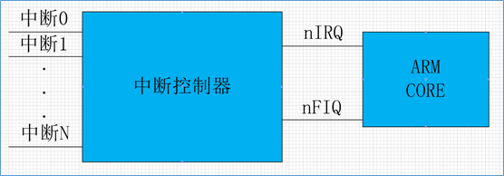
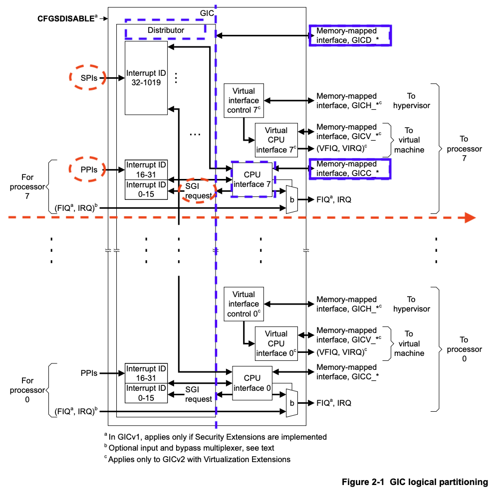

实验五 时钟Tick
=====================

Arm的中断系统
--------------------------

.. 中断
.. ^^^^^^^^^^^^^^^^^^^^^

中断是一种硬件机制。借助于中断，CPU可以不必再采用轮询这种低效的方式访问外部设备。将所有的外部设备与CPU直接相连是不现实的，外部设备的中断请求一般经由中断控制器，由中断控制器仲裁后再转发给CPU。如下图所示Arm的中断系统。

其中nIRQ是普通中断，nFIQ是快速中断。 Arm采用的中断控制器叫做GIC，即general interrupt controller。gic包括多个版本，如GICv1（已弃用），GICv2，GICv3，GICv4。简单起见，我们实验将选用GICv2版本。

为了配置好gicv2中断控制器，与pl011串口一样，我们需要阅读其技术参考手册。访问Arm官网在 `这里 <https://developer.arm.com/documentation/ihi0048/latest>`_ 下载ARM Generic Interrupt Controller Architecture Specification - version 2.0 的pdf版本。

从上图（来源于ARM Generic Interrupt Controller Architecture Specification - version 2.0中的Chapter 2 GIC Partitioning）可以看出：

- GICv2 最多支持8个核的中断管理。
- GIC包括两大主要部分（由图中蓝色虚竖线分隔，Distributor和CPU Interface由蓝色虚矩形框标示），分别是：

  - Distributor，其通过GICD_开头的寄存器进行控制（蓝色实矩形框标示）
  - CPU Interface，其通过GICC_开头的寄存器进行控制（蓝色实矩形框标示）

- 中断类型分为以下几类（由图中红色虚线椭圆标示）：

  - SPI：（shared peripheral interrupt），共享外设中断。该中断来源于外设，通过Distributor分发给特定的core，其中断编号为32-1019。从图中可以看到所有核共享SPI。
  - PPI：（private peripheral interrupt），私有外设中断。该中断来源于外设，但只对指定的core有效，中断信号只会发送给指定的core，其中断编号为16-31。从图中可以看到每个core都有自己的PPI。
  - SGI：（software-generated interrupt），软中断。软件产生的中断，用于给其他的core发送中断信号，其中断编号为0-15。
  - virtual interrupt，虚拟中断，用于支持虚拟机。图中也可以看到，因为我们暂时不关心，所以没有标注。
  - 此外可以看到(FIQ, IRQ)可通过b进行旁路，我们也不关心。如感兴趣可以查看技术手册了解细节。

此外，由ARM Generic Interrupt Controller Architecture Specification - version 2.0 (section 1.4.2)可知，外设中断可由两种方式触发：

- edge-triggered: 边沿触发，当检测到中断信号上升沿时中断有效。
- level-sensitive：电平触发，当中断源为指定电平时中断有效。

因为soc中，中断有很多，为了方便对中断的管理，对每个中断，附加了中断优先级。在中断仲裁时，高优先级的中断，会优于低优先级的中断，发送给cpu处理。当cpu在响应低优先级中断时，如果此时来了高优先级中断，那么高优先级中断会抢占低优先级中断，而被处理器响应。

由ARM Generic Interrupt Controller Architecture Specification - version 2.0 (section 3.3)可知，GICv2最多支持256个中断优先级。GICv2中规定，所支持的中断优先级别数与GIC的具体实现有关，如果支持的中断优先级数比256少（最少为16），则8位优先级的低位为0，且遵循RAZ/WI（Read-As-Zero, Writes Ignored）原则。

GICv2初始化
--------------------------

由下图中virt.dts中intc和timer的部分

.. code-block:: dts

	intc@8000000 {
		phandle = <0x8001>;
		reg = <0x00 0x8000000 0x00 0x10000 0x00 0x8010000 0x00 0x10000>;
		compatible = "arm,cortex-a15-gic";
		ranges;
		#size-cells = <0x02>;
		#address-cells = <0x02>;
		interrupt-controller;
		#interrupt-cells = <0x03>;

		v2m@8020000 {
			phandle = <0x8002>;
			reg = <0x00 0x8020000 0x00 0x1000>;
			msi-controller;
			compatible = "arm,gic-v2m-frame";
		};
	};

	timer {
		interrupts = <0x01 0x0d 0x104 0x01 0x0e 0x104 0x01 0x0b 0x104 0x01 0x0a 0x104>;
		always-on;
		compatible = "arm,armv8-timer\0arm,armv7-timer";
	};

并结合kernel.org中关于 `ARM Generic Interrupt Controller <https://www.kernel.org/doc/Documentation/devicetree/bindings/interrupt-controller/arm%2Cgic.txt>`_ 和 `ARM architected timer <https://www.kernel.org/doc/Documentation/devicetree/bindings/arm/arch_timer.txt>`_ 的devicetree的说明可知：

- intc中的 ``reg`` 指明GICD寄存器映射到内存的位置为0x8000000，长度为0x10000， GICC寄存器映射到内存的位置为0x8010000，长度为0x10000
- intc中的 ``#interrupt-cells`` 指明 interrupts 包括3个cells。`第一个文档 <https://www.kernel.org/doc/Documentation/devicetree/bindings/interrupt-controller/arm%2Cgic.txt>`_ 指明：第一个cell为中断类型，0表示SPI，1表示PPI；第二个cell为中断号，SPI范围为[0-987]，PPI为[0-15]；第三个cell为flags，其中[3:0]位表示触发类型，4表示高电平触发，[15:8]为PPI的cpu中断掩码，每1位对应一个cpu，为1表示该中断会连接到对应的cpu。
- 以timer设备为例，其中包括4个中断。以第二个中断的参数 ``0x01 0x0e 0x104`` 为例，其指明该中断为PPI类型的中断，中断号14， 路由到第一个cpu，且高电平触发。但注意到PPI的起始中断号为16，所以实际上该中断在GICv2中的中断号应为16 + 14 = 30。

阅读ARM Generic Interrupt Controller Architecture Specification - version 2.0，在其Chapter 4 Programmers’ Model部分有关于GICD和GICC寄存器的描述，以及如何使能Distributor和CPU Interfaces的方法。

新建 src/bsp/hwi_init.c 文件，初始化 GIC

.. code-block:: c
    :linenos:

    #include "prt_typedef.h"
    #include "os_attr_armv8_external.h"

    #define OS_GIC_VER                 2

    #define GIC_DIST_BASE              0x08000000
    #define GIC_CPU_BASE               0x08010000

    #define GICD_CTLR                  (GIC_DIST_BASE + 0x0000U)
    #define GICD_TYPER                 (GIC_DIST_BASE + 0x0004U)
    #define GICD_IIDR                  (GIC_DIST_BASE + 0x0008U)
    #define GICD_IGROUPRn              (GIC_DIST_BASE + 0x0080U)
    #define GICD_ISENABLERn            (GIC_DIST_BASE + 0x0100U)
    #define GICD_ICENABLERn            (GIC_DIST_BASE + 0x0180U)
    #define GICD_ISPENDRn              (GIC_DIST_BASE + 0x0200U)
    #define GICD_ICPENDRn              (GIC_DIST_BASE + 0x0280U)
    #define GICD_ISACTIVERn            (GIC_DIST_BASE + 0x0300U)
    #define GICD_ICACTIVERn            (GIC_DIST_BASE + 0x0380U)
    #define GICD_IPRIORITYn            (GIC_DIST_BASE + 0x0400U)
    #define GICD_ICFGR                 (GIC_DIST_BASE + 0x0C00U)

    #define GICD_CTLR_ENABLE                1  /* Enable GICD */
    #define GICD_CTLR_DISABLE               0     /* Disable GICD */
    #define GICD_ISENABLER_SIZE             32
    #define GICD_ICENABLER_SIZE             32
    #define GICD_ICPENDR_SIZE               32
    #define GICD_IPRIORITY_SIZE             4
    #define GICD_IPRIORITY_BITS             8
    #define GICD_ICFGR_SIZE                 16
    #define GICD_ICFGR_BITS                 2

    #define GICC_CTLR                  (GIC_CPU_BASE  + 0x0000U)
    #define GICC_PMR                   (GIC_CPU_BASE  + 0x0004U)
    #define GICC_BPR                   (GIC_CPU_BASE  + 0x0008U)
    #define IAR_MASK        0x3FFU
    #define GICC_IAR		(GIC_CPU_BASE + 0xc)
    #define GICC_EOIR		(GIC_CPU_BASE + 0x10)
    #define	GICD_SGIR		(GIC_DIST_BASE + 0xf00)

    #define BIT(n)                     (1 << (n))

    #define GICC_CTLR_ENABLEGRP0       BIT(0)
    #define GICC_CTLR_ENABLEGRP1       BIT(1)
    #define GICC_CTLR_FIQBYPDISGRP0    BIT(5)
    #define GICC_CTLR_IRQBYPDISGRP0    BIT(6)
    #define GICC_CTLR_FIQBYPDISGRP1    BIT(7)
    #define GICC_CTLR_IRQBYPDISGRP1    BIT(8)

    #define GICC_CTLR_ENABLE_MASK      (GICC_CTLR_ENABLEGRP0 | \
                                        GICC_CTLR_ENABLEGRP1)

    #define GICC_CTLR_BYPASS_MASK      (GICC_CTLR_FIQBYPDISGRP0 | \
                                        GICC_CTLR_IRQBYPDISGRP0 | \
                                        GICC_CTLR_FIQBYPDISGRP1 | \
                                        GICC_CTLR_IRQBYPDISGRP1)    

    #define GICC_CTLR_ENABLE            1
    #define GICC_CTLR_DISABLE           0
    // Priority Mask Register. interrupt priority filter, Higher priority corresponds to a lower Priority field value.
    #define GICC_PMR_PRIO_LOW           0xff
    // The register defines the point at which the priority value fields split into two parts,
    // the group priority field and the subpriority field. The group priority field is used to
    // determine interrupt preemption. NO GROUP.
    #define GICC_BPR_NO_GROUP           0x00

    #define GIC_REG_READ(addr)         (*(volatile U32 *)((uintptr_t)(addr)))
    #define GIC_REG_WRITE(addr, data)  (*(volatile U32 *)((uintptr_t)(addr)) = (U32)(data))

    void OsGicInitCpuInterface(void)
    {
        // 初始化Gicv2的distributor和cpu interface
        // 禁用distributor和cpu interface后进行相应配置
        GIC_REG_WRITE(GICD_CTLR, GICD_CTLR_DISABLE);
        GIC_REG_WRITE(GICC_CTLR, GICC_CTLR_DISABLE);
        GIC_REG_WRITE(GICC_PMR, GICC_PMR_PRIO_LOW);
        GIC_REG_WRITE(GICC_BPR, GICC_BPR_NO_GROUP);

        // 启用distributor和cpu interface
        GIC_REG_WRITE(GICD_CTLR, GICD_CTLR_ENABLE);
        GIC_REG_WRITE(GICC_CTLR, GICC_CTLR_ENABLE);

    }

    // src/arch/drv/gic/prt_gic_init.c
    /*
    * 描述: 去使能（禁用）指定中断
    */
    OS_SEC_L4_TEXT void OsGicDisableInt(U32 intId)
    {
        // Interrupt Clear-Enable Registers
    }

    /*
    * 描述: 使能指定中断
    */
    OS_SEC_L4_TEXT void OsGicEnableInt(U32 intId)
    {
        // Interrupt Set-Enable Registers    
    }

    OS_SEC_L4_TEXT void OsGicClearInt(uint32_t interrupt) 
    {
        GIC_REG_WRITE(GICD_ICPENDRn + (interrupt / GICD_ICPENDR_SIZE)*sizeof(U32), 1 << (interrupt % GICD_ICPENDR_SIZE));
    }

    // 设置中断号为interrupt的中断的优先级为priority
    OS_SEC_L4_TEXT void OsGicIntSetPriority(uint32_t interrupt, uint32_t priority) {
        uint32_t shift = (interrupt % GICD_IPRIORITY_SIZE) * GICD_IPRIORITY_BITS;
        volatile uint32_t* addr = ((volatile U32 *)(uintptr_t)(GICD_IPRIORITYn + (interrupt / GICD_IPRIORITY_SIZE) * sizeof(U32))) ;
        uint32_t value = GIC_REG_READ(addr);
        value &= ~(0xff << shift); // 每个中断占8位，所以掩码为 0xFF
        value |= priority << shift;
        GIC_REG_WRITE(addr, value);
    }

    // 设置中断号为interrupt的中断的属性为config
    OS_SEC_L4_TEXT void OsGicIntSetConfig(uint32_t interrupt, uint32_t config) {
        uint32_t shift = (interrupt % GICD_ICFGR_SIZE) * GICD_ICFGR_BITS;
        volatile uint32_t* addr = ((volatile U32 *)(uintptr_t)(GICD_ICFGR + (interrupt / GICD_ICFGR_SIZE)*sizeof(U32)));
        uint32_t value = GIC_REG_READ(addr);
        value &= ~(0x03 << shift);
        value |= config << shift;
        GIC_REG_WRITE(addr, value);
    }

    /*
    * 描述: 中断确认
    */
    OS_SEC_L4_TEXT U32 OsGicIntAcknowledge(void)
    {
        // reads this register to obtain the interrupt ID of the signaled interrupt.
        // This read acts as an acknowledge for the interrupt.
        U32 value = GIC_REG_READ(GICC_IAR);
        return value;
    }

    /*
    * 描述: 标记中断完成，清除相应中断位
    */
    OS_SEC_L4_TEXT void OsGicIntClear(U32 value)
    {
        // A processor writes to this register to inform the CPU interface either:
        // • that it has completed the processing of the specified interrupt
        // • in a GICv2 implementation, when the appropriate GICC_CTLR.EOImode bit is set to 1, to indicate that the interface should perform priority drop for the specified interrupt.
        GIC_REG_WRITE(GICC_EOIR, value);
    }

    U32 OsHwiInit(void)
    {

        OsGicInitCpuInterface();

        return OS_OK;
    }

在 hwi_init.c 中 OsHwiInit 函数实现 GIC 的初始化，此外还提供了其他函数实现开关指定中断、设置中断属性、确认中断和标记中断完成等功能。

.. attention:: 你需要参照 OsGicIntSetPriority 等函数实现 OsGicEnableInt 和 OsGicClearInt 函数。

使能时钟中断
---------------------------
新建 src/include/prt_config.h 

.. code-block:: C
    :linenos:

    /* Tick中断时间间隔，tick处理时间不能超过1/OS_TICK_PER_SECOND(s) */
    #define OS_TICK_PER_SECOND                              1000

新建 src/include/os_cpu_armv8.h。

.. code-block:: C
    :linenos:

    #ifndef OS_CPU_ARMV8_H
    #define OS_CPU_ARMV8_H

    #include "prt_typedef.h"

    // CurrentEl等级
    #define CURRENT_EL_2       0x8
    #define CURRENT_EL_1       0x4
    #define CURRENT_EL_0       0x0

    #define DAIF_DBG_BIT      (1U << 3)
    #define DAIF_ABT_BIT      (1U << 2)
    #define DAIF_IRQ_BIT      (1U << 1)
    #define DAIF_FIQ_BIT      (1U << 0)

    #define INT_MASK          (1U << 7)

    #define PRT_DSB() OS_EMBED_ASM("DSB sy" : : : "memory")
    #define PRT_DMB() OS_EMBED_ASM("DMB sy" : : : "memory")
    #define PRT_ISB() OS_EMBED_ASM("ISB" : : : "memory")

    #endif /* OS_CPU_ARMV8_H */

新建 src/bsp/timer.c 文件，对定时器和对应的中断进行配置

.. code-block:: c

    #include "prt_typedef.h"
    #include "prt_config.h"
    #include "os_cpu_armv8.h"

    U64 g_timerFrequency;
    extern void OsGicIntSetConfig(uint32_t interrupt, uint32_t config);
    extern void OsGicIntSetPriority(uint32_t interrupt, uint32_t priority);
    extern void OsGicEnableInt(U32 intId);
    extern void OsGicClearInt(uint32_t interrupt);

    void CoreTimerInit(void)
    {
        // 配置中断控制器
        OsGicIntSetConfig(30, 0); // 配置为电平触发
        OsGicIntSetPriority(30, 0); // 优先级为0
        OsGicClearInt(30); // 清除中断
        OsGicEnableInt(30); // 启用中断

        // 配置定时器
        OS_EMBED_ASM("MRS %0, CNTFRQ_EL0" : "=r"(g_timerFrequency) : : "memory", "cc"); //读取时钟频率

        U32 cfgMask = 0x0;
        U64 cycle = g_timerFrequency / OS_TICK_PER_SECOND;
        
        OS_EMBED_ASM("MSR CNTP_CTL_EL0, %0" : : "r"(cfgMask) : "memory");
        PRT_ISB();
        OS_EMBED_ASM("MSR CNTP_TVAL_EL0, %0" : : "r"(cycle) : "memory", "cc"); //设置中断周期
        
        cfgMask = 0x1;
        OS_EMBED_ASM("MSR CNTP_CTL_EL0, %0" : : "r"(cfgMask) : "memory"); //启用定时器 enable=1, imask=0, istatus= 0,
        OS_EMBED_ASM("MSR DAIFCLR, #2");
    }

时钟中断处理
---------------------------

- 将 prt_vector.S 中的 EXC_HANDLE  5 OsExcDispatch 改为 EXC_HANDLE  5 OsHwiDispatcher，表明我们将对 IRQ 类型的异常（即中断）使用 OsHwiDispatcher 处理。

    .. hint:: 需修改为 EXC_HANDLE  5 OsHwiDispatcher ，否则还是 OsExcDispatch 函数处理，仅会输出 "Catch a exception." 信息

- 在 prt_vector.S 中加入 OsHwiDispatcher 处理代码，其类似于之前的 OsExcDispatch ，因此不再说明。

    .. code-block:: asm
        :linenos:

            .globl OsHwiDispatcher
            .type OsHwiDispatcher, @function
            .align 4
        OsHwiDispatcher:
            mrs    x5, esr_el1
            mrs    x4, far_el1
            mrs    x3, spsr_el1
            mrs    x2, elr_el1
            stp    x4, x5, [sp,#-16]!
            stp    x2, x3, [sp,#-16]!

            mov    x0, x1  // 异常类型0~15，参见异常向量表
            mov    x1, sp  // 异常时寄存器信息，通过栈及其sp指针提供
            bl     OsHwiDispatch

            ldp    x2, x3, [sp],#16
            add    sp, sp, #16        // 跳过far, esr, HCR_EL2.TRVM==1的时候，EL1不能写far, esr
            msr    spsr_el1, x3
            msr    elr_el1, x2
            dsb    sy
            isb

            RESTORE_EXC_REGS // 恢复上下文
            
            eret //从异常返回

- 在 prt_exc.c 中引用头文件 os_attr_armv8_external.h  ， os_cpu_armv8.h  ， OsHwiDispatch 处理 IRQ 类型的中断。

    

    .. code-block:: C
        :linenos:

        extern void OsTickDispatcher(void);
        OS_SEC_ALW_INLINE INLINE void OsHwiHandleActive(U32 irqNum)
        {
            switch(irqNum){
                case 30: 
                    OsTickDispatcher();
                    // PRT_Printf(".");
                    break;
                default:
                    break;
            }
        }

        extern  U32 OsGicIntAcknowledge(void);
        extern void OsGicIntClear(U32 value);
        // src/arch/cpu/armv8/common/hwi/prt_hwi.c  OsHwiDispatch(),OsHwiDispatchHandle()
        /*
        * 描述: 中断处理入口, 调用处外部已关中断
        */
        OS_SEC_L0_TEXT void OsHwiDispatch( U32 excType, struct ExcRegInfo *excRegs) //src/arch/cpu/armv8/common/hwi/prt_hwi.c
        {
            // 中断确认，相当于OsHwiNumGet()
            U32 value = OsGicIntAcknowledge();
            U32 irq_num = value & 0x1ff;
            U32 core_num = value & 0xe00;

            OsHwiHandleActive(irq_num);

            // 清除中断，相当于 OsHwiClear(hwiNum);
            OsGicIntClear(irq_num|core_num);
        }

    src/bsp/os_attr_armv8_external.h 头文件可以在 `此处 <../\_static/os_attr_armv8_external.h>`_ 下载。 

- 新建 src/kernel/tick/prt_tick.c 文件，提供 OsTickDispatcher 时钟中断处理函数。

    .. code-block:: c
        :linenos:

        #include "os_attr_armv8_external.h"
        #include "prt_typedef.h"
        #include "prt_config.h"
        #include "os_cpu_armv8_external.h"

        extern U64 g_timerFrequency;

        /* Tick计数 */
        OS_SEC_BSS U64 g_uniTicks; //src/core/kernel/sys/prt_sys.c

        /*
        * 描述：Tick中断的处理函数。扫描任务超时链表、扫描超时软件定时器、扫描TSKMON等。
        */
        OS_SEC_TEXT void OsTickDispatcher(void)
        {
            uintptr_t intSave;

            intSave = OsIntLock();
            g_uniTicks++;
            OsIntRestore(intSave);

            U64 cycle = g_timerFrequency / OS_TICK_PER_SECOND;
            OS_EMBED_ASM("MSR CNTP_TVAL_EL0, %0" : : "r"(cycle) : "memory", "cc"); //设置中断周期
            
        }

        /*
        * 描述：获取当前的tick计数
        */
        OS_SEC_L2_TEXT U64 PRT_TickGetCount(void) //src/core/kernel/sys/prt_sys_time.c
        {
            return g_uniTicks;
        }

注意需将 hwi_init.c timer.c prt_tick.c 等文件加入构建系统。

.. hint:: src/kernel， src/kernel/tick 目录下均需加入 CMakeLists.txt， src/ 和 src/bsp/ 下的 CMakeLists.txt 需修改。其中，
    
    src/kernel/tick/CMakeLists.txt 类似 src/bsp/CMakeLists.txt
    
    src/kernel/CMakeLists.txt 内容为：  add_subdirectory(tick)
    
    src/CMakeLists.txt 需修改增加include目录、包含子目录和编译目标： 

        .. code-block:: c

            ... ...
            include_directories( 
                ${CMAKE_CURRENT_SOURCE_DIR}/include   # 增加 src/include 目录
                ${CMAKE_CURRENT_SOURCE_DIR}/bsp
            )

            add_subdirectory(bsp) 
            add_subdirectory(kernel) # 增加 kernel 子目录

            list(APPEND OBJS $<TARGET_OBJECTS:bsp> $<TARGET_OBJECTS:tick>) # 增加 $<TARGET_OBJECTS:tick> 目标
            add_executable(${APP} main.c ${OBJS})
    
    后续实验中若新增文件加入构建系统不再赘述，请参照此处。

- 在 OsTickDispatcher 中调用了 OsIntLock 和 OsIntRestore 函数，这两个函数用于关中断和开中断。简单起见，将其放入 prt_exc.c 中。

    .. code-block:: c
        :linenos:

        /*
        * 描述: 开启全局可屏蔽中断。
        */
        OS_SEC_L0_TEXT uintptr_t PRT_HwiUnLock(void) //src/arch/cpu/armv8/common/hwi/prt_hwi.c
        {
            uintptr_t state = 0;

            OS_EMBED_ASM(
                "mrs %0, DAIF      \n"
                "msr DAIFClr, %1   \n"
                : "=r"(state)
                : "i"(DAIF_IRQ_BIT)
                : "memory", "cc");

            return state & INT_MASK;
        }

        /*
        * 描述: 关闭全局可屏蔽中断。
        */
        OS_SEC_L0_TEXT uintptr_t PRT_HwiLock(void) //src/arch/cpu/armv8/common/hwi/prt_hwi.c
        {
            uintptr_t state = 0;
            OS_EMBED_ASM(
                "mrs %0, DAIF      \n"
                "msr DAIFSet, %1   \n"
                : "=r"(state)
                : "i"(DAIF_IRQ_BIT)
                : "memory", "cc");
            return state & INT_MASK;
        }

        /*
        * 描述: 恢复原中断状态寄存器。
        */
        OS_SEC_L0_TEXT void PRT_HwiRestore(uintptr_t intSave) //src/arch/cpu/armv8/common/hwi/prt_hwi.c
        {
            if ((intSave & INT_MASK) == 0) {
                OS_EMBED_ASM(
                    "msr DAIFClr, %0\n"
                    :
                    : "i"(DAIF_IRQ_BIT)
                    : "memory", "cc");
            } else {
                OS_EMBED_ASM(
                    "msr DAIFSet, %0\n"
                    :
                    : "i"(DAIF_IRQ_BIT)
                    : "memory", "cc");
            }
            return;
        }

头文件 src/bsp/os_cpu_armv8_external.h

    .. code-block:: C
        :linenos:

        #ifndef OS_CPU_ARMV8_EXTERNAL_H
        #define OS_CPU_ARMV8_EXTERNAL_H

        extern uintptr_t PRT_HwiUnLock(void);
        extern uintptr_t PRT_HwiLock(void);
        extern void PRT_HwiRestore(uintptr_t intSave);

        #define OsIntUnLock() PRT_HwiUnLock()
        #define OsIntLock()   PRT_HwiLock()
        #define OsIntRestore(intSave) PRT_HwiRestore(intSave)

        #endif 

读取系统Tick值
--------------------

新建 prt_tick.h，声明 Tick 相关的接口函数.

.. code-block:: c
    :linenos:

    #ifndef PRT_TICK_H
    #define PRT_TICK_H

    #include "prt_typedef.h"

    extern U64 PRT_TickGetCount(void);

    #endif /* PRT_TICK_H */

main.c 修改为：

.. code-block:: c
    :linenos:

    #include "prt_typedef.h"
    #include "prt_tick.h"

    extern U32 PRT_Printf(const char *format, ...);
    extern void PRT_UartInit(void);
    extern void CoreTimerInit(void);
    extern U32 OsHwiInit(void);

    U64 delay_time = 10000;

    S32 main(void)
    {
        // 初始化GIC
        OsHwiInit();
        // 启用Timer
        CoreTimerInit();

        PRT_UartInit();

        PRT_Printf("            _       _ _____      _             _             _   _ _   _ _   _           \n");
        PRT_Printf("  _ __ ___ (_)_ __ (_) ____|   _| | ___ _ __  | |__  _   _  | | | | \\ | | | | | ___ _ __ \n");
        PRT_Printf(" | '_ ` _ \\| | '_ \\| |  _|| | | | |/ _ \\ '__| | '_ \\| | | | | |_| |  \\| | | | |/ _ \\ '__|\n");
        PRT_Printf(" | | | | | | | | | | | |__| |_| | |  __/ |    | |_) | |_| | |  _  | |\\  | |_| |  __/ |   \n");
        PRT_Printf(" |_| |_| |_|_|_| |_|_|_____\\__,_|_|\\___|_|    |_.__/ \\__, | |_| |_|_| \\_|\\___/ \\___|_|   \n");
        PRT_Printf("                                                     |___/                               \n");

        PRT_Printf("ctr-a h: print help of qemu emulator. ctr-a x: quit emulator.\n\n");

        for(int i = 0; i < 10; i++)
        {

            U32 tick = PRT_TickGetCount();
            PRT_Printf("[%d] current tick: %u\n", i, tick);

            //delay
            int delay_time = 10000000;  // 根据自己机器计算能力不同调整该值
            while(delay_time>0){
                PRT_TickGetCount();  //消耗时间，防止延时代码被编译器优化
                delay_time--;
            }
        
        }

        while(1);
        return 0;

    }

 
lab5 作业
--------------------------

作业1 
^^^^^^^^^^^^^^^^^^^^^^^^^^^

实现 hwi_init.c 中缺失的 OsGicEnableInt 和 OsGicClearInt 函数。

.. 作业2 
.. ^^^^^^^^^^^^^^^^^^^^^^^^^^^
.. 将 PRT_TickGetCount 实现为系统调用。

.. [1] https://developer.arm.com/documentation/den0024/a/Fundamentals-of-ARMv8/Execution-states
.. [2] https://developer.arm.com/documentation/den0024/a/AArch64-Exception-Handling/Synchronous-and-asynchronous-exceptions
.. [3] https://developer.arm.com/documentation/den0024/a/AArch64-Exception-Handling/AArch64-exception-table
.. [4] https://developer.arm.com/documentation/den0024/a/ARMv8-Registers/AArch64-special-registers/Stack-pointer
.. [5] https://www.ic.unicamp.br/~celio/mc404-2014/docs/gnu-arm-directives.pdf
.. [6] https://developer.arm.com/documentation/ddi0487/gb
.. [7] https://doc.rust-lang.org/reference/inline-assembly.html#register-operands
.. [8] https://cloud.tencent.com/developer/article/1520799

