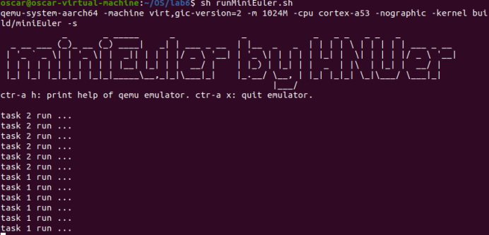

实验六 任务调度
=====================

本实验旨在实现一个任务调度器。任务调度是操作系统的核心功能之一。 UniProton实现的是一个单进程支持多线程的操作系统。在UniProton中，一个任务表示一个线程。UniProton中的任务为抢占式调度机制，而非时间片轮转调度方式。高优先级的任务可打断低优先级任务，低优先级任务必须在高优先级任务挂起或阻塞后才能得到调度。

基础数据结构：双向链表
--------------------------

首先新建src/include/list_types.h 文件，并在其中定义双向链表结构 TagListObject。

.. code-block:: c
    :linenos:

    #ifndef _LIST_TYPES_H
    #define _LIST_TYPES_H

    struct TagListObject {
        struct TagListObject *prev;
        struct TagListObject *next;
    };

    #endif  /* end _LIST_TYPES_H */

L4-L7 定义的双向链表结构非常简单。这个结构本身不包含任何实际的数据字段，仅包含 prev 和 next两个指针，prev指向前驱节点，next指向后继节点。

然后新建 src/include/prt_list_external.h 文件，其中定义链表各种相关操作。

.. code-block:: c
    :linenos:

    #ifndef PRT_LIST_EXTERNAL_H
    #define PRT_LIST_EXTERNAL_H

    #include "prt_typedef.h"
    #include "list_types.h"

    #define LIST_OBJECT_INIT(object) { \
            &(object), &(object)       \
        }

    #define INIT_LIST_OBJECT(object)   \
        do {                           \
            (object)->next = (object); \
            (object)->prev = (object); \
        } while (0)

    #define LIST_LAST(object) ((object)->prev)
    #define LIST_FIRST(object) ((object)->next)
    #define OS_LIST_FIRST(object) ((object)->next)

    /* list action low level add */
    OS_SEC_ALW_INLINE INLINE void ListLowLevelAdd(struct TagListObject *newNode, struct TagListObject *prev,
                                                struct TagListObject *next)
    {
        newNode->next = next;
        newNode->prev = prev;
        next->prev = newNode;
        prev->next = newNode;
    }

    /* list action add */
    OS_SEC_ALW_INLINE INLINE void ListAdd(struct TagListObject *newNode, struct TagListObject *listObject)
    {
        ListLowLevelAdd(newNode, listObject, listObject->next);
    }

    /* list action tail add */
    OS_SEC_ALW_INLINE INLINE void ListTailAdd(struct TagListObject *newNode, struct TagListObject *listObject)
    {
        ListLowLevelAdd(newNode, listObject->prev, listObject);
    }

    /* list action lowel delete */
    OS_SEC_ALW_INLINE INLINE void ListLowLevelDelete(struct TagListObject *prevNode, struct TagListObject *nextNode)
    {
        nextNode->prev = prevNode;
        prevNode->next = nextNode;
    }

    /* list action delete */
    OS_SEC_ALW_INLINE INLINE void ListDelete(struct TagListObject *node)
    {
        ListLowLevelDelete(node->prev, node->next);

        node->next = NULL;
        node->prev = NULL;
    }

    /* list action empty */
    OS_SEC_ALW_INLINE INLINE bool ListEmpty(const struct TagListObject *listObject)
    {
        return (bool)((listObject->next == listObject) && (listObject->prev == listObject));
    }

    #define OFFSET_OF_FIELD(type, field) ((uintptr_t)((uintptr_t)(&((type *)0x10)->field) - (uintptr_t)0x10))

    #define COMPLEX_OF(ptr, type, field) ((type *)((uintptr_t)(ptr) - OFFSET_OF_FIELD(type, field)))

    /* 根据成员地址得到控制块首地址, ptr成员地址, type控制块结构, field成员名 */
    #define LIST_COMPONENT(ptrOfList, typeOfList, fieldOfList) COMPLEX_OF(ptrOfList, typeOfList, fieldOfList)

    #define LIST_FOR_EACH(posOfList, listObject, typeOfList, field)                                                    \
        for ((posOfList) = LIST_COMPONENT((listObject)->next, typeOfList, field); &(posOfList)->field != (listObject); \
            (posOfList) = LIST_COMPONENT((posOfList)->field.next, typeOfList, field))

    #define LIST_FOR_EACH_SAFE(posOfList, listObject, typeOfList, field)                \
        for ((posOfList) = LIST_COMPONENT((listObject)->next, typeOfList, field);       \
            (&(posOfList)->field != (listObject))&&((posOfList)->field.next != NULL);  \
            (posOfList) = LIST_COMPONENT((posOfList)->field.next, typeOfList, field))

    #endif /* PRT_LIST_EXTERNAL_H */

L7-L19 是一些宏定义。其中： 
  - LIST_OBJECT_INIT 静态初始化一个链表，使得它的 prev 和 next 都指向它自己（空表状态），如 struct TagListObject listOne = LIST_OBJECT_INIT(listOne); ；
  - INIT_LIST_OBJECT 宏用于运行时动态初始化链表，注意该宏采用do{ } while(0)的形式定义，其目的是为了使该宏可以作为整体像一条语句一样安全使用，如在if-else中。如已定义了一个链表结构 listTwo，可以在运行时通过 INIT_LIST_OBJECT(&listTwo); 来初始化；
  - LIST_FIRST/ OS_LIST_FIRST 访问链表的第一个节点，LIST_LAST 访问链表的最后一个节点。
L22-L57 以内联方式定义了双向链表的一些基础操作函数，主要包括在头部添加节点 ListAdd，在尾部添加节点 ListTailAdd，删除节点 ListDelete 以及判断是否链表是否为空 ListEmpty 等。
L65-L70 定义了3个宏，这是此文件中最有趣的部分，可仔细分析理解。这3个宏后一个依赖于前一个。其中：
  - OFFSET_OF_FIELD 宏计算一个结构中的某个field相对于结构的偏移，其原理很简单，就是将一个地址 （0x10） 强制转换为指定类型获得其field地址后与结构地址相减，0x10也可以是别的地址，但如果是0x0的话一些编译器可能会将其视为非法访问。
  - COMPLEX_OF 宏给定一个结构中某个field的地址 ptr，结构类型 type，和地址ptr对应的field，反推出结构本身的起始地址，该宏更常被命名为：CONTAINER_OF。
  - LIST_COMPONENT 宏则只是COMPLEX_OF 宏的别名，使其用于链表操作时代码更加直观可读。
L72-L79 定义了两个宏 LIST_FOR_EACH 和 LIST_FOR_EACH_SAFE 定义遍历链表时的for条件，主要用于简化代码编写防止出错。区别在于SAFT版本多加了一个判断：(posOfList)->field.next != NULL ，防止访问到无效节点。

.. hint:: 由于是基础数据结构，我们在代码仓提供 list_types.h 和 prt_list_external.h 的完整代码。

任务控制块
--------------------------

任务相关的头文件主要包括 src/include/prt_task.h 和 src/include/prt_task_external.h两个头文件。此外还会用到 src/include/prt_module.h  和 src/include/prt_errno.h  两个头文件。 prt_module.h中主要是一些模块ID的定义，而 prt_errno.h 主要是错误类型的相关定义，引入这两个头文件主要是为了保持接口与 UniProton 原版相一致。这4个文件主要来源于uniproton [1]_ [2]_的同名文件，做了适当删改。

.. hint:: 由于是基础数据结构，我们在代码仓提供 prt_task.h、prt_task_external.h、prt_module.h、prt_errno.h的完整代码。

prt_task.h 中除了一些相关宏定义外，还定义了任务创建时参数传递的结构体： struct TskInitParam。

.. code-block:: c
    :linenos:

    /*
    * 任务创建参数的结构体定义。
    *
    * 传递任务创建时指定的参数信息。
    */
    struct TskInitParam {
        /* 任务入口函数 */
        TskEntryFunc taskEntry;
        /* 任务优先级 */
        TskPrior taskPrio;
        U16 reserved;
        /* 任务参数，最多4个 */
        uintptr_t args[4];
        /* 任务栈的大小 */
        U32 stackSize;
        /* 任务名 */
        char *name;
        /*
        * 本任务的任务栈独立配置起始地址，用户必须对该成员进行初始化，
        * 若配置为0表示从系统内部空间分配，否则用户指定栈起始地址
        */
        uintptr_t stackAddr;
    };

可以看到任务创建时所需的信息：
  - 入口函数 taskEntry （L8）和将传递给该函数的实参 args[4]（L13）；
  - 任务优先级 taskPrio（L10）；
  - 任务名 name（L17）
  - 任务栈起始地址 stackAddr （L22）及其 stackSize（L15）；

prt_task_external.h 中定义了任务调度中最重要的数据结构——任务控制块 struct TagTskCb。

.. code-block:: c
    :linenos:

    #define TagOsRunQue TagListObject //简单实现

    /*
    * 任务线程及进程控制块的结构体统一定义。
    */
    struct TagTskCb {
        /* 当前任务的SP */
        void *stackPointer;
        /* 任务状态,后续内部全改成U32 */
        U32 taskStatus;
        /* 任务的运行优先级 */
        TskPrior priority;
        /* 任务栈配置标记 */
        U16 stackCfgFlg;
        /* 任务栈大小 */
        U32 stackSize;
        TskHandle taskPid;

        /* 任务栈顶 */
        uintptr_t topOfStack;

        /* 任务入口函数 */
        TskEntryFunc taskEntry;
        /* 任务Pend的信号量指针 */
        void *taskSem;

        /* 任务的参数 */
        uintptr_t args[4];
    #if (defined(OS_OPTION_TASK_INFO))
        /* 存放任务名 */
        char name[OS_TSK_NAME_LEN];
    #endif
        /* 信号量链表指针 */
        struct TagListObject pendList;
        /* 任务延时链表指针 */
        struct TagListObject timerList;
        /* 持有互斥信号量链表 */
        struct TagListObject semBList;
        /* 记录条件变量的等待线程 */
        struct TagListObject condNode;
    #if defined(OS_OPTION_LINUX)
        /* 等待队列指针 */
        struct TagListObject waitList;
    #endif
    #if defined(OS_OPTION_EVENT)
        /* 任务事件 */
        U32 event;
        /* 任务事件掩码 */
        U32 eventMask;
    #endif
        /* 任务记录的最后一个错误码 */
        U32 lastErr;
        /* 任务恢复的时间点(单位Tick) */
        U64 expirationTick;

    #if defined(OS_OPTION_NUTTX_VFS)
        struct filelist tskFileList;
    #if defined(CONFIG_FILE_STREAM)
        struct streamlist ta_streamlist;
    #endif
    #endif
    };

L1 简单起见，我们还将任务运行队列结构 TagOsRunQue 直接定义为双向链表 TagListObject 结构。 

L6-L62 定义任务控制块结构，任务控制块是任务管理中最重要的数据结构，目前只关注 L8-L32的部分，其大部已在 struct TskInitParam 结构中进行说明，不再赘述。

新建src/include/prt_amp_task_internal.h 文件，加入下面代码（对 [3]_ 适当删改）：

.. code-block:: C
    :linenos:

    #ifndef PRT_AMP_TASK_INTERNAL_H
    #define PRT_AMP_TASK_INTERNAL_H

    #include "prt_task_external.h"
    #include "prt_list_external.h"

    #define OS_TSK_EN_QUE(runQue, tsk, flags) OsEnqueueTaskAmp((runQue), (tsk))
    #define OS_TSK_EN_QUE_HEAD(runQue, tsk, flags) OsEnqueueTaskHeadAmp((runQue), (tsk))
    #define OS_TSK_DE_QUE(runQue, tsk, flags) OsDequeueTaskAmp((runQue), (tsk))

    extern U32 OsTskAMPInit(void);
    extern U32 OsIdleTskAMPCreate(void);

    OS_SEC_ALW_INLINE INLINE void OsEnqueueTaskAmp(struct TagOsRunQue *runQue, struct TagTskCb *tsk)
    {
        ListTailAdd(&tsk->pendList, runQue);
        return;
    }

    OS_SEC_ALW_INLINE INLINE void OsEnqueueTaskHeadAmp(struct TagOsRunQue *runQue, struct TagTskCb *tsk)
    {
        ListAdd(&tsk->pendList, runQue);
        return;
    }

    OS_SEC_ALW_INLINE INLINE void OsDequeueTaskAmp(struct TagOsRunQue *runQue, struct TagTskCb *tsk)
    {
        ListDelete(&tsk->pendList);
        return;
    }

    #endif /* PRT_AMP_TASK_INTERNAL_H */

这里主要定义了三个内联函数，用于将任务控制块 tsk加入运行队列runQue或从运行队列中移除任务控制块。

任务创建
--------------------------

任务创建代码主要在 src/kernel/task/prt_task_init.c 中。 代码比较多，我们分几个部分分别介绍。

相关变量与函数声明
^^^^^^^^^^^^^^^^^^^^^^^^^^

.. code-block:: c
    :linenos:

    #include "list_types.h"
    #include "os_attr_armv8_external.h"
    #include "prt_list_external.h"
    #include "prt_task.h"
    #include "prt_task_external.h"
    #include "prt_asm_cpu_external.h"
    #include "os_cpu_armv8_external.h"
    #include "prt_config.h"

    /* Unused TCBs and ECBs that can be allocated. */
    OS_SEC_DATA struct TagListObject g_tskCbFreeList = LIST_OBJECT_INIT(g_tskCbFreeList);

    extern U32 OsTskAMPInit(void);
    extern U32 OsIdleTskAMPCreate(void);
    extern void OsFirstTimeSwitch(void);

L1-L8引入必要的头文件。其中头文件 src/include/prt_asm_cpu_external.h 包含内核相关的一些状态定义，我们直接在代码仓提供。
L12声明了 1 个全局双向链表 g_tskCbFreeList，并通过 LIST_OBJECT_INIT 宏进行初始化（可参考关于双向链表的静态初始化说明），该链表用于保存空闲的任务控制块。
最后声明了3个将会用到的外部函数，其实现稍后进行说明。其中：
  - OsTskAMPInit 函数实现 AMP任务初始化；
  - OsIdleTskAMPCreate 函数创建一个空闲Idle任务；
  - OsFirstTimeSwitch 函数实现系统启动时的首次任务创建；

极简内存空间管理
^^^^^^^^^^^^^^^^^^^^^^^^^^

内核运行过程中需要动态分配内存。为了更加专注于任务调度管理的实现，我们首先实现一种极简的内存管理，该内存管理方法仅支持4K大小，最多256字节对齐空间的分配，主要用于为用户任务分配栈空间。

.. code-block:: C
    :linenos:
   
    //简单实现OsMemAllocAlign
    /*
    * 描述：分配任务栈空间
    * 仅支持4K大小，最多256字节对齐空间的分配
    */
    uint8_t stackMem[20][4096] __attribute__((aligned(256))); // 256 字节对齐，20 个 4K 大小的空间
    uint8_t stackMemUsed[20] = {0}; // 记录对应 4K 空间是否已被分配
    OS_SEC_TEXT void *OsMemAllocAlign(U32 mid, U8 ptNo, U32 size, U8 alignPow)
    {
        // 最多支持256字节对齐
        if (alignPow > 8)
            return NULL;
        if (size != 4096)
            return NULL;
        for(int i = 0; i < 20; i++){
            if (stackMemUsed[i] == 0){
                stackMemUsed[i] = 1; // 记录对应 4K 空间已被分配
                return &(stackMem[i][0]); // 返回 4K 空间起始地址
            }
        }
        return NULL;
    }

    /*
    * 描述：分配任务栈空间
    */
    OS_SEC_L4_TEXT void *OsTskMemAlloc(U32 size)
    {
        void *stackAddr = NULL;
            stackAddr = OsMemAllocAlign((U32)OS_MID_TSK, (U8)0, size,
                                    /* 内存已按16字节大小对齐 */
                                    OS_TSK_STACK_SIZE_ALLOC_ALIGN);
        return stackAddr;
    }

L6 定义了20个256字节对齐、4k大小的空间stackMem；
L7 用 stackMemUsed 数组记录上述 20 个空间的分配情况；
L8-L22 定义一个底层函数 OsMemAllocAlign，其实现非常简单，只是做一些简单的判断后如果有空闲空间就返回其中1个4k空间。（注：该函数接口与 UniProton 中同名函数接口一致）
L27-L34 定义 OsTskMemAlloc 函数对OsMemAllocAlign 函数进行了简单封装，方便代码直观可读。（注：该函数接口与 UniProton同名函数实现一致）

任务栈初始化
^^^^^^^^^^^^^^^^^^^^^^^^^^

在理论课程中，我们知道当发生任务切换时会首先保存前一个任务的上下文到栈里，然后从栈中恢复下一个将运行任务的上下文。可是当任务第一次运行的时候怎么恢复上下文，之前从来没有保存过上下文？

答案就是我们手工制造一个就可以了。下面代码中 stack->x01 到 stack->x29 被初始化成很有标志性意义的值，其他他们的值不重要。比较重要的是 stack->x30 和 stack->spsr 等处的值。

struct TskContext 表示任务上下文，放在 src/bsp/os_cpu_armv8.h 中定义。在我们的实现上它与中断上下文 struct ExcRegInfo (在 src/bsp/os_exc_armv8.h 中定义)没有区别。在UniProton中，它们的定义有一些差别。

.. code-block:: c
    :linenos:

    /*
    * 描述: 初始化任务栈的上下文
    */
    void *OsTskContextInit(U32 taskID, U32 stackSize, uintptr_t *topStack, uintptr_t funcTskEntry)
    {
        (void)taskID;
        struct TskContext *stack = (struct TskContext *)((uintptr_t)topStack + stackSize);

        stack -= 1; // 指针减，减去一个TskContext大小

        stack->x00 = 0;
        stack->x01 = 0x01010101;
        stack->x02 = 0x02020202;
        stack->x03 = 0x03030303;
        stack->x04 = 0x04040404;
        stack->x05 = 0x05050505;
        stack->x06 = 0x06060606;
        stack->x07 = 0x07070707;
        stack->x08 = 0x08080808;
        stack->x09 = 0x09090909;
        stack->x10 = 0x10101010;
        stack->x11 = 0x11111111;
        stack->x12 = 0x12121212;
        stack->x13 = 0x13131313;
        stack->x14 = 0x14141414;
        stack->x15 = 0x15151515;
        stack->x16 = 0x16161616;
        stack->x17 = 0x17171717;
        stack->x18 = 0x18181818;
        stack->x19 = 0x19191919;
        stack->x20 = 0x20202020;
        stack->x21 = 0x21212121;
        stack->x22 = 0x22222222;
        stack->x23 = 0x23232323;
        stack->x24 = 0x24242424;
        stack->x25 = 0x25252525;
        stack->x26 = 0x26262626;
        stack->x27 = 0x27272727;
        stack->x28 = 0x28282828;
        stack->x29 = 0x29292929;
        stack->x30 = funcTskEntry;   // x30： lr(link register)
        stack->xzr = 0;

        stack->elr = funcTskEntry;
        stack->esr = 0;
        stack->far = 0;
        stack->spsr = 0x305;    // EL1_SP1 | D | A | I | F
        return stack;
    }

L7 设置栈顶，L9 减去一个TskContext大小用于保存手工创建的上下文以方便第一次运行时切换上下文。
L11 -L47 手工设置上下文，其中 L41 的值恢复到link register，L44的值恢复到exception link register，L47是spsr寄存器，这些寄存器可参考 [3]_ 了解详情。

.. hint:: 手工设置的上下文应与实验四异常处理中的 EXC_HANDLE 宏处理过程中所保存的上下文相一致。

struct TskContext 表示任务上下文，放在 src/bsp/os_cpu_armv8.h 中定义。在我们的实现上它与中断上下文 struct ExcRegInfo (在 src/bsp/os_exc_armv8.h 中定义)没有区别（注：在UniProton中它们的定义有一些差别，除TskContext包含的上下文信息外，ExcRegInfo还包括其他额外信息）。
在 src/bsp/os_cpu_armv8.h 中加入 struct TskContext 定义。

.. code-block:: C
    :linenos:

    /*
    * 任务上下文的结构体定义。
    */
    struct TskContext {
        /* *< 当前物理寄存器R0-R12 */
        uintptr_t elr;               // 返回地址
        uintptr_t spsr;
        uintptr_t far;
        uintptr_t esr;
        uintptr_t xzr;
        uintptr_t x30;
        uintptr_t x29;
        uintptr_t x28;
        uintptr_t x27;
        uintptr_t x26;
        uintptr_t x25;
        uintptr_t x24;
        uintptr_t x23;
        uintptr_t x22;
        uintptr_t x21;
        uintptr_t x20;
        uintptr_t x19;
        uintptr_t x18;
        uintptr_t x17;
        uintptr_t x16;
        uintptr_t x15;
        uintptr_t x14;
        uintptr_t x13;
        uintptr_t x12;
        uintptr_t x11;
        uintptr_t x10;
        uintptr_t x09;
        uintptr_t x08;
        uintptr_t x07;
        uintptr_t x06;
        uintptr_t x05;
        uintptr_t x04;
        uintptr_t x03;
        uintptr_t x02;
        uintptr_t x01;
        uintptr_t x00;
    };

任务入口函数
^^^^^^^^^^^^^^^^^^^^^^^^^^

这个函数有几个有趣的地方:
  - 你在所有代码中找不到类似 OsTskEntry(taskId); 这样的对 OsTskEntry 的函数调用。这实际上是在通过 OsTskContextInit 函数进行栈初始化时（2.3.3.3节）通过 funcTskEntry 传入的函数地址，也就意味着当任务第一次就绪运行时会通过恢复elr寄存器进入 OsTskEntry 执行。
  - 用户指定的 taskcb->taskEntry 不一定要求是 4 参数的，可以是 0~4 参数之间任意选定，这个需要在汇编层面去理解。
  - 采用 OsTskEntry 的好处是在用户提供的 taskCb->taskEntry 函数的基础上进行了一层封装，比如可以确保调用taskCb->taskEntry执行完后调用 OsTaskExit。

.. code-block:: c
    :linenos:

    /*
    * 描述：所有任务入口
    */
    OS_SEC_L4_TEXT void OsTskEntry(TskHandle taskId)
    {
        struct TagTskCb *taskCb;
        uintptr_t intSave;

        (void)taskId;

        taskCb = RUNNING_TASK;

        taskCb->taskEntry(taskCb->args[OS_TSK_PARA_0], taskCb->args[OS_TSK_PARA_1], taskCb->args[OS_TSK_PARA_2],
                        taskCb->args[OS_TSK_PARA_3]);

        // 调度结束后会开中断，所以不需要自己添加开中断
        intSave = OsIntLock();

        OS_TASK_LOCK_DATA = 0;

        /* PRT_TaskDelete不能关中断操作，否则可能会导致它核发SGI等待本核响应时死等 */
        OsIntRestore(intSave);

        OsTaskExit(taskCb);
    }

创建任务
^^^^^^^^^^^^^^^^^^^^^^^^^^

创建任务的代码看上去还是比较多，但已经不是很复杂了。

.. code-block:: c
    :linenos:

    // src/core/kernel/task/prt_task_internal.h
    OS_SEC_ALW_INLINE INLINE U32 OsTaskCreateChkAndGetTcb(struct TagTskCb **taskCb)
    {
        if (ListEmpty(&g_tskCbFreeList)) {
            return OS_ERRNO_TSK_TCB_UNAVAILABLE;
        }

        // 先获取到该控制块
        *taskCb = GET_TCB_PEND(OS_LIST_FIRST(&g_tskCbFreeList));
        // 成功，从空闲列表中移除
        ListDelete(OS_LIST_FIRST(&g_tskCbFreeList));

        return OS_OK;
    }

    OS_SEC_ALW_INLINE INLINE bool OsCheckAddrOffsetOverflow(uintptr_t base, size_t size)
    {
        return (base + size) < base;
    }

    OS_SEC_L4_TEXT U32 OsTaskCreateRsrcInit(U32 taskId, struct TskInitParam *initParam, struct TagTskCb *taskCb,
                                                    uintptr_t **topStackOut, uintptr_t *curStackSize)
    {
        U32 ret = OS_OK;
        uintptr_t *topStack = NULL;

        /* 查看用户是否配置了任务栈，如没有，则进行内存申请，并标记为系统配置，如有，则标记为用户配置。 */
        if (initParam->stackAddr != 0) {
            topStack = (void *)(initParam->stackAddr);
            taskCb->stackCfgFlg = OS_TSK_STACK_CFG_BY_USER;
        } else {
            topStack = OsTskMemAlloc(initParam->stackSize);
            if (topStack == NULL) {
                ret = OS_ERRNO_TSK_NO_MEMORY;
            } else {
                taskCb->stackCfgFlg = OS_TSK_STACK_CFG_BY_SYS;
            }
        }
        *curStackSize = initParam->stackSize;
        if (ret != OS_OK) {
            return ret;
        }

        *topStackOut = topStack;
        return OS_OK;
    }

    OS_SEC_L4_TEXT void OsTskCreateTcbInit(uintptr_t stackPtr, struct TskInitParam *initParam,
        uintptr_t topStackAddr, uintptr_t curStackSize, struct TagTskCb *taskCb)
    {
        /* Initialize the task's stack */
        taskCb->stackPointer = (void *)stackPtr;
        taskCb->args[OS_TSK_PARA_0] = (uintptr_t)initParam->args[OS_TSK_PARA_0];
        taskCb->args[OS_TSK_PARA_1] = (uintptr_t)initParam->args[OS_TSK_PARA_1];
        taskCb->args[OS_TSK_PARA_2] = (uintptr_t)initParam->args[OS_TSK_PARA_2];
        taskCb->args[OS_TSK_PARA_3] = (uintptr_t)initParam->args[OS_TSK_PARA_3];
        taskCb->topOfStack = topStackAddr;
        taskCb->stackSize = curStackSize;
        taskCb->taskSem = NULL;
        taskCb->priority = initParam->taskPrio;
        taskCb->taskEntry = initParam->taskEntry;
    #if defined(OS_OPTION_EVENT)
        taskCb->event = 0;
        taskCb->eventMask = 0;
    #endif
        taskCb->lastErr = 0;

        INIT_LIST_OBJECT(&taskCb->semBList);
        INIT_LIST_OBJECT(&taskCb->pendList);
        INIT_LIST_OBJECT(&taskCb->timerList);

        return;
    }

    /*
    * 描述：创建一个任务但不进行激活
    */
    OS_SEC_L4_TEXT U32 OsTaskCreateOnly(TskHandle *taskPid, struct TskInitParam *initParam)
    {
        U32 ret;
        U32 taskId;
        uintptr_t intSave;
        uintptr_t *topStack = NULL;
        void *stackPtr = NULL;
        struct TagTskCb *taskCb = NULL;
        uintptr_t curStackSize = 0;

        intSave = OsIntLock();
        // 获取一个空闲的任务控制块
        ret = OsTaskCreateChkAndGetTcb(&taskCb);
        if (ret != OS_OK) {
            OsIntRestore(intSave);
            return ret;
        }

        taskId = taskCb->taskPid;
        // 分配堆栈空间资源
        ret = OsTaskCreateRsrcInit(taskId, initParam, taskCb, &topStack, &curStackSize);
        if (ret != OS_OK) {
            ListAdd(&taskCb->pendList, &g_tskCbFreeList);
            OsIntRestore(intSave);
            return ret;
        }
        // 栈初始化，就像刚发生过中断一样
        stackPtr = OsTskContextInit(taskId, curStackSize, topStack, (uintptr_t)OsTskEntry);
        // 任务控制块初始化
        OsTskCreateTcbInit((uintptr_t)stackPtr, initParam, (uintptr_t)topStack, curStackSize, taskCb);

        taskCb->taskStatus = OS_TSK_SUSPEND | OS_TSK_INUSE;
        // 出参ID传出
        *taskPid = taskId;
        OsIntRestore(intSave);
        return OS_OK;
    }

    /*
    * 描述：创建一个任务但不进行激活
    */
    OS_SEC_L4_TEXT U32 PRT_TaskCreate(TskHandle *taskPid, struct TskInitParam *initParam)
    {
        return OsTaskCreateOnly(taskPid, initParam);
    }

我们从后面的代码往前面看，这样方便理解。
L119-L122是接口函数 PRT_TaskCreate ，该函数根据传入的 TskInitParam结构参数创建任务，并返回任务句柄 taskPid。PRT_TaskCreate 函数则直接调用 OsTaskCreateOnly 函数实际进行任务创建。
L78-L114 实现OsTaskCreateOnly 函数，该函数通过：
  - L88等处的OsIntLock()、L92等处的OsIntRestore 是通过关中断再开中断进行临界区访问，后面不再赘述。
  - L90 调用OsTaskCreateChkAndGetTcb 函数从空闲链表 g_tskCbFreeList 中取一个任务控制块，其实现在L2-L14；
  - L98 在 OsTaskCreateRsrcInit 函数中，如果用户未提供堆栈空间，则通过 OsTskMemAlloc 为新建的任务分配堆栈空间，其实现在L21-L46；
  - L105 调用OsTskContextInit 函数负责将栈初始化成刚刚发生过中断一样，其实现在2.3.3.3节；
  - L107 调用OsTskCreateTcbInit 函数负责用 TskInitParam结构参数等初始化任务控制块，包括栈指针、入口函数、优先级和参数等，其实现在L48-L73；
  - L109 最后将任务的状态设置为挂起 Suspend 状态。这意味着 PRT_TaskCreate 创建任务后处于 Suspend 状态，而不是就绪状态。关于任务的状态定义可查看2.3.2节描述的 prt_task.h 文件，包括OS_TSK_UNUSED、OS_TSK_INUSE、OS_TSK_READY、 OS_TSK_RUNNING、 OS_TSK_SUSPEND 、 OS_TSK_WAIT_SIGNAL ……等等。
因为OsTaskCreateOnly函数所调用的函数都比较简单，不再详述。

解挂任务挂起状态
^^^^^^^^^^^^^^^^^^^^^^^^^^

简单起见，我们将解除任务挂起状态的代码也放到src/kernel/task/prt_task_init.c 中。

PRT_TaskResume 函数负责解除任务挂起状态，即将 Suspend 状态的任务转换到就绪状态。

.. code-block:: C
    :linenos:
    
    // src/core/kernel/task/prt_task_internal.h
    OS_SEC_ALW_INLINE INLINE void OsMoveTaskToReady(struct TagTskCb *taskCb)
    {
        if (TSK_STATUS_TST(taskCb, OS_TSK_DELAY_INTERRUPTIBLE)) {
            /* 可中断delay, 属于定时等待的任务时候，去掉其定时等待标志位*/
            if (TSK_STATUS_TST(taskCb, OS_TSK_TIMEOUT)) {
                OS_TSK_DELAY_LOCKED_DETACH(taskCb);
            }
            TSK_STATUS_CLEAR(taskCb, OS_TSK_TIMEOUT | OS_TSK_DELAY_INTERRUPTIBLE);
        }

        /* If task is not blocked then move it to ready list */
        if ((taskCb->taskStatus & OS_TSK_BLOCK) == 0) {
            OsTskReadyAdd(taskCb);
    
            if ((OS_FLG_BGD_ACTIVE & UNI_FLAG) != 0) {
                OsTskSchedule();
                return;
            }
        }
    }

    /*
    * 描述解挂任务
    */
    OS_SEC_L2_TEXT U32 PRT_TaskResume(TskHandle taskPid)
    {
        uintptr_t intSave;
        struct TagTskCb *taskCb = NULL;

        // 获取 taskPid 对应的任务控制块
        taskCb = GET_TCB_HANDLE(taskPid);

        intSave = OsIntLock();

        if (TSK_IS_UNUSED(taskCb)) {
            OsIntRestore(intSave);
            return OS_ERRNO_TSK_NOT_CREATED;
        }

        if (((OS_TSK_RUNNING & taskCb->taskStatus) != 0) && (g_uniTaskLock != 0)) {
            OsIntRestore(intSave);
            return OS_ERRNO_TSK_ACTIVE_FAILED;
        }

        /* If task is not suspended and not in interruptible delay then return */
        if (((OS_TSK_SUSPEND | OS_TSK_DELAY_INTERRUPTIBLE) & taskCb->taskStatus) == 0) {
            OsIntRestore(intSave);
            return OS_ERRNO_TSK_NOT_SUSPENDED;
        }

        TSK_STATUS_CLEAR(taskCb, OS_TSK_SUSPEND);

        /* If task is not blocked then move it to ready list */
        OsMoveTaskToReady(taskCb);
        OsIntRestore(intSave);

        return OS_OK;
    }

我们还是从后面的代码往前面看，这样方便理解。
L26-L59 的 PRT_TaskResume 函数主要包括：
  - L32 通过任务的 taskPid 获得对应的任务控制块结构，从而获取对应任务的信息。
  - L36-L39 检查当前任务是否已创建，如未创建返回错误 OS_ERRNO_TSK_NOT_CREATED；
  - L41-L44 检查当前任务是否正在运行或已被锁定，若是则返回错误 OS_ERRNO_TSK_ACTIVE_FAILED 因为该任务无法转成就绪态；
  - L47-L50检查是否处于 Suspend 状态，
    - 如果未处于 Suspend 状态，则返回错误 OS_ERRNO_TSK_NOT_SUSPENDED；
    - 如果处于 Suspend 状态，则清除 Suspend 位，然后调用 OsMoveTaskToReady 将任务控制块移到就绪队列中。

L2-L21 的OsMoveTaskToReady 函数主要包括：
  - L4-L10 检查并清除 OS_TSK_TIMEOUT 和 OS_TSK_DELAY_INTERRUPTIBLE 等标志位；
  - L14 通过 OsTskReadyAdd 函数（稍后描述）将任务加入就绪队列 g_runQueue；
  - L17通过 OsTskSchedule 函数（稍后描述）进行任务调度和切换。 由于有新的任务就绪，所以需要通过OsTskSchedule 进行调度。这类位置一般称为调度点，即需要执行调度算法的位置。对于调度来说，找到所有的调度点并进行调度非常重要。

补充实现任务就绪、任务退出等函数
^^^^^^^^^^^^^^^^^^^^^^^^^^

在PRT_TaskResume函数、OsTskEntry 函数中会分别调用 OsTskReadyAdd 函数、OsTaskExit函数，我们在 src/kernel/task/prt_task.c 中实现。

.. code-block:: c
    :linenos:

    #include "prt_task_external.h"
    #include "prt_typedef.h"
    #include "os_attr_armv8_external.h"
    #include "prt_asm_cpu_external.h"
    #include "os_cpu_armv8_external.h"
    #include "prt_amp_task_internal.h"

    OS_SEC_BSS struct TagOsRunQue g_runQueue;  // 核的局部运行队列

    /*
    * 描述：将任务添加到就绪队列, 调用者确保不会换核，并锁上rq
    */
    OS_SEC_L0_TEXT void OsTskReadyAdd(struct TagTskCb *task)
    {
        struct TagOsRunQue *rq = &g_runQueue;
        TSK_STATUS_SET(task, OS_TSK_READY);

        OS_TSK_EN_QUE(rq, task, 0);
        OsTskHighestSet();

        return;
    }

    /*
    * 描述：将任务从就绪队列中移除，关中断外部保证
    */
    OS_SEC_L0_TEXT void OsTskReadyDel(struct TagTskCb *taskCb)
    {
        struct TagOsRunQue *runQue = &g_runQueue;
        TSK_STATUS_CLEAR(taskCb, OS_TSK_READY);

        OS_TSK_DE_QUE(runQue, taskCb, 0);
        OsTskHighestSet();

        return;
    }

    // src/core/kernel/task/prt_task_del.c
    /*
    * 描述：任务结束退出
    */
    OS_SEC_L4_TEXT void OsTaskExit(struct TagTskCb *tsk)
    {

        uintptr_t intSave = OsIntLock();

        OsTskReadyDel(tsk);
        OsTskSchedule();

        OsIntRestore(intSave);

    }

L8 声明就绪队列 g_runQueue， 注意我们之前已经将struct TagOsRunQue定义为双向链表。
L13-L22 提供了将任务添加到就绪队列的 OsTskReadyAdd 函数，将任务设置为就绪状态并加入运行队列g_runQueue。
  - L19、L33处 OsTskHighestSet 函数在就绪队列中查找最高优先级任务并将 g_highestTask 指针指向该任务。
L27-L36 实现从就绪队列中移除任务并清除任务的就绪态的 OsTskReadyDel 函数。
L42-L52 提供了任务结束退出 OsTaskExit 函数，注意 OsTskEntry 中会调用 OsTaskExit 函数。由于任务退出，因此需要进行调度，即存在调度点，所以调用 OsTskSchedule 函数（稍后描述）。

.. hint::OS_TSK_EN_QUE 和 OS_TSK_DE_QUE 宏在 src/include/prt_amp_task_internal.h 定义。

任务管理系统初始化与启动
^^^^^^^^^^^^^^^^^^^^^^^^^^

简单起见，我们将解除任务挂起状态的代码也放到src/kernel/task/prt_task_init.c 中。

.. code-block:: c
    :linenos:

    /*
    * 描述：AMP任务初始化
    */
    extern U32 g_threadNum;
    extern void *OsMemAllocAlign(U32 mid, U8 ptNo, U32 size, U8 alignPow);
    OS_SEC_L4_TEXT U32 OsTskAMPInit(void)
    {
        uintptr_t size;
        U32 idx;

        // 简单处理，分配4096,存OS_MAX_TCB_NUM个任务。#define OS_MAX_TCB_NUM  (g_tskMaxNum + 1 + 1)  // 1个IDLE，1个无效任务
        g_tskCbArray = (struct TagTskCb *)OsMemAllocAlign((U32)OS_MID_TSK, 0,
                                                        4096, OS_TSK_STACK_SIZE_ALLOC_ALIGN);
        if (g_tskCbArray == NULL) {
            return OS_ERRNO_TSK_NO_MEMORY;
        }

        g_tskMaxNum = 4096 / sizeof(struct TagTskCb) - 2;
        

        // 1为Idle任务
        g_threadNum += (g_tskMaxNum + 1);

        // 初始化为全0
        for(int i = 0; i < OS_MAX_TCB_NUM - 1; i++)
            g_tskCbArray[i] = {0};

        g_tskBaseId = 0;

        // 将所有控制块加入g_tskCbFreeList链表，且设置控制块的初始状态和任务id
        INIT_LIST_OBJECT(&g_tskCbFreeList);
        for (idx = 0; idx < OS_MAX_TCB_NUM - 1; idx++) {
            g_tskCbArray[idx].taskStatus = OS_TSK_UNUSED;
            g_tskCbArray[idx].taskPid = (idx + g_tskBaseId);
            ListTailAdd(&g_tskCbArray[idx].pendList, &g_tskCbFreeList);
        }

        /* 在初始化时给RUNNING_TASK的PID赋一个合法的无效值，放置在Trace使用时出现异常 */
        RUNNING_TASK = OS_PST_ZOMBIE_TASK;

        /* 在初始化时给RUNNING_TASK的PID赋一个合法的无效值，放置在Trace使用时出现异常 */
        RUNNING_TASK->taskPid = idx + g_tskBaseId;

        INIT_LIST_OBJECT(&g_runQueue);

        /* 增加OS_TSK_INUSE状态，使得在Trace记录的第一条信息状态为OS_TSK_INUSE(创建状态) */
        RUNNING_TASK->taskStatus = (OS_TSK_INUSE | OS_TSK_RUNNING);
        RUNNING_TASK->priority = OS_TSK_PRIORITY_LOWEST + 1;

        return OS_OK;
    }

    /*
    * 描述：任务初始化
    */
    OS_SEC_L4_TEXT U32 OsTskInit(void)
    {
        U32 ret;
        ret = OsTskAMPInit();
        if (ret != OS_OK) {
            return ret;
        }

        return OS_OK;
    }

    /*
    * 描述：Idle背景任务
    */
    OS_SEC_TEXT void OsTskIdleBgd(void)
    {
        while (TRUE);   
    }

    /*
    * 描述：ilde任务创建.
    */
    OS_SEC_L4_TEXT U32 OsIdleTskAMPCreate(void)
    {
        U32 ret;
        TskHandle taskHdl;
        struct TskInitParam taskInitParam = {0};
        char tskName[OS_TSK_NAME_LEN] = "IdleTask";

        /* Create background task. */
        taskInitParam.taskEntry = (TskEntryFunc)OsTskIdleBgd;
        taskInitParam.stackSize = 4096;
        // taskInitParam.name = tskName;
        taskInitParam.taskPrio = OS_TSK_PRIORITY_LOWEST;
        taskInitParam.stackAddr = 0;

        /* 任务调度的必要条件就是有背景任务，此时背景任务还没有创建，因此不会发生任务切换 */
        ret = PRT_TaskCreate(&taskHdl, &taskInitParam);
        if (ret != OS_OK) {
            return ret;
        }
        ret = PRT_TaskResume(taskHdl);
        if (ret != OS_OK) {
            return ret;
        }
        IDLE_TASK_ID = taskHdl;

        return ret;
    }

    /*
    * 描述：激活任务管理
    */
    OS_SEC_L4_TEXT U32 OsActivate(void)
    {
        U32 ret;
        ret = OsIdleTskAMPCreate();
        if (ret != OS_OK) {
            return ret;
        }

        OsTskHighestSet();

        /* Indicate that background task is running. */
        UNI_FLAG |= OS_FLG_BGD_ACTIVE | OS_FLG_TSK_REQ;

        /* Start Multitasking. */
        OsFirstTimeSwitch();
        // 正常情况不应执行到此
        return OS_ERRNO_TSK_ACTIVE_FAILED;
    }

L56-L65 OsTskInit 函数直接调用 OsTskAMPInit 函数完成任务管理系统的初始化。
L6-L51 OsTskAMPInit 函数实现主要包括：
  - L12 预先为所有任务控制块分配存放空间。由于我们只实现了简单的内存分配算法，分配大小为4k，所以支持的任务控制块数目为：4096 / sizeof(struct TagTskCb) - 2; （L18）减去2是因为预留了 1 个空闲任务， 1 个无效任务。
  - L25-L26 所有任务控制块全部初始化为0。
  - L31 初始化空闲任务控制块链表 g_tskCbFreeList， L32-L36 预先设置任务控制块的任务id和OS_TSK_UNUSED状态，并通过 ListTailAdd 将所有任务控制块都加入链表 g_tskCbFreeList。（提示：链表操作参见"基础数据结构1：双向链表"节）
  - L39-L42 RUNNING_TASK 一般指向当前正在运行的任务，目前整个系统正在初始化，将其指向无效任务。
  - L44 将任务就绪链表 g_runQueue 通过 INIT_LIST_OBJECT 初始化为空。
L109-L126 OsActivate 函数用于启动多任务系统，激活任务管理，主要包括：
  - L112 通过 OsIdleTskAMPCreate 函数创建空闲任务，这样当系统中没有其他任务就绪时就可以执行空闲任务了。
    - L78-L104 是OsIdleTskAMPCreate 函数的实现，因较简单不做说明。
  - L117 OsTskHighestSet 函数在就绪队列中查找最高优先级任务并将 g_highestTask 指针指向该任务。
  - L120 UNI_FLAG 设置内核状态为 OS_FLG_BGD_ACTIVE | OS_FLG_TSK_REQ；（注：内核状态在prt_asm_cpu_external.h 中定义，其他状态还包括 OS_FLG_HWI_ACTIVE、OS_FLG_TICK_ACTIVE等），注意将内核状态与任务状态相区分，内核状态是内核所处的状态。
  - L123 OsFirstTimeSwitch 函数将会加载 g_highestTask 的上下文后执行（稍后描述）。

在 prt_config.h 中加入空闲任务优先级定义。

.. code-block:: C
    :linenos:

    #define OS_TSK_PRIORITY_LOWEST 63

任务调度与切换
--------------------------

任务调度与切换部分的代码不多，但其是理解任务系统的关键。
系统启动时会调用上面任务管理系统初始化与启动节描述的 OsTskInit() 函数进行任务管理系统的初始化，之后用户可能创建其他的任务，然后调用任务管理系统初始化与启动节描述的 OsActivate() 函数启动调度。
- OsTskInit 函数主要完成初始化空闲控制块链表、就绪队列等数据结构；
- OsActivate 函数则会创建Idle任务，然后在就绪队列中查找最高优先级任务并将 g_highestTask 指针指向该任务，之后调用 OsFirstTimeSwitch 函数进行首次切换。

由于代码较分散，在介绍详细代码之前我们先建立大致框架：
- 在 OsFirstTimeSwitch 函数将就绪队列中的最高优先级任务设成当前运行任务 RUNNING_TASK（任务控制块指针），设成运行态，然后调用 OsTskContextLoad((uintptr_t)RUNNING_TASK)；
- OsTskContextLoad 是汇编代码，根据Arm函数调用的参数传递规则RUNNING_TASK 将作为实参放到x0寄存器中，从该地址可以得到任务控制块信息，任务控制块的第一个成员是栈指针stackPointer（参见 2.3.2节）。
  - OsTskContextLoad 将栈中的任务上下文恢复到处理器上并执行eret 指令从异常返回回到用户任务执行。
- 在用户任务执行时会陷入操作系统，并需要在调用 OsTskSchedule 函数，该函数会从查找就绪中的最高优先级任务，然后调用 OsTaskTrap()
- OsTaskTrap 是汇编代码，会保存当前任务的上下文，然后调用 OsMainSchedule 函数。
- OsMainSchedule 函数则将调度函数 OsTskSchedule 选择的新任务（也可能是原任务）的上下文通过 OsTskContextLoad恢复到处理器上执行。

.. hint::理解上述框架是理解任务系统及其调度和切换的关键。

下面是各函数的具体实现，代码相对简单且已注释，我们仅做少量说明。

在src/kernel/sched/prt_sched_single.c中加入下面代码：

.. code-block:: c
    :linenos:

    #include "prt_task_external.h"
    #include "os_attr_armv8_external.h"
    #include "prt_asm_cpu_external.h"
    #include "os_cpu_armv8_external.h"

    /*
    * 描述：任务调度，切换到最高优先级任务
    */
    OS_SEC_TEXT void OsTskSchedule(void)
    {
        /* 外层已经关中断 */
        /* Find the highest task */
        OsTskHighestSet();

        /* In case that running is not highest then reschedule */
        if ((g_highestTask != RUNNING_TASK) && (g_uniTaskLock == 0)) {
            UNI_FLAG |= OS_FLG_TSK_REQ;

            /* only if there is not HWI or TICK the trap */
            if (OS_INT_INACTIVE) { // 不在中断上下文中，否则应该在中断返回时切换
                OsTaskTrap();
                return;
            }
        }

        return;
    }
    
    /*
    * 描述: 调度的主入口
    * 备注: NA
    */
    OS_SEC_L0_TEXT void OsMainSchedule(void)
    {
        struct TagTskCb *prevTsk;
        if ((UNI_FLAG & OS_FLG_TSK_REQ) != 0) {
            prevTsk = RUNNING_TASK;

            /* 清除OS_FLG_TSK_REQ标记位 */
            UNI_FLAG &= ~OS_FLG_TSK_REQ;

            RUNNING_TASK->taskStatus &= ~OS_TSK_RUNNING;
            g_highestTask->taskStatus |= OS_TSK_RUNNING;

            RUNNING_TASK = g_highestTask;
        }
        // 如果中断没有驱动一个任务ready，直接回到被打断的任务
        OsTskContextLoad((uintptr_t)RUNNING_TASK);
    }

    /*
    * 描述: 系统启动时的首次任务调度
    * 备注: NA
    */
    OS_SEC_L4_TEXT void OsFirstTimeSwitch(void)
    {
        OsTskHighestSet();
        RUNNING_TASK = g_highestTask;
        TSK_STATUS_SET(RUNNING_TASK, OS_TSK_RUNNING);
        OsTskContextLoad((uintptr_t)RUNNING_TASK);
        // never get here
        return;
    }
L17 OS_FLG_TSK_REQ 标志任务调度请求。
L40 清除任务调度请求。

OsTskHighestSet 函数在 src/include/prt_task_external.h 中被定义为内联函数，以提高性能。

.. code-block:: C
    :linenos:

    /*
    * 模块内内联函数定义
    */
    OS_SEC_ALW_INLINE INLINE void OsTskHighestSet(void)
    {
        struct TagTskCb *taskCb = NULL;
        struct TagTskCb *savedTaskCb = NULL;

        // 遍历g_runQueue队列，查找优先级最高的任务
        LIST_FOR_EACH(taskCb, &g_runQueue, struct TagTskCb, pendList) {
            // 第一个任务，直接保存到savedTaskCb
            if(savedTaskCb == NULL) {
                savedTaskCb = taskCb;
                continue;
            }
            // 比较优先级，值越小优先级越高
            if(taskCb->priority < savedTaskCb->priority){
                savedTaskCb = taskCb;
            }
        }

        g_highestTask = savedTaskCb;
    }

L10-L20 遍历就绪队列 g_runQueue，找出最高优先级任务。

在 src/bsp/prt_vector.S 实现 OsTskContextLoad，OsContextLoad 和 OsTaskTrap。

.. code-block:: asm
    :linenos:

    /*
    * 描述: void OsTskContextLoad(uintptr_t stackPointer)
    */
        .globl OsTskContextLoad
        .type OsTskContextLoad, @function
        .align 4
    OsTskContextLoad:
        ldr    X0, [X0]
        mov    SP, X0            // X0 is stackPointer

    OsContextLoad:
        ldp    x2, x3, [sp],#16
        add    sp, sp, #16        // 跳过far, esr, HCR_EL2.TRVM==1的时候，EL1不能写far, esr
        msr    spsr_el1, x3
        msr    elr_el1, x2
        dsb    sy
        isb

        RESTORE_EXC_REGS // 恢复上下文
        
        eret //从异常返回

    /*
    * 描述: Task调度处理函数。 X0 is g_runningTask
    */
        .globl OsTaskTrap
        .type OsTaskTrap, @function
        .align 4

    OsTaskTrap:
        LDR    x1, =g_runningTask /* OsTaskTrap是函数调用过来，x0 x1寄存器是caller save，此处能直接使用 */
        LDR    x0, [x1] /* x0 is the &g_pRunningTask->sp */

        SAVE_EXC_REGS

        /* TskTrap需要保存CPSR，由于不能直接访问，需要拼接获取当前CPSR入栈 */
        mrs    x3, DAIF /* CPSR：DAIF 4种事件的mask, bits[9:6] */
        mrs    x2, NZCV /* NZCV：Condition flags, bits[31:28] */
        orr    x3, x3, x2
        orr    x3, x3, #(0x1U << 2) /* 当前的 exception level,bits[3:2] 00:EL0,01:El1,10:El2,11:EL3 */
        orr    x3, x3, #(0x1U) /* 当前栈的选择,bits[0] 0:SP_EL0,1:SP_ELX */

        mov    x2, x30    // 用返回地址x30作为现场恢复点
        sub    sp, sp, #16  // 跳过esr_el1, far_el1, 异常时才有用
        stp    x2, x3, [sp,#-16]!

        // 存入SP指针到g_pRunningTask->sp
        mov    x1, sp
        str    x1, [x0]   // x0 is the &g_pRunningTask->sp

        B      OsMainSchedule
    loop1:
        B      loop1

在 src/bsp/os_cpu_armv8_external.h 加入 OsTaskTrap 和 OsTskContextLoad 的声明和关于栈地址和大小对齐宏。

.. code-block:: c
    :linenos:

    #define OS_TSK_STACK_SIZE_ALIGN  16U
    #define OS_TSK_STACK_SIZE_ALLOC_ALIGN 4U //按2的幂对齐，即2^4=16字节
    #define OS_TSK_STACK_ADDR_ALIGN  16U

    extern void OsTaskTrap(void);
    extern void OsTskContextLoad(uintptr_t stackPointer);

最后在 src/kernel/task/prt_sys.c 定义了内核的各种全局数据。 

.. code-block:: C
    :linenos:

    #include "prt_typedef.h"
    #include "os_attr_armv8_external.h"
    #include "prt_task.h"

    OS_SEC_L4_BSS U32 g_threadNum;
    
    /* Tick计数 */
    // OS_SEC_BSS U64 g_uniTicks; // 把 lab5 中在 src/kernel/tick/prt_tick.c 定义的 g_uniTicks 移到此处则取消此行的注释

    /* 系统状态标志位 */
    OS_SEC_DATA U32 g_uniFlag = 0;

    OS_SEC_DATA struct TagTskCb *g_runningTask = NULL;

    // src/core/kernel/task/prt_task_global.c
    OS_SEC_BSS TskEntryFunc g_tskIdleEntry;

    OS_SEC_BSS U32 g_tskMaxNum;
    OS_SEC_BSS struct TagTskCb *g_tskCbArray;
    OS_SEC_BSS U32 g_tskBaseId;

    OS_SEC_BSS TskHandle g_idleTaskId;
    OS_SEC_BSS U16 g_uniTaskLock;
    OS_SEC_BSS struct TagTskCb *g_highestTask;

.. hint:: 将新增文件加入构建系统

任务调度测试
--------------------------

任务调度测试，更改main.c

.. code-block:: C
    :linenos:

    #include "prt_typedef.h"
    #include "prt_tick.h"
    #include "prt_task.h"

    extern U32 PRT_Printf(const char *format, ...);
    extern void PRT_UartInit(void);
    extern void CoreTimerInit(void);
    extern U32 OsHwiInit(void);
    extern U32 OsActivate(void);
    extern U32 OsTskInit(void);

    void Test1TaskEntry()
    {
        PRT_Printf("task 1 run ...\n");

        U32 cnt = 5;
        while (cnt > 0) {
            // PRT_TaskDelay(200);
            PRT_Printf("task 1 run ...\n");
            cnt--;
        }
    }

    void Test2TaskEntry()
    {
        PRT_Printf("task 2 run ...\n");

        U32 cnt = 5;
        while (cnt > 0) {
            // PRT_TaskDelay(100);
            PRT_Printf("task 2 run ...\n");
            cnt--;
        }
    }

    S32 main(void)
    {

        // 初始化GIC
        OsHwiInit();
        // 启用Timer
        CoreTimerInit();
        // 任务系统初始化
        OsTskInit();

        PRT_UartInit();

        PRT_Printf("            _       _ _____      _             _             _   _ _   _ _   _           \n");
        PRT_Printf("  _ __ ___ (_)_ __ (_) ____|   _| | ___ _ __  | |__  _   _  | | | | \\ | | | | | ___ _ __ \n");
        PRT_Printf(" | '_ ` _ \\| | '_ \\| |  _|| | | | |/ _ \\ '__| | '_ \\| | | | | |_| |  \\| | | | |/ _ \\ '__|\n");
        PRT_Printf(" | | | | | | | | | | | |__| |_| | |  __/ |    | |_) | |_| | |  _  | |\\  | |_| |  __/ |   \n");
        PRT_Printf(" |_| |_| |_|_|_| |_|_|_____\\__,_|_|\\___|_|    |_.__/ \\__, | |_| |_|_| \\_|\\___/ \\___|_|   \n");
        PRT_Printf("                                                     |___/                               \n");

        PRT_Printf("ctr-a h: print help of qemu emulator. ctr-a x: quit emulator.\n\n");

        U32 ret;
        struct TskInitParam param = {0};

        // task 1
        // param.stackAddr = 0;
        param.taskEntry = (TskEntryFunc)Test1TaskEntry;
        param.taskPrio = 35;
        // param.name = "Test1Task";
        param.stackSize = 0x1000; //固定4096，参见prt_task_init.c的OsMemAllocAlign

        TskHandle tskHandle1;
        ret = PRT_TaskCreate(&tskHandle1, &param);
        if (ret) {
            return ret;
        }

        ret = PRT_TaskResume(tskHandle1);
        if (ret) {
            return ret;
        }

        // task 2
        // param.stackAddr = 0;
        param.taskEntry = (TskEntryFunc)Test2TaskEntry;
        param.taskPrio = 30;
        // param.name = "Test2Task";
        param.stackSize = 0x1000; //固定4096，参见prt_task_init.c的OsMemAllocAlign

        TskHandle tskHandle2;
        ret = PRT_TaskCreate(&tskHandle2, &param);
        if (ret) {
            return ret;
        }

        ret = PRT_TaskResume(tskHandle2);
        if (ret) {
            return ret;
        }

        // 启动调度
        OsActivate();

        // while(1);
        return 0;

    }

L45 任务系统初始化。
L63-L95 创建了2个新的任务。
L98 启动任务调度。

如果一切正常，其运行结果如下：

lab6 作业
--------------------------

作业1 
^^^^^^^^^^^^^^^^^^^^^^^^^^^

实现分时调度。

.. hint:: 分时调度的调度点存在于时钟Tick中断、任务结束等处。

.. [1] https://gitee.com/openeuler/UniProton/tree/master/src/core/kernel/include 
.. [2] https://gitee.com/openeuler/UniProton/tree/master/src/include/uapi 
.. [3] https://gitee.com/openeuler/UniProton/blob/master/src/core/kernel/task/amp/prt_amp_task_internal.h
.. [4] https://developer.arm.com/documentation/ddi0601/2025-03/AArch64-Registers?lang=en
