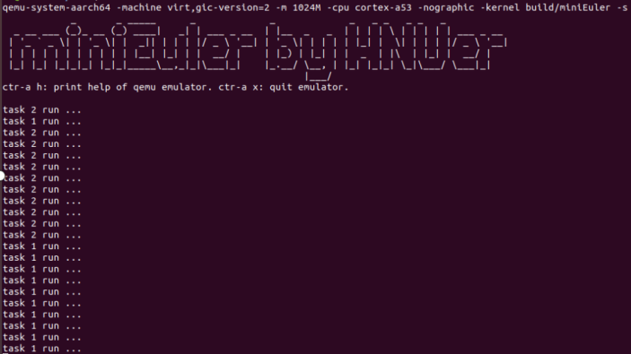

实验七 信号量与同步 
=====================
本实验旨在实现信号量机制。信号量是一种同步机制，主要用于避免多个进程或线程同时访问共享资源导致的竞态条件。

基础数据结构：信号量控制块
--------------------------

新建 lab7/src/include/prt_sem_external.h 头文件，代码如下：

.. code-block:: C
    :linenos:

    #ifndef PRT_SEM_EXTERNAL_H
    #define PRT_SEM_EXTERNAL_H

    #include "prt_sem.h"
    #include "prt_task_external.h"
    #if defined(OS_OPTION_POSIX)
    #include "bits/semaphore_types.h"
    #endif

    #define OS_SEM_UNUSED 0
    #define OS_SEM_USED   1

    #define SEM_PROTOCOL_PRIO_INHERIT 1
    #define SEM_TYPE_BIT_WIDTH        0x4U
    #define SEM_PROTOCOL_BIT_WIDTH    0x8U

    #define OS_SEM_WITH_LOCK_FLAG    1
    #define OS_SEM_WITHOUT_LOCK_FLAG 0

    #define MAX_POSIX_SEMAPHORE_NAME_LEN    31

    #define GET_SEM_LIST(ptr) LIST_COMPONENT(ptr, struct TagSemCb, semList)
    #define GET_SEM(semid) (((struct TagSemCb *)g_allSem) + (semid))
    #define GET_SEM_TSK(semid) (((SEM_TSK_S *)g_semTsk) + (semid))
    #define GET_TSK_SEM(tskid) (((TSK_SEM_S *)g_tskSem) + (tskid))
    #define GET_SEM_TYPE(semType) (U32)((semType) & ((1U << SEM_TYPE_BIT_WIDTH) - 1))
    #define GET_MUTEX_TYPE(semType) (U32)(((semType) >> SEM_TYPE_BIT_WIDTH) & ((1U << SEM_TYPE_BIT_WIDTH) - 1))
    #define GET_SEM_PROTOCOL(semType) (U32)((semType) >> SEM_PROTOCOL_BIT_WIDTH)

    struct TagSemCb {
        /* 是否使用 OS_SEM_UNUSED/OS_SEM_USED */
        U16 semStat;
        /* 核内信号量索引号 */
        U16 semId;
    #if defined(OS_OPTION_SEM_RECUR_PV)
        /* 二进制互斥信号量递归P计数，计数型信号量和二进制同步模式信号量无效 */
        U32 recurCount;
    #endif
        /* 当该信号量已用时，其信号量计数 */
        U32 semCount;
        /* 挂接阻塞于该信号量的任务 */
        struct TagListObject semList;
        /* 挂接任务持有的互斥信号量，计数型信号量信号量无效 */
        struct TagListObject semBList;

        /* Pend到该信号量的线程ID */
        U32 semOwner;
        /* 信号量唤醒阻塞任务的方式 */
        enum SemMode semMode;
        /* 信号量，计数型或二进制 */
        U32 semType;
    #if defined(OS_OPTION_POSIX)
        /* 信号量名称 */
        char name[MAX_POSIX_SEMAPHORE_NAME_LEN + 1]; // + \0
        /* sem_open 句柄 */
        sem_t handle;
    #endif
    };

    /* 模块间全局变量声明 */
    extern U16 g_maxSem;

    /* 指向核内信号量控制块 */
    extern struct TagSemCb *g_allSem;

    extern U32 OsSemCreate(U32 count, U32 semType, enum SemMode semMode, SemHandle *semHandle, U32 cookie);
    extern bool OsSemBusy(SemHandle semHandle);

    #endif /* PRT_SEM_EXTERNAL_H */

L30-L58 定义了信号量控制块，其中：
- L40 semCount 用于信号量计数；
- L42 semList 列表链接阻塞在此信号量上的任务；
- L44 semBList 列表仅用于二值信号量。
L22-L28 定义了一些与信号量相关的宏，如：
- L22 GET_SEM_LIST 宏所用 LIST_COMPONENT 宏在实验六中定义，该宏根据链表节点ptr地址（L42 处：struct TagListObject semList;）返回对应容器即信号量控制块的首地址。
- L23 GET_SEM 宏根据semid返回对应信号量控制块地址。

信号量初始化
--------------------------

在src/kernel/sem/prt_sem_init.c中加入以下代码：

.. code-block:: c
    :linenos:

    #include "prt_sem_external.h"
    #include "os_attr_armv8_external.h"
    #include "os_cpu_armv8_external.h"

    OS_SEC_BSS struct TagListObject g_unusedSemList;
    OS_SEC_BSS struct TagSemCb *g_allSem;

    extern void *OsMemAllocAlign(U32 mid, U8 ptNo, U32 size, U8 alignPow);
    /*
    * 描述：信号量初始化
    */
    OS_SEC_L4_TEXT U32 OsSemInit(void)
    {
        struct TagSemCb *semNode = NULL;
        U32 idx;
        U32 ret = OS_OK;

        g_allSem = (struct TagSemCb *)OsMemAllocAlign((U32)OS_MID_SEM,
                                                    0,
                                                    4096,
                                                    OS_SEM_ADDR_ALLOC_ALIGN);

        if (g_allSem == NULL) {
            return OS_ERRNO_SEM_NO_MEMORY;
        }

        g_maxSem = 4096 / sizeof(struct TagSemCb);

        char *cg_allSem = (char *)g_allSem;
        for(int i = 0; i < 4096; i++)
            cg_allSem[i] = 0;

        INIT_LIST_OBJECT(&g_unusedSemList);
        for (idx = 0; idx < g_maxSem; idx++) {
            semNode = ((struct TagSemCb *)g_allSem) + idx; //指针操作
            semNode->semId = (U16)idx;
            ListTailAdd(&semNode->semList, &g_unusedSemList);
        }

        return ret;
    }

    /*
    * 描述：创建一个信号量
    */
    OS_SEC_L4_TEXT U32 OsSemCreate(U32 count, U32 semType, enum SemMode semMode,
                                SemHandle *semHandle, U32 cookie)
    {
        uintptr_t intSave;
        struct TagSemCb *semCreated = NULL;
        struct TagListObject *unusedSem = NULL;
        (void)cookie;

        if (semHandle == NULL) {
            return OS_ERRNO_SEM_PTR_NULL;
        }

        intSave = OsIntLock();

        if (ListEmpty(&g_unusedSemList)) {
            OsIntRestore(intSave);
            return OS_ERRNO_SEM_ALL_BUSY;
        }

        /* 在空闲链表中取走一个控制节点 */
        unusedSem = OS_LIST_FIRST(&(g_unusedSemList));
        ListDelete(unusedSem);

        /* 获取到空闲节点对应的信号量控制块，并开始填充控制块 */
        semCreated = (GET_SEM_LIST(unusedSem));
        semCreated->semCount = count;
        semCreated->semStat = OS_SEM_USED;
        semCreated->semMode = semMode;
        semCreated->semType = semType;
        semCreated->semOwner = OS_INVALID_OWNER_ID;
        if (GET_SEM_TYPE(semType) == SEM_TYPE_BIN) {
            INIT_LIST_OBJECT(&semCreated->semBList);
    #if defined(OS_OPTION_SEM_RECUR_PV)
            if (GET_MUTEX_TYPE(semType) == PTHREAD_MUTEX_RECURSIVE) {
                semCreated->recurCount = 0;
            }
    #endif
        }

        INIT_LIST_OBJECT(&semCreated->semList);
        *semHandle = (SemHandle)semCreated->semId;

        OsIntRestore(intSave);
        return OS_OK;
    }

    /*
    * 描述：创建一个信号量
    */
    OS_SEC_L4_TEXT U32 PRT_SemCreate(U32 count, SemHandle *semHandle)
    {
        U32 ret;

        if (count > OS_SEM_COUNT_MAX) {
            return OS_ERRNO_SEM_OVERFLOW;
        }

        ret = OsSemCreate(count, SEM_TYPE_COUNT, SEM_MODE_FIFO, semHandle, (U32)(uintptr_t)semHandle);
        return ret;
    }

L12-L41 实现 OsSemInit 函数，该函数用于初始化全部信号量控制块。与任务控制块的初始化原理基本类似，我们基于所实现的简单的内存分配函数 OsMemAllocAlign 分配4k的内存空间供信号量控制块使用。这也解释了GET_SEM宏的原理。
- 在初始化后会将所有信号量控制块加入 g_unusedSemList 链表。
L46-L90 实现 OsSemCreate 函数，该函数将创建一个信号量。 
- L60-L63 检测是否有空闲的信号量控制块；
- L66-L67 从空闲信号量控制块链表中取出一个使用；
- L70-L83 对信号量控制块进行初始化；
- L85 初始化该信号量的semList （等待该信号量的任务链表）为空；
- L86 返回信号量id作为semHandle。
L95-L105 实现 PRT_SemCreate 函数，该函数只是对 OsSemCreate 函数的简单封装。

需要在 src/bsp/os_cpu_armv8_external.h加入所用宏：

.. code-block:: c
    :linenos:

    #define OS_SEM_ADDR_ALLOC_ALIGN 2U //按2的幂对齐，即2^2=4字节

信号量操作
--------------------------
下面实现信号量的Pend和Post操作，对应 PRT_SemPend 函数和 PRT_SemPost 函数。

在 src/kernel/sem/prt_sem.c 加入以下代码：

.. code-block:: c
    :linenos:

    #include "prt_sem_external.h"
    #include "prt_asm_cpu_external.h"
    #include "os_attr_armv8_external.h"
    #include "os_cpu_armv8_external.h"

    /* 核内信号量最大个数 */
    OS_SEC_BSS U16 g_maxSem;

    OS_SEC_ALW_INLINE INLINE U32 OsSemPostErrorCheck(struct TagSemCb *semPosted, SemHandle semHandle)
    {
        (void)semHandle;
        /* 检查信号量控制块是否UNUSED，排除大部分错误场景 */
        if (semPosted->semStat == OS_SEM_UNUSED) {
            return OS_ERRNO_SEM_INVALID;
        }

        /* post计数型信号量的错误场景, 释放计数型信号量且信号量计数大于最大计数 */
        if ((semPosted)->semCount >= OS_SEM_COUNT_MAX) {
            return OS_ERRNO_SEM_OVERFLOW;
        }

        return OS_OK;
    }

    /*
    * 描述：把当前运行任务挂接到信号量链表上
    */
    OS_SEC_L0_TEXT void OsSemPendListPut(struct TagSemCb *semPended, U32 timeOut)
    {
        struct TagTskCb *curTskCb = NULL;
        struct TagTskCb *runTsk = RUNNING_TASK;
        struct TagListObject *pendObj = &runTsk->pendList;

        OsTskReadyDel((struct TagTskCb *)runTsk);

        runTsk->taskSem = (void *)semPended;

        TSK_STATUS_SET(runTsk, OS_TSK_PEND);
        /* 根据唤醒方式挂接此链表，同优先级再按FIFO子顺序插入 */
        if (semPended->semMode == SEM_MODE_PRIOR) {
            LIST_FOR_EACH(curTskCb, &semPended->semList, struct TagTskCb, pendList) {
                if (curTskCb->priority > runTsk->priority) {
                    ListTailAdd(pendObj, &curTskCb->pendList);
                    // goto TIMER_ADD;
                    return;
                }
            }
        }
        /* 如果到这里，说明是FIFO方式；或者是优先级方式且挂接首个节点或者挂接尾节点 */
        ListTailAdd(pendObj, &semPended->semList);

    }

    /*
    * 描述：从非空信号量链表上摘首个任务放入到ready队列
    */
    OS_SEC_L0_TEXT struct TagTskCb *OsSemPendListGet(struct TagSemCb *semPended)
    {
        struct TagTskCb *taskCb = GET_TCB_PEND(LIST_FIRST(&(semPended->semList)));

        ListDelete(LIST_FIRST(&(semPended->semList)));
        /* 如果阻塞的任务属于定时等待的任务时候，去掉其定时等待标志位，并将其从去除 */
        if (TSK_STATUS_TST(taskCb, OS_TSK_TIMEOUT)) {
            OS_TSK_DELAY_LOCKED_DETACH(taskCb);
        }

        /* 必须先去除 OS_TSK_TIMEOUT 态，再入队[睡眠时是先出ready队，再置OS_TSK_TIMEOUT态] */
        TSK_STATUS_CLEAR(taskCb, OS_TSK_TIMEOUT | OS_TSK_PEND);
        taskCb->taskSem = NULL;
        /* 如果去除信号量阻塞位后，该任务不处于阻塞态则将该任务挂入就绪队列并触发任务调度 */
        if (!TSK_STATUS_TST(taskCb, OS_TSK_SUSPEND)) {
            OsTskReadyAddBgd(taskCb);
        }

        return taskCb;
    }

    OS_SEC_L0_TEXT U32 OsSemPendParaCheck(U32 timeout)
    {
        if (timeout == 0) {
            return OS_ERRNO_SEM_UNAVAILABLE;
        }

        if (OS_TASK_LOCK_DATA != 0) {
            return OS_ERRNO_SEM_PEND_IN_LOCK;
        }
        return OS_OK;
    }

    OS_SEC_L0_TEXT bool OsSemPendNotNeedSche(struct TagSemCb *semPended, struct TagTskCb *runTsk)
    {
        if (semPended->semCount > 0) {
            semPended->semCount--;
            semPended->semOwner = runTsk->taskPid;

            return TRUE;
        }
        return FALSE;
    }

    /*
    * 描述：指定信号量的P操作
    */
    OS_SEC_L0_TEXT U32 PRT_SemPend(SemHandle semHandle, U32 timeout)
    {
        uintptr_t intSave;
        U32 ret;
        struct TagTskCb *runTsk = NULL;
        struct TagSemCb *semPended = NULL;

        if (semHandle >= (SemHandle)g_maxSem) {
            return OS_ERRNO_SEM_INVALID;
        }

        semPended = GET_SEM(semHandle);

        intSave = OsIntLock();
        if (semPended->semStat == OS_SEM_UNUSED) {
            OsIntRestore(intSave);
            return OS_ERRNO_SEM_INVALID;
        }

        if (OS_INT_ACTIVE) {
            OsIntRestore(intSave);
            return OS_ERRNO_SEM_PEND_INTERR;
        }

        runTsk = (struct TagTskCb *)RUNNING_TASK;

        if (OsSemPendNotNeedSche(semPended, runTsk) == TRUE) {
            OsIntRestore(intSave);
            return OS_OK;
        }

        ret = OsSemPendParaCheck(timeout);
        if (ret != OS_OK) {
            OsIntRestore(intSave);
            return ret;
        }
        /* 把当前任务挂接在信号量链表上 */
        OsSemPendListPut(semPended, timeout);
        if (timeout != OS_WAIT_FOREVER) {
            OsIntRestore(intSave);
            return OS_ERRNO_SEM_FUNC_NOT_SUPPORT;
        } else {
            /* 恢复ps的快速切换 */
            OsTskScheduleFastPs(intSave);
            
        }

        OsIntRestore(intSave);
        return OS_OK;
    }

    OS_SEC_ALW_INLINE INLINE void OsSemPostSchePre(struct TagSemCb *semPosted)
    {
        struct TagTskCb *resumedTask = NULL;

        resumedTask = OsSemPendListGet(semPosted);
        semPosted->semOwner = resumedTask->taskPid;
    }

    /*
    * 描述：判断信号量post是否有效
    * 备注：以下情况表示post无效，返回TRUE: post互斥二进制信号量，若该信号量被嵌套pend或者已处于空闲状态
    */
    OS_SEC_ALW_INLINE INLINE bool OsSemPostIsInvalid(struct TagSemCb *semPosted)
    {
        if (GET_SEM_TYPE(semPosted->semType) == SEM_TYPE_BIN) {
            /* 释放互斥二进制信号量且信号量已处于空闲状态 */
            if ((semPosted)->semCount == OS_SEM_FULL) {
                return TRUE;
            }
        }
        return FALSE;
    }

    /*
    * 描述：指定信号量的V操作
    */
    OS_SEC_L0_TEXT U32 PRT_SemPost(SemHandle semHandle)
    {
        U32 ret;
        uintptr_t intSave;
        struct TagSemCb *semPosted = NULL;

        if (semHandle >= (SemHandle)g_maxSem) {
            return OS_ERRNO_SEM_INVALID;
        }

        semPosted = GET_SEM(semHandle);
        intSave = OsIntLock();

        ret = OsSemPostErrorCheck(semPosted, semHandle);
        if (ret != OS_OK) {
            OsIntRestore(intSave);
            return ret;
        }

        /* 信号量post无效，不需要调度 */
        if (OsSemPostIsInvalid(semPosted) == TRUE) {
            OsIntRestore(intSave);
            return OS_OK;
        }

        /* 如果有任务阻塞在信号量上，就激活信号量阻塞队列上的首个任务 */
        if (!ListEmpty(&semPosted->semList)) {
            OsSemPostSchePre(semPosted);
            /* 相当于快速切换+中断恢复 */
            OsTskScheduleFastPs(intSave);
        } else {
            semPosted->semCount++;
            semPosted->semOwner = OS_INVALID_OWNER_ID;

        }

        OsIntRestore(intSave);
        return OS_OK;
    }

代码较多，我们分别从 PRT_SemPend 函数和 PRT_SemPost 函数入手来理解代码。
L106-L155 实现PRT_SemPend 函数：
- L117 通过 GET_SEM 宏（2.3.1节）依据semHandle获取信号量控制块；
- L119 关中断并返回状态 intSave；
- L120-L128 做错误检查；
- L130 获得当前的运行任务，即正执行 PRT_SemPend 函数的任务；
- L132-L135 调用 OsSemPendNotNeedSche 函数（L92-L101）检查信号量的值（计数式信号量），如果信号量的值大于0，直接返回；
- L137-L141 调用 OsSemPendParaCheck 函数（L80-L90）进行信号量等待操作（Pend）时的参数检查；
- L143 调用 OsSemPendListPut 函数（L30-L54）将当前任务挂到信号量的等待链表上；
  - L36 将当前任务从就绪队列中移除；（参考实验六）
  - L38 记录当前任务所等待的信号量；（参考实验六 任务控制块结构代码部分的L25）
  - L40 设置当前任务为阻塞状态：OS_TSK_PEND；
  - L42-L50 如果信号量是 SEM_MODE_PRIOR 模式，依据优先级将当前任务插入到信号量的等待链表上并返回；
  - L52 如果不是 SEM_MODE_PRIOR 模式，依据FIFO将当前任务插入到信号量的等待链表上；
- L144-L151 进行检查，正常情况下会调用 OsTskScheduleFastPs 函数（L149，该函数下一段描述）进行任务切换。
- L153 恢复中断状态 intSave （对应L119行）。注意：能运行到此处说明已经得到等待的信号量（或出错了），因为L149已会切换到其他任务运行，当前任务阻塞了。

L183-L221 实现 PRT_SemPost 函数：
- L189-L191 检查 semHandle 是否有效；
- L193 通过 GET_SEM 宏（2.3.1节）依据semHandle获取信号量控制块；
- L196-L200 进行Post操作参数检查；
- L203-L206 调用 OsSemPostIsInvalid 函数（L169-L178）检查是否能进行有效的Post操作；
- L209-L217 进行信号量Post操作：
  - L209-L212 如果有等待此信号量的任务（L209），通过调用 OsSemPostSchePre 函数（L157-L163）获取即将解除阻塞的任务，然后调用 OsTskScheduleFastPs 函数执行任务切换；其中 OsSemPostSchePre 函数会调用 OsSemPendListGet 函数（L59-L78）从信号量的等待列表中移除一个任务并将其加入就绪队列：
    - L61 获取信号量等待列表中的第一个任务对应的任务控制块；（注意：该等待列表中的任务已经按优先级或FIFO方式排列）
    - L63 将该等待节点从信号量链表中移除；
    - L65-L67 如果是因为定时等待而阻塞，将任务同时从 taskCb->timerList （参见实验六任务控制块结构代码L36）中移除；
    - L70 清除任务的 OS_TSK_TIMEOUT | OS_TSK_PEND 状态；
    - L73-L75 调用 OsTskReadyAddBgd 函数（稍后描述）将任务加入就绪队列；
  - L213-L217 如果没有等待此信号量的任务（L213），信号量值+1；

下面我们介绍 OsTskScheduleFastPs 函数。
在src/kernel/task/prt_task.c 加入 OsTskScheduleFastPs()

.. code-block:: c
    :linenos:

    // src/core/kernel/task/prt_amp_task.c
    /*
    * 描述：如果快速切换后只有中断恢复，使用此接口
    */
    OS_SEC_TEXT void OsTskScheduleFastPs(uintptr_t intSave)
    {
        /* Find the highest task */
        OsTskHighestSet();

        /* In case that running is not highest then reschedule */
        if ((g_highestTask != RUNNING_TASK) && (g_uniTaskLock == 0)) {
            UNI_FLAG |= OS_FLG_TSK_REQ;

            /* only if there is not HWI or TICK the trap */
            if (OS_INT_INACTIVE) {
                OsTaskTrapFastPs(intSave);
            }
        }
    }

L8 查找最高优先级任务。
L12 将内核设成请求调度状态。
L16 若目前不是中断处理，调用 OsTaskTrapFastPs 函数（下一段给出代码）经由OsTaskTrap 函数（实验六已详细描述）进行任务切换。

需要在src/bsp/os_cpu_armv8_external.h 加入 OsTaskTrapFastPs()

.. code-block:: C
    :linenos:

    OS_SEC_ALW_INLINE INLINE void OsTaskTrapFastPs(uintptr_t intSave)
    {
        (void)intSave;
        OsTaskTrap();
    }

需要在src/include/prt_task_external.h 加入 OsTskReadyAddBgd()

.. code-block:: c
    :linenos:

    OS_SEC_ALW_INLINE INLINE void OsTskReadyAddBgd(struct TagTskCb *task)
    {
        OsTskReadyAdd(task);
    }

需要加入 src/include/prt_sem.h （代码仓提供完整代码），该头文件主要是信号量相关的函数声明和宏定义。

.. hint:: 我们在代码仓提供 prt_sem.h 的完整代码。
.. hint:: 将新增文件加入构建系统

任务同步验证
--------------------------

main.c作适当修改测试任务同步的信号量机制。

.. code-block:: c
    :linenos:

    #include "prt_typedef.h"
    #include "prt_tick.h"
    #include "prt_task.h"
    #include "prt_sem.h"

    extern U32 PRT_Printf(const char *format, ...);
    extern void PRT_UartInit(void);
    extern U32 OsActivate(void);
    extern U32 OsTskInit(void);
    extern U32 OsSemInit(void);

    static SemHandle sem_sync;

    void Test1TaskEntry()
    {
        PRT_Printf("task 1 run ...\n");
        PRT_SemPost(sem_sync);
        U32 cnt = 5;
        while (cnt > 0) {
            // PRT_TaskDelay(200);
            PRT_Printf("task 1 run ...\n");
            cnt--;
        }
    }

    void Test2TaskEntry()
    {
        PRT_Printf("task 2 run ...\n");

        PRT_SemPend(sem_sync, OS_WAIT_FOREVER);
        U32 cnt = 5;
        while (cnt > 0) {
            // PRT_TaskDelay(100);
            PRT_Printf("task 2 run ...\n");
            cnt--;
        }
    }

    S32 main(void)
    {
        // 任务模块初始化
        OsTskInit();
        OsSemInit(); // 参见demos/ascend310b/config/prt_config.c 系统初始化注册表

        PRT_UartInit();

        PRT_Printf("            _       _ _____      _             _             _   _ _   _ _   _           \n");
        PRT_Printf("  _ __ ___ (_)_ __ (_) ____|   _| | ___ _ __  | |__  _   _  | | | | \\ | | | | | ___ _ __ \n");
        PRT_Printf(" | '_ ` _ \\| | '_ \\| |  _|| | | | |/ _ \\ '__| | '_ \\| | | | | |_| |  \\| | | | |/ _ \\ '__|\n");
        PRT_Printf(" | | | | | | | | | | | |__| |_| | |  __/ |    | |_) | |_| | |  _  | |\\  | |_| |  __/ |   \n");
        PRT_Printf(" |_| |_| |_|_|_| |_|_|_____\\__,_|_|\\___|_|    |_.__/ \\__, | |_| |_|_| \\_|\\___/ \\___|_|   \n");
        PRT_Printf("                                                     |___/                               \n");

        PRT_Printf("ctr-a h: print help of qemu emulator. ctr-a x: quit emulator.\n\n");

        U32 ret;
        ret = PRT_SemCreate(0, &sem_sync);
        if (ret != OS_OK) {
            PRT_Printf("failed to create synchronization sem\n");
            return 1;
        }

        struct TskInitParam param = {0};

        // task 1
        // param.stackAddr = 0;
        param.taskEntry = (TskEntryFunc)Test1TaskEntry;
        param.taskPrio = 35;
        // param.name = "Test1Task";
        param.stackSize = 0x1000; //固定4096，参见prt_task_init.c的OsMemAllocAlign
        
        TskHandle tskHandle1;
        ret = PRT_TaskCreate(&tskHandle1, &param);
        if (ret) {
            return ret;
        }

        ret = PRT_TaskResume(tskHandle1);
        if (ret) {
            return ret;
        }

        // task 2
        // param.stackAddr = 0;
        param.taskEntry = (TskEntryFunc)Test2TaskEntry;
        param.taskPrio = 30;
        // param.name = "Test2Task";
        param.stackSize = 0x1000; //固定4096，参见prt_task_init.c的OsMemAllocAlign

        TskHandle tskHandle2;
        ret = PRT_TaskCreate(&tskHandle2, &param);
        if (ret) {
            return ret;
        }

        ret = PRT_TaskResume(tskHandle2);
        if (ret) {
            return ret;
        }

        // 启动调度
        OsActivate();

        // while(1);
        return 0;

    }

L16-L26 是第一个任务，该任务会调用 PRT_SemPost 发送信号；
L28-L39 是第二个任务，该任务会调用 PRT_SemPend 等待信号；
L45 执行信号系统初始化；
L59 创建1个信号量；
L69-L83 创建任务1并启动，优先级35；
L87-L101 创建任务2并启动，优先级30；

如果一切正常，运行结果如下：

lab7 作业
--------------------------

作业1
^^^^^^^^^^^^^^^^^^^^^^^^^^

各种并发问题模拟，至少3种。