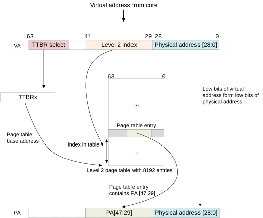
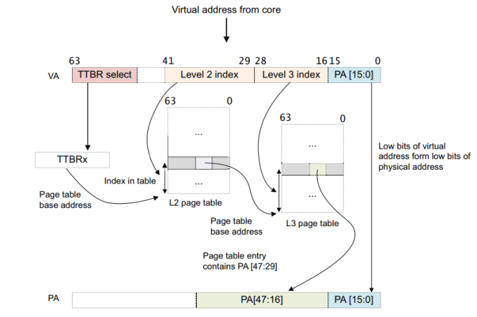

实验八 分页内存管理 
=====================

对内存管理单元MMU进行相关配置、设置页表，完成虚拟地址到物理地址的映射。

ARMv8地址翻译简略介绍
------------------------------

TTBRx：页表基址寄存器。TTBR0指向整个虚拟空间下半部分，通常用于应用程序的空间。TTBR1指向虚拟空间的上半部分，通常用于内核的空间。
下面以一个一级页表为例来进行地址转换过程。如下图所示，假设我们使用的页面64KB 的粒度（granule），并且虚拟地址是 42位。

.. role:: red
    （注：图片来源 ARM Cortex-A Series Programmer’s Guide for ARMv8-A 文档中的 12.3 节，:red:`该文档随代码仓提供`）
- 如果虚拟地址bit[63:42]都为1，则使用TTBR1作为第一级页目录表基地址，当bit[63:42]都为0时，使用TTBR0作为第一级页目录表基地址。
- TTBRx指向一个二级页表，该页表中包含2^13=8192个页表项，使用虚拟地址的[41:29]作为索引。
- MMU会检查页表项是否有效、是否可读，如果有效，则允许访问。
- 在上图中，每个页表项指向的是一个 512MB 的大页。
- MMU 会从该页表项中获取 Bits[47:29]，用于 :red:`构建物理地址（PA）的 Bits[47:29]`。
- 由于我们使用的是一个 512MB 的大页，因此虚拟地址的 Bits[28:0] 会直接作为物理地址的 PA[28:0]。这和上面的 Bits[47:29] 两部分合并一起构成物理地址。
更多信息希望读者能够自行查阅ARMv8的文档及相关资料。

mmu管理
------------------------------

新建 src/bsp/mmu.c 文件

.. code-block:: c
    :linenos:

    #include "prt_typedef.h"
    #include "prt_module.h"
    #include "prt_errno.h"
    #include "mmu.h"
    #include "prt_task.h"

    extern U64 g_mmu_page_begin;
    extern U64 g_mmu_page_end;

    extern void os_asm_invalidate_dcache_all(void);
    extern void os_asm_invalidate_icache_all(void);
    extern void os_asm_invalidate_tlb_all(void);

    static mmu_mmap_region_s g_mem_map_info[] = {
        {
            .virt      = 0x0,
            .phys      = 0x0,
            .size      = 0x40000000, // 1G size
            .max_level = 0x2,  // 
            .attrs     = MMU_ATTR_DEVICE_NGNRNE | MMU_ACCESS_RWX, // 设备
        }, {
            .virt      = 0x40000000,
            .phys      = 0x40000000,
            .size      = 0x40000000, // 1G size
            .max_level = 0x2, // // 
            .attrs     = MMU_ATTR_CACHE_SHARE | MMU_ACCESS_RWX, // 内存
        }
    };

    static mmu_ctrl_s g_mmu_ctrl = { 0 };

    // 依据实际情况生成tcr的值，pva_bits返回虚拟地址位数。Translation Control Register (tcr)
    static U64 mmu_get_tcr(U32 *pips, U32 *pva_bits)
    {
        U64 max_addr = 0;
        U64 ips, va_bits;
        U64 tcr;
        U32 i;
        U32 mmu_table_num = sizeof(g_mem_map_info) / sizeof(mmu_mmap_region_s);
        
        // 根据g_mem_map_info表计算所使用的虚拟地址的最大值
        for (i = 0; i < mmu_table_num; ++i) {
            max_addr = MAX(max_addr, g_mem_map_info[i].virt + g_mem_map_info[i].size);
        }
        
        // 依据虚拟地址最大值计算虚拟地址所需的位数，
        // 实际上应该分别计算物理地址的ips和虚拟地址的va_bits，而不是如下同时进行。
        if (max_addr > (1ULL << MMU_BITS_44)) {
            ips = MMU_PHY_ADDR_LEVEL_5;
            va_bits = MMU_BITS_48;
        } else if (max_addr > (1ULL << MMU_BITS_42)) {
            ips = MMU_PHY_ADDR_LEVEL_4;
            va_bits = MMU_BITS_44;
        } else if (max_addr > (1ULL << MMU_BITS_40)) {
            ips = MMU_PHY_ADDR_LEVEL_3;
            va_bits = MMU_BITS_42;
        } else if (max_addr > (1ULL << MMU_BITS_36)) {
            ips = MMU_PHY_ADDR_LEVEL_2;
            va_bits = MMU_BITS_40;
        } else if (max_addr > (1ULL << MMU_BITS_32)) {
            ips = MMU_PHY_ADDR_LEVEL_1;
            va_bits = MMU_BITS_36;
        } else {
            ips = MMU_PHY_ADDR_LEVEL_0;
            va_bits = MMU_BITS_32;
        }
        
        // 构建Translation Control Register寄存器的值,tcr可控制TTBR0_EL1和TTBR1_EL1的影响
        tcr = TCR_EL1_RSVD | TCR_IPS(ips);
        
        if (g_mmu_ctrl.granule == MMU_GRANULE_4K) {
            tcr |= TCR_TG0_4K | TCR_SHARED_INNER | TCR_ORGN_WBWA | TCR_IRGN_WBWA;
        } else {
            tcr |= TCR_TG0_64K | TCR_SHARED_INNER | TCR_ORGN_WBWA | TCR_IRGN_WBWA;
        }
        
        tcr |= TCR_T0SZ(va_bits);   // Memory region 2^(64-T0SZ)
        
        if (pips != NULL) {
            *pips = ips;
        }
        
        if (pva_bits != NULL) {
            *pva_bits = va_bits;
        }
        
        return tcr;
    }

    static U32 mmu_get_pte_type(U64 const *pte)
    {
        return (U32)(*pte & PTE_TYPE_MASK);
    }

    // 根据页表项级别计算当个页表项表示的范围（位数）
    static U32 mmu_level2shift(U32 level)
    {
        if (g_mmu_ctrl.granule == MMU_GRANULE_4K) {
            return (U32)(MMU_BITS_12 + MMU_BITS_9 * (MMU_LEVEL_3 - level));
        } else {
            return (U32)(MMU_BITS_16 + MMU_BITS_13 * (MMU_LEVEL_3 - level));
        }
    }

    // 根据虚拟地址找到对应级别的页表项
    static U64 *mmu_find_pte(U64 addr, U32 level)
    {
        U64 *pte = NULL;
        U64 idx;
        U32 i;
        
        if (level < g_mmu_ctrl.start_level) {
            return NULL;
        }
        
        pte = (U64 *)g_mmu_ctrl.tlb_addr;
        
        // 从顶级页表开始，直到找到所需level级别的页表项或返回NULL
        for (i = g_mmu_ctrl.start_level; i < MMU_LEVEL_MAX; ++i) {
            // 依据级别i计算页表项在页表中的索引idx
            if (g_mmu_ctrl.granule == MMU_GRANULE_4K) {
                idx = (addr >> mmu_level2shift(i)) & 0x1FF;
            } else {
                idx = (addr >> mmu_level2shift(i)) & 0x1FFF;
            }
            
            // 找到对应的页表项
            pte += idx;
            
            // 如果是需要level级别的页表项则返回
            if (i == level) {
                return pte;
            }
            
            // 从顶级页表开始找，
            // 找到当前级别页表项不是有效的（无效或是block entry）直接返回NULL
            if (mmu_get_pte_type(pte) != PTE_TYPE_TABLE) {
                return NULL;
            }
            
            // 不是所需级别但pte指向有效，依据页表粒度准备访问下级页表
            if (g_mmu_ctrl.granule == MMU_GRANULE_4K) {
                pte = (U64 *)(*pte & PTE_TABLE_ADDR_MARK_4K);
            } else {
                pte = (U64 *)(*pte & PTE_TABLE_ADDR_MARK_64K);
            }
        }
        
        return NULL;
    }

    // 根据页表粒度在页表区域新建一个页表，返回页表起始位置
    static U64 *mmu_create_table(void)
    {
        U32 pt_len;
        U64 *new_table = (U64 *)g_mmu_ctrl.tlb_fillptr;
        
        if (g_mmu_ctrl.granule == MMU_GRANULE_4K) {
            pt_len = MAX_PTE_ENTRIES_4K * sizeof(U64);
        } else {
            pt_len = MAX_PTE_ENTRIES_64K * sizeof(U64);
        }
        
        // 根据页表粒度在页表区域新建一个页表（4K或64K）
        g_mmu_ctrl.tlb_fillptr += pt_len;
        
        if (g_mmu_ctrl.tlb_fillptr - g_mmu_ctrl.tlb_addr > g_mmu_ctrl.tlb_size) {
            return NULL;
        }
        
        // 初始化页表全为0，因此该页表所有的页表项初始都是PTE_TYPE_FAULT
        // (void)memset_s((void *)new_table, MAX_PTE_ENTRIES_64K * sizeof(U64), 0, pt_len);
        U64 *tmp = new_table;
        for(int i = 0; i < pt_len; i+=sizeof(U64)){
            *tmp = 0;
            tmp++;
        }

        return new_table;
    }

    static void mmu_set_pte_table(U64 *pte, U64 *table)
    {
        // https://developer.arm.com/documentation/den0024/a/The-Memory-Management-Unit/Translation-tables-in-ARMv8-A/AArch64-descriptor-format
        *pte = PTE_TYPE_TABLE | (U64)table;
    }

    // 依据mmu_mmap_region_s填充pte
    static S32 mmu_add_map_pte_process(mmu_mmap_region_s const *map, U64 *pte, U64 phys, U32 level)
    {
        U64 *new_table = NULL;
        
        // 属于上级页表项
        if (level < map->max_level) {
            // 如果页表项指向无效，新建一个页表且pte指向该页表
            if (mmu_get_pte_type(pte) == PTE_TYPE_FAULT) {
                // 新建一个页表
                new_table = mmu_create_table();
                if (new_table == NULL) {
                    return -1;
                }
                // pte指向下级页表
                mmu_set_pte_table(pte, new_table);
            } //else: 如果页表项指向有效，不做任何处理。
        } else if (level == MMU_LEVEL_3) { // 最多4级页表(0,1,2,3)，这是最后一级页表项，最后L3级页表项定义略有不同
            *pte = phys | map->attrs | PTE_TYPE_PAGE;
        } else { 
            // 这里的情况：等于map->max_level且不到最后L3级页表，依据mmu_mmap_region_s的配置作为block entry类型直接指向物理区域
            *pte = phys | map->attrs | PTE_TYPE_BLOCK;
        }
        
        return 0;
    }

    // 依据 mmu_mmap_region_s 的定义，生成 mmu 映射
    static S32 mmu_add_map(mmu_mmap_region_s const *map)
    {
        U64 virt = map->virt;
        U64 phys = map->phys;
        U64 max_level = map->max_level;
        U64 start_level = g_mmu_ctrl.start_level;
        U64 block_size = 0;
        U64 map_size = 0;
        U32 level;
        U64 *pte = NULL;
        S32 ret;
        
        if (map->max_level <= start_level) {
            return -2;
        }
        
        while (map_size < map->size) {
            // 从起始级别start_level开始遍历页表。注意起始级别页表肯定存在
            for (level = start_level; level <= max_level; ++level) {
                // 找到对应level的页表项
                pte = mmu_find_pte(virt, level);
                if (pte == NULL) {
                    return -3;
                }
                
                // 如果为上级页表项且pte指向无效，新建下级页表且pte指向该新建的页表
                // 如果为最低页表项或到达设定级别页表项，直接设置页表项的值
                ret = mmu_add_map_pte_process(map, pte, phys, level);
                if (ret) {
                    return ret;
                }
                
                if (level != start_level) {
                    block_size = 1ULL << mmu_level2shift(level);
                }
            }
            
            virt += block_size;
            phys += block_size;
            map_size += block_size;
        }
        
        return 0;
    }

    static inline void mmu_set_ttbr_tcr_mair(U64 table, U64 tcr, U64 attr)
    {
        OS_EMBED_ASM("dsb sy");
        
        OS_EMBED_ASM("msr ttbr0_el1, %0" : : "r" (table) : "memory");
        // OS_EMBED_ASM("msr ttbr1_el1, %0" : : "r" (table) : "memory");
        OS_EMBED_ASM("msr tcr_el1, %0" : : "r" (tcr) : "memory");
        OS_EMBED_ASM("msr mair_el1, %0" : : "r" (attr) : "memory");
        
        OS_EMBED_ASM("isb");
    }

    static U32 mmu_setup_pgtables(mmu_mmap_region_s *mem_map, U32 mem_region_num, U64 tlb_addr, U64 tlb_len, U32 granule)
    {
        U32 i;
        U32 ret;
        U64 tcr;
        U64 *new_table = NULL;
        
        g_mmu_ctrl.tlb_addr = tlb_addr;
        g_mmu_ctrl.tlb_size = tlb_len;
        g_mmu_ctrl.tlb_fillptr = tlb_addr;
        g_mmu_ctrl.granule = granule;
        g_mmu_ctrl.start_level = 0;
        
        tcr = mmu_get_tcr(NULL, &g_mmu_ctrl.va_bits);
        
        // 依据页表粒度和虚拟地址位数计算地址转换起始级别
        if (g_mmu_ctrl.granule == MMU_GRANULE_4K) {
            if (g_mmu_ctrl.va_bits < MMU_BITS_39) {
                g_mmu_ctrl.start_level = MMU_LEVEL_1;
            } else {
                g_mmu_ctrl.start_level = MMU_LEVEL_0; 
            }
        } else {
            if (g_mmu_ctrl.va_bits <= MMU_BITS_36) {
                g_mmu_ctrl.start_level = MMU_LEVEL_2;
            } else {
                g_mmu_ctrl.start_level = MMU_LEVEL_1;
                return 3;
            }
        }
        
        // 创建一个顶级页表，不一定是L0
        new_table = mmu_create_table();
        if (new_table == NULL) {
            return 1;
        }
        
        for (i = 0; i < mem_region_num; ++i) {
            ret = mmu_add_map(&mem_map[i]);
            if (ret) {
                return ret;
            }
        }
        
        mmu_set_ttbr_tcr_mair(g_mmu_ctrl.tlb_addr, tcr, MEMORY_ATTRIBUTES);
        
        return 0;
    }

    static S32 mmu_setup(void)
    {
        S32 ret;
        U64 page_addr;
        U64 page_len;
        
        page_addr = (U64)&g_mmu_page_begin;
        page_len = (U64)&g_mmu_page_end - (U64)&g_mmu_page_begin;
        
        ret = mmu_setup_pgtables(g_mem_map_info, (sizeof(g_mem_map_info) / sizeof(mmu_mmap_region_s)),
                                page_addr, page_len, MMU_GRANULE_4K);
        if (ret) {
            return ret;
        }
        
        return 0;
    }

    S32 mmu_init(void)
    {
        S32 ret;

        ret = mmu_setup();
        if (ret) {
            return ret;
        }

        os_asm_invalidate_dcache_all();
        os_asm_invalidate_icache_all();
        os_asm_invalidate_tlb_all();

        set_sctlr(get_sctlr() | CR_C | CR_M | CR_I);

        return 0;
    }

以上代码总体框架如下：
mmu_init()
├── mmu_setup()
│   └── mmu_setup_pgtables() ──> 生成页表、建立映射
│        └── mmu_add_map()
│             └── mmu_find_pte() + mmu_add_map_pte_process()
├── os_asm_invalidate_dcache_all() 等 —— 清空数据、指令缓存和所有tlb表项
└── set_sctlr(get_sctlr() | CR_C | CR_M | CR_I) —— 启用 MMU 和 Cache

我们从mmu_init 函数（L342-L358）开始进行分析。
L346 调用 mmu_setup 函数（L322-L338）进行MMU的初始化，其主要通过：
- L331 调用 mmu_setup_pgtables 函数（L273-L320）依据映射信息表 g_mem_map_info （L14-L28）设置页表 g_mmu_page_begin，采用4K页面大小，其中 :red:`g_mmu_page_begin在链接脚本aarch64-qemu.ld中定义`。
    - L280-L302 依据配置计算tcr（Translation Control Register 参考： https://developer.arm.com/documentation/ddi0601/2025-03/AArch64-Registers/TCR-EL1--Translation-Control-Register--EL1-?lang=en ）的值，此外还通过mmu_get_tcr 函数（L33-L88）和 &g_mmu_ctrl.va_bits 返回恰当的虚拟地址位数；
            - g_mmu_ctrl 是一个 mmu_ctrl_s 结构（L30），用于辅助MMU映射的配置，其结构在mmu.h中定义。比如用于计算新页表的存储位置等。
    - L305 调用 mmu_create_table 函数（L153-L180）创建顶级页表；
    - L310-L315 依据映射表 g_mem_map_info （L14-L28）加入页表项；
    - L317 调用 mmu_set_ttbr_tcr_mair 函数（L261-L271）设置 ttbr0_el1、 tcr_el1 和 mair_el1 寄存器，分别对应页表基地址、MMU控制和内存属性控制。（注：寄存器参考 https://developer.arm.com/documentation/ddi0601/2025-03/AArch64-Registers?lang=en ）
L351-L353 清空数据、指令缓存和所有tlb表项
L355 设置 SCTLR_EL1寄存器（System Control Register） :red:`正式启用MMU和Cache`，（参考：https://developer.arm.com/documentation/ddi0601/2025-03/AArch64-Registers/SCTLR-EL1--System-Control-Register--EL1-?lang=en ）
下面分别说明 mmu_create_table 函数（L153-L180）和 mmu_add_map 函数（L216-L259）
- mmu_create_table 函数用于新建一个页表，主要包括：
    - L156 首先获取新页表的存储位置为：g_mmu_ctrl.tlb_fillptr；
    - L158-L162 计算本页表所需的长度；
    - L165 由于本页表会占用空间，准备下一个新建页表的存放位置 g_mmu_ctrl.tlb_fillptr += pt_len;
    - L173-L177 初始化本页表全部页表项为全0；
    - L179 返回本新建页表的起始位置；
- mmu_add_map 函数用于处理一个mmu_mmap_region_s 结构（如L14-L28 g_mem_map_info 结构中的其中一项，mmu_mmap_region_s结构在mmu.h中定义）所描述的MMU映射，主要包括：
    - L228-L230 需确保待处理MMU映射项的（最大）页表级别大于整体系统地址映射的起始级别；
    - L232-L256 循环处理将mmu_mmap_region_s结构描述的全部空间映射为页表项（Page Table Entry，PTE），如有需要还应建立下一级页表;
            - L234 从系统起始级别开始一直处理到映射项设定的页表级别；
            - L236 调用 mmu_find_pte 函数（L106-L150）找到虚拟地址virt对应级别页表的页表项pte；( :red:`注：这部分作为作业请大家自行分析``)
            - L243 调用 mmu_add_map_pte_process 函数（L189-L213）填充页表项，主要包括：
                - L194-L204 是中间级页表，如果下级页表未创建则应 :red:`新建页表并将此页表项指向下级页表`（L196-L204）；如果下级页表已存在，不需要执行任何操作；
                - L205-L206 是Arm v8支持的最大的3级页表，直接 :red:`设定该页表项的值`为：phys | map->attrs | PTE_TYPE_PAGE; 
                - L207-L210 是映射项设定的最大级页表，但还未到Arm v8支持的最大的3级页表，直接 :red:`设定该页表项的值`为：phys | map->attrs | PTE_TYPE_BLOCK;
            - L248-L250 正常时会获取到最后一级页表项所表示的地址空间大小，其中 mmu_level2shift 函数（L96-L103）用于计算特定级别页表项所表示的地址空间大小的二进制位数。
            - L253-L255 虚拟地址virt、物理地址phys和映射大小map_size均相应递增一页大小。

总的来说，MMU的初始化可结合下图理解：

MMU的配置首先以start_level开始，并将g_mmu_ctrl.tlb_fillptr指向在g_mmu_ctrl.tlb_addr处，在g_mmu_ctrl.tlb_fillptr建立一个顶级页表（g_mmu_ctrl.tlb_fillptr相应递增）。
对于单个的mmu_mmap_region_s，首先分别设定一个值为virt和phy,初始化为虚拟地址和物理地址的起始地址，根据virt找到这个地址对应的级别的页表项(多级页表的寻址)，如果这个页表项不是最高级别，且没有指向下一级页表，则在g_mmu_ctrl.tlb_fillptr新建一个页表（g_mmu_ctrl.tlb_fillptr相应递增），并使这个页表项指向这个新建的下一级页表，直到最后一级页表已经被建立。然后接着对更新后的virt从初始级别的页表重复上述操作，直到一个mmap需要的空间映射已经被完全建立,即大小达到size。

启用 mmu
--------------------------

打开Start.S 在 B OsEnterMain 之前启用 MMU。

.. code-block:: asm
    :linenos:

    // 启用 MMU
    BL     mmu_init
    // 进入 main 函数
    B      OsEnterMain

:red:`.. hint:: 将新增文件加入构建系统`

:red:`.. hint:: 通过调试确保你真的启动了 MMU`

    在没有出错的情况下，系统应该正常运行并输出：
    .. image:: result.png

作业
--------------------------

作业1
^^^^^^^^^^^^^^^^^^^^^^^^^^

请调试跟踪并详细解释mmu_find_pte 函数的处理过程。

作业2
^^^^^^^^^^^^^^^^^^^^^^^^^^

启用 TTBR1 ，将地址映射到虚拟地址的高半部分，使用高地址访问串口 修改后：
(1)src/bsp/print.c中 

.. code-block:: c
    
    #define UART_0_REG_BASE (0xffffffff00000000 + 0x09000000)

(2)src/bsp/hwi_init.c 中 

.. code-block:: c

    #define GIC_DIST_BASE              (0xffffffff00000000 + 0x08000000)
    #define GIC_CPU_BASE               (0xffffffff00000000 + 0x08010000)

使得程序可以正常运行。（GIC_DIST_BASE 和 GIC_CPU_BASE 的高位多少个f与你对MMU的配置有关）。

