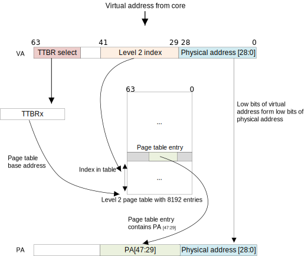

实验八 分页内存管理 
=====================

Armv8的地址转换
------------------------------

`ARM Cortex-A Series Programmer's Guide for ARMv8-A <https://developer.arm.com/documentation/den0024/a/The-Memory-Management-Unit/Context-switching>`_ 中提到：For EL0 and EL1, there are two translation tables. TTBR0_EL1 provides translations for the bottom of Virtual Address space, which is typically application space and TTBR1_EL1 covers the top of Virtual Address space, typically kernel space. This split means that the OS mappings do not have to be replicated in the translation tables of each task. 即TTBR0指向整个虚拟空间下半部分通常用于应用程序的空间，TTBR1指向虚拟空间的上半部分通常用于内核的空间。其中TTBR0除了在EL1中存在外，也在EL2 and EL3中存在，但TTBR1只在EL1中存在 [1]_。

TTBR0_ELn 和 TTBR1_ELn 是页表基地址寄存器 [2]_，地址转换的过程如下所示 [3]_。

In a simple address translation involving only one level of look-up. It assumes we are using a 64KB granule with a 42-bit Virtual Address. The MMU translates a Virtual Address as follows:

1. If VA[63:42] = 1 then TTBR1 is used for the base address for the first page table. When VA[63:42] = 0, TTBR0 is used for the base address for the first page table.
2. The page table contains 8192 64-bit page table entries, and is indexed using VA[41:29]. The MMU reads the pertinent level 2 page table entry from the table.
3. The MMU checks the page table entry for validity and whether or not the requested memory access is allowed. Assuming it is valid, the memory access is allowed.
4. In the above Figure, the page table entry refers to a 512MB page (it is a block descriptor).
5. Bits [47:29] are taken from this page table entry and form bits [47:29] of the Physical Address.
6. Because we have a 512MB page, bits [28:0] of the VA are taken to form PA[28:0]. See Effect of granule sizes on translation tables
7. The full PA[47:0] is returned, along with additional information from the page table entry.

In practice, such a simple translation process severely limits how finely you can divide up your address space. Instead of using only this first-level translation table, a first-level table entry can also point to a second-level page table.

mmu管理
------------------------------

新建 src/bsp/mmu.c 文件

.. code-block:: c
    :linenos:

    #include "prt_typedef.h"
    #include "prt_module.h"
    #include "prt_errno.h"
    #include "mmu.h"
    #include "prt_task.h"

    extern U64 g_mmu_page_begin;
    extern U64 g_mmu_page_end;

    extern void os_asm_invalidate_dcache_all(void);
    extern void os_asm_invalidate_icache_all(void);
    extern void os_asm_invalidate_tlb_all(void);

    static mmu_mmap_region_s g_mem_map_info[] = {
        {
            .virt      = 0x0,
            .phys      = 0x0,
            .size      = 0x40000000, // 1G size
            .max_level = 0x2,  // 不应大于3
            .attrs     = MMU_ATTR_DEVICE_NGNRNE | MMU_ACCESS_RWX, // 设备
        }, {
            .virt      = 0x40000000,
            .phys      = 0x40000000,
            .size      = 0x40000000, // 1G size
            .max_level = 0x2, // // 不应大于3
            .attrs     = MMU_ATTR_CACHE_SHARE | MMU_ACCESS_RWX, // 内存
        }
    };

    static mmu_ctrl_s g_mmu_ctrl = { 0 };

    // 依据实际情况生成tcr的值，pva_bits返回虚拟地址位数。Translation Control Register (tcr)
    static U64 mmu_get_tcr(U32 *pips, U32 *pva_bits)
    {
        U64 max_addr = 0;
        U64 ips, va_bits;
        U64 tcr;
        U32 i;
        U32 mmu_table_num = sizeof(g_mem_map_info) / sizeof(mmu_mmap_region_s);
        
        // 根据g_mem_map_info表计算所使用的虚拟地址的最大值
        for (i = 0; i < mmu_table_num; ++i) {
            max_addr = MAX(max_addr, g_mem_map_info[i].virt + g_mem_map_info[i].size);
        }
        
        // 依据虚拟地址最大值计算虚拟地址所需的位数，
        // 实际上应该分别计算物理地址的ips和虚拟地址的va_bits，而不是如下同时进行。
        if (max_addr > (1ULL << MMU_BITS_44)) {
            ips = MMU_PHY_ADDR_LEVEL_5;
            va_bits = MMU_BITS_48;
        } else if (max_addr > (1ULL << MMU_BITS_42)) {
            ips = MMU_PHY_ADDR_LEVEL_4;
            va_bits = MMU_BITS_44;
        } else if (max_addr > (1ULL << MMU_BITS_40)) {
            ips = MMU_PHY_ADDR_LEVEL_3;
            va_bits = MMU_BITS_42;
        } else if (max_addr > (1ULL << MMU_BITS_36)) {
            ips = MMU_PHY_ADDR_LEVEL_2;
            va_bits = MMU_BITS_40;
        } else if (max_addr > (1ULL << MMU_BITS_32)) {
            ips = MMU_PHY_ADDR_LEVEL_1;
            va_bits = MMU_BITS_36;
        } else {
            ips = MMU_PHY_ADDR_LEVEL_0;
            va_bits = MMU_BITS_32;
        }
        
        // 构建Translation Control Register寄存器的值,tcr可控制TTBR0_EL1和TTBR1_EL1的影响
        tcr = TCR_EL1_RSVD | TCR_IPS(ips);
        
        if (g_mmu_ctrl.granule == MMU_GRANULE_4K) {
            tcr |= TCR_TG0_4K | TCR_SHARED_INNER | TCR_ORGN_WBWA | TCR_IRGN_WBWA;
        } else {
            tcr |= TCR_TG0_64K | TCR_SHARED_INNER | TCR_ORGN_WBWA | TCR_IRGN_WBWA;
        }
        
        tcr |= TCR_T0SZ(va_bits);   // Memory region 2^(64-T0SZ)
        
        if (pips != NULL) {
            *pips = ips;
        }
        
        if (pva_bits != NULL) {
            *pva_bits = va_bits;
        }
        
        return tcr;
    }

    static U32 mmu_get_pte_type(U64 const *pte)
    {
        return (U32)(*pte & PTE_TYPE_MASK);
    }

    // 根据页表项级别计算当个页表项表示的范围（位数）
    static U32 mmu_level2shift(U32 level)
    {
        if (g_mmu_ctrl.granule == MMU_GRANULE_4K) {
            return (U32)(MMU_BITS_12 + MMU_BITS_9 * (MMU_LEVEL_3 - level));
        } else {
            return (U32)(MMU_BITS_16 + MMU_BITS_13 * (MMU_LEVEL_3 - level));
        }
    }

    // 根据虚拟地址找到对应级别的页表项
    static U64 *mmu_find_pte(U64 addr, U32 level)
    {
        U64 *pte = NULL;
        U64 idx;
        U32 i;
        
        if (level < g_mmu_ctrl.start_level) {
            return NULL;
        }
        
        pte = (U64 *)g_mmu_ctrl.tlb_addr;
        
        // 从顶级页表开始，直到找到所需level级别的页表项或返回NULL
        for (i = g_mmu_ctrl.start_level; i < MMU_LEVEL_MAX; ++i) {
            // 依据级别i计算页表项在页表中的索引idx
            if (g_mmu_ctrl.granule == MMU_GRANULE_4K) {
                idx = (addr >> mmu_level2shift(i)) & 0x1FF;
            } else {
                idx = (addr >> mmu_level2shift(i)) & 0x1FFF;
            }
            
            // 找到对应的页表项
            pte += idx;
            
            // 如果是需要level级别的页表项则返回
            if (i == level) {
                return pte;
            }
            
            // 从顶级页表开始找，
            // 找到当前级别页表项不是有效的（无效或是block entry）直接返回NULL
            if (mmu_get_pte_type(pte) != PTE_TYPE_TABLE) {
                return NULL;
            }
            
            // 不是所需级别但pte指向有效，依据页表粒度准备访问下级页表
            if (g_mmu_ctrl.granule == MMU_GRANULE_4K) {
                pte = (U64 *)(*pte & PTE_TABLE_ADDR_MARK_4K);
            } else {
                pte = (U64 *)(*pte & PTE_TABLE_ADDR_MARK_64K);
            }
        }
        
        return NULL;
    }

    // 根据页表粒度在页表区域新建一个页表，返回页表起始位置
    static U64 *mmu_create_table(void)
    {
        U32 pt_len;
        U64 *new_table = (U64 *)g_mmu_ctrl.tlb_fillptr;
        
        if (g_mmu_ctrl.granule == MMU_GRANULE_4K) {
            pt_len = MAX_PTE_ENTRIES_4K * sizeof(U64);
        } else {
            pt_len = MAX_PTE_ENTRIES_64K * sizeof(U64);
        }
        
        // 根据页表粒度在页表区域新建一个页表（4K或64K）
        g_mmu_ctrl.tlb_fillptr += pt_len;
        
        if (g_mmu_ctrl.tlb_fillptr - g_mmu_ctrl.tlb_addr > g_mmu_ctrl.tlb_size) {
            return NULL;
        }
        
        // 初始化页表全为0，因此该页表所有的页表项初始都是PTE_TYPE_FAULT
        // (void)memset_s((void *)new_table, MAX_PTE_ENTRIES_64K * sizeof(U64), 0, pt_len);
        U64 *tmp = new_table;
        for(int i = 0; i < pt_len; i+=sizeof(U64)){
            *tmp = 0;
            tmp++;
        }

        return new_table;
    }

    static void mmu_set_pte_table(U64 *pte, U64 *table)
    {
        // https://developer.arm.com/documentation/den0024/a/The-Memory-Management-Unit/Translation-tables-in-ARMv8-A/AArch64-descriptor-format
        *pte = PTE_TYPE_TABLE | (U64)table;
    }

    // 依据mmu_mmap_region_s填充pte
    static S32 mmu_add_map_pte_process(mmu_mmap_region_s const *map, U64 *pte, U64 phys, U32 level)
    {
        U64 *new_table = NULL;
        
        // 属于上级页表项
        if (level < map->max_level) {
            // 如果页表项指向无效，新建一个页表且pte指向该页表
            if (mmu_get_pte_type(pte) == PTE_TYPE_FAULT) {
                // 新建一个页表
                new_table = mmu_create_table();
                if (new_table == NULL) {
                    return -1;
                }
                // pte指向下级页表
                mmu_set_pte_table(pte, new_table);
            } //else: 如果页表项指向有效，不做任何处理。
        } else if (level == MMU_LEVEL_3) { // 最多4级页表(0,1,2,3)，这是最后一级页表项，最后L3级页表项定义略有不同
            *pte = phys | map->attrs | PTE_TYPE_PAGE;
        } else { 
            // 这里的情况：等于map->max_level且不到最后L3级页表，依据mmu_mmap_region_s的配置作为block entry类型直接指向物理区域
            *pte = phys | map->attrs | PTE_TYPE_BLOCK;
        }
        
        return 0;
    }

    // 依据 mmu_mmap_region_s 的定义，生成 mmu 映射
    static S32 mmu_add_map(mmu_mmap_region_s const *map)
    {
        U64 virt = map->virt;
        U64 phys = map->phys;
        U64 max_level = map->max_level;
        U64 start_level = g_mmu_ctrl.start_level;
        U64 block_size = 0;
        U64 map_size = 0;
        U32 level;
        U64 *pte = NULL;
        S32 ret;
        
        if (map->max_level <= start_level) {
            return -2;
        }
        
        while (map_size < map->size) {
            // 从起始级别start_level开始遍历页表。注意起始级别页表肯定存在
            for (level = start_level; level <= max_level; ++level) {
                // 找到对应level的页表项
                pte = mmu_find_pte(virt, level);
                if (pte == NULL) {
                    return -3;
                }
                
                // 如果为上级页表项且pte指向无效，新建下级页表且pte指向该新建的页表
                // 如果为最低页表项或到达设定级别页表项，直接设置页表项的值
                ret = mmu_add_map_pte_process(map, pte, phys, level);
                if (ret) {
                    return ret;
                }
                
                if (level != start_level) {
                    block_size = 1ULL << mmu_level2shift(level);
                }
            }
            
            virt += block_size;
            phys += block_size;
            map_size += block_size;
        }
        
        return 0;
    }

    static inline void mmu_set_ttbr_tcr_mair(U64 table, U64 tcr, U64 attr)
    {
        OS_EMBED_ASM("dsb sy");
        
        OS_EMBED_ASM("msr ttbr0_el1, %0" : : "r" (table) : "memory");
        // OS_EMBED_ASM("msr ttbr1_el1, %0" : : "r" (table) : "memory");
        OS_EMBED_ASM("msr tcr_el1, %0" : : "r" (tcr) : "memory");
        OS_EMBED_ASM("msr mair_el1, %0" : : "r" (attr) : "memory");
        
        OS_EMBED_ASM("isb");
    }

    static U32 mmu_setup_pgtables(mmu_mmap_region_s *mem_map, U32 mem_region_num, U64 tlb_addr, U64 tlb_len, U32 granule)
    {
        U32 i;
        U32 ret;
        U64 tcr;
        U64 *new_table = NULL;
        
        g_mmu_ctrl.tlb_addr = tlb_addr;
        g_mmu_ctrl.tlb_size = tlb_len;
        g_mmu_ctrl.tlb_fillptr = tlb_addr;
        g_mmu_ctrl.granule = granule;
        g_mmu_ctrl.start_level = 0;
        
        tcr = mmu_get_tcr(NULL, &g_mmu_ctrl.va_bits);
        
        // 依据页表粒度和虚拟地址位数计算地址转换起始级别
        if (g_mmu_ctrl.granule == MMU_GRANULE_4K) {
            if (g_mmu_ctrl.va_bits < MMU_BITS_39) {
                g_mmu_ctrl.start_level = MMU_LEVEL_1;
            } else {
                g_mmu_ctrl.start_level = MMU_LEVEL_0; 
            }
        } else {
            if (g_mmu_ctrl.va_bits <= MMU_BITS_36) {
                g_mmu_ctrl.start_level = MMU_LEVEL_2;
            } else {
                g_mmu_ctrl.start_level = MMU_LEVEL_1;
                return 3;
            }
        }
        
        // 创建一个顶级页表，不一定是L0
        new_table = mmu_create_table();
        if (new_table == NULL) {
            return 1;
        }
        
        for (i = 0; i < mem_region_num; ++i) {
            ret = mmu_add_map(&mem_map[i]);
            if (ret) {
                return ret;
            }
        }
        
        mmu_set_ttbr_tcr_mair(g_mmu_ctrl.tlb_addr, tcr, MEMORY_ATTRIBUTES);
        
        return 0;
    }

    static S32 mmu_setup(void)
    {
        S32 ret;
        U64 page_addr;
        U64 page_len;
        
        page_addr = (U64)&g_mmu_page_begin;
        page_len = (U64)&g_mmu_page_end - (U64)&g_mmu_page_begin;
        
        ret = mmu_setup_pgtables(g_mem_map_info, (sizeof(g_mem_map_info) / sizeof(mmu_mmap_region_s)),
                                page_addr, page_len, MMU_GRANULE_4K);
        if (ret) {
            return ret;
        }
        
        return 0;
    }

    S32 mmu_init(void)
    {
        S32 ret;

        ret = mmu_setup();
        if (ret) {
            return ret;
        }

        os_asm_invalidate_dcache_all();
        os_asm_invalidate_icache_all();
        os_asm_invalidate_tlb_all();

        set_sctlr(get_sctlr() | CR_C | CR_M | CR_I);

        return 0;
    }

新建 src/bsp/mmu.h， 该文件可从 `这里 <../\_static/mmu.h>`_ 下载

新建 src/bsp/cache_asm.S， 该文件可从 `这里 <../\_static/cache_asm.S>`_ 下载

启用 mmu
--------------------------

start.S 中在 B      OsEnterMain 之前启用 MMU

.. code-block:: asm
    :linenos:

    // 启用 MMU
    BL     mmu_init
    // 进入 main 函数
    B      OsEnterMain

.. hint:: 将新增文件加入构建系统

.. hint:: 通过调试确保你真的启动了 MMU

lab8 作业
--------------------------

作业1
^^^^^^^^^^^^^^^^^^^^^^^^^^

启用 TTBR1 ，将地址映射到虚拟地址的高半部分，使用高地址访问串口
修改后：（1）src/bsp/print.c中 

.. code-block:: c
    
    #define UART_0_REG_BASE (0xffffffff00000000 + 0x09000000)

(2)src/bsp/hwi_init.c 中 

.. code-block:: c

    #define GIC_DIST_BASE              (0xffffffff00000000 + 0x08000000)
    #define GIC_CPU_BASE               (0xffffffff00000000 + 0x08010000)

程序可以正常运行。（GIC_DIST_BASE 和 GIC_CPU_BASE 的高位多少个f与你对MMU的配置有关）

